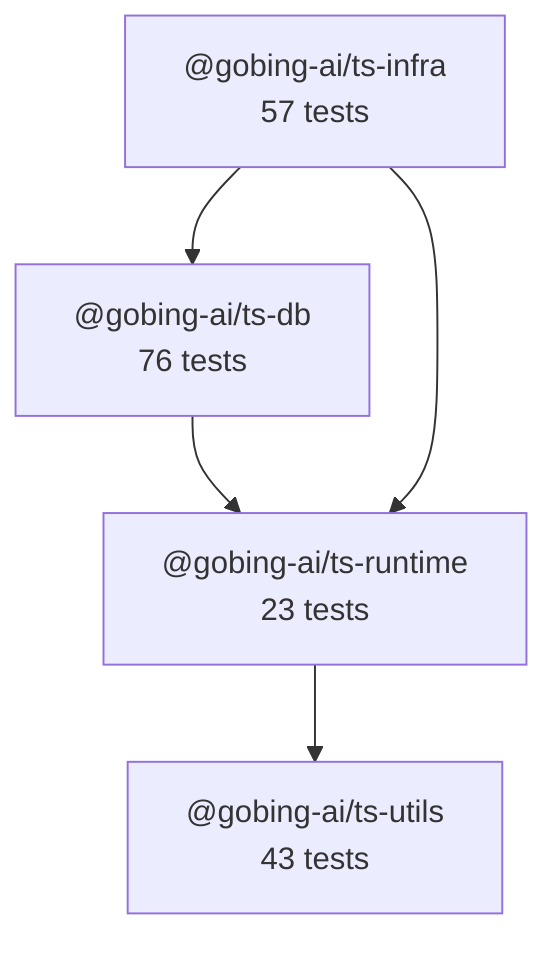

# @gobing-ai/ts-libs

Monorepo of TypeScript libraries — shared runtime abstractions, database layer, and infrastructure backbone for [Gobing.ai](https://gobing.ai) applications. Built on the [ts-base](https://github.com/robinmin/ts-base) template.

## Toolchain

| Tool | Version | Purpose |
|------|---------|---------|
| [Bun](https://bun.sh) | 1.3.14 | Runtime, package manager, test runner |
| [Biome](https://biomejs.dev) | 2.4.16 | Linter + formatter (no ESLint, no Prettier) |
| [TypeScript](https://www.typescriptlang.org) | 6.0 | Type checking |
| [Lefthook](https://github.com/evilmartians/lefthook) | 1.13 | Git hooks (commit-msg, pre-commit, pre-push) |
| [cocogitto](https://github.com/cocogitto/cocogitto) | 6.5 | Conventional commits + changelog generation |
| [proto](https://moonrepo.dev/proto) | — | Tool version manager (`.prototools`) |

Versions are pinned in `.prototools`. Run `proto use` once to install all toolchain binaries.

## Libraries

### Dependency Graph



### @gobing-ai/ts-utils

Shared utilities with zero dependencies — error types, date helpers, cursor-based pagination, and role-based access control.

| | |
|---|---|
| **Package** | `@gobing-ai/ts-utils` |
| **Dependencies** | None |
| **Peer dependencies** | None |
| **Tests** | 43 pass · 99.3% line coverage |

**Key exports:** `AppError`, `NotFoundError`, `ValidationError`, `ConflictError`, `InternalError` · `nowMs`, `toMs`, `fromMs` · `encodeCursor`, `decodeCursor`, `encodeCursorFromItem`, `buildCursorMeta` · `hasRole`, `getRoles`

### @gobing-ai/ts-runtime

Runtime abstraction — decouples application code from Bun/Node vs Cloudflare Workers. Provides `RuntimeContext` (service locator), `FileSystem` interface, `ProcessExecutor`, Zod-validated `Config`, and `SpanContext` for distributed tracing.

| | |
|---|---|
| **Package** | `@gobing-ai/ts-runtime` |
| **Dependencies** | `@gobing-ai/ts-utils`, `execa`, `yaml`, `zod` |
| **Peer dependencies** | None |
| **Tests** | 23 pass · 99.9% line coverage |

**Key exports:** `RuntimeContext`, `RuntimeFactory`, `FileSystem`, `NodeFileSystem`, `CloudflareFileSystem` · `ProcessExecutor`, `NodeProcessExecutor` · `Config`, `buildConfigFromYaml`, `buildConfigFromObject` · `SpanContext`

### @gobing-ai/ts-db

Database abstraction layer with Drizzle ORM — adapter pattern for Bun SQLite and Cloudflare D1, generic CRUD DAOs, job queue persistence, and migration tooling.

| | |
|---|---|
| **Package** | `@gobing-ai/ts-db` |
| **Dependencies** | `@gobing-ai/ts-runtime` |
| **Peer dependencies** | `drizzle-orm` (≥ 0.38) |
| **Tests** | 76 pass · 93.1% line coverage |

**Key exports:** `DbAdapter`, `BunSqliteAdapter`, `D1Adapter`, `createDbAdapter` · `BaseDao`, `EntityDao`, `QueueJobDao` · `applyMigrations`, `embeddedMigrations` · `standardColumns`, `standardColumnsWithSoftDelete`, `queueJobs` · `SpanContext`

### @gobing-ai/ts-infra

Infrastructure backbone — typed event bus, job queue types, cron scheduler, OpenTelemetry telemetry, HTTP API client, and structured logging.

| | |
|---|---|
| **Package** | `@gobing-ai/ts-infra` |
| **Dependencies** | `@gobing-ai/ts-runtime`, `@gobing-ai/ts-db` |
| **Peer dependencies** | `@opentelemetry/api` (≥ 1.9) |
| **Tests** | 57 pass · 81.4% line coverage |

**Key exports:** `EventBus`, `createSystemBus` · `JobQueue`, `QueueConsumer`, `Job`, `QueueStats` · `NodeSchedulerAdapter`, `CloudflareSchedulerAdapter`, `NoopSchedulerAdapter`, `initScheduler` · `initTelemetry`, `traceAsync`, `traceSync`, `sanitizeSql`, `getTracer` · `APIClient`, `APIError` · `getLogger`, `initializeLogger`

## Getting Started

```bash
# 1. Install toolchain (one-time)
proto use

# 2. Install dependencies
bun install

# 3. Verify everything works
bun run check
```

## Commands

| Command | What it does |
|---------|-------------|
| `bun run check` | Full gate: lint (Biome + tsc) → test (all workspaces, parallel) |
| `bun run lint` | Biome check + `tsc --noEmit` across all packages |
| `bun run format` | Biome auto-fix (`--write`) |
| `bun run autofix` | Format then type-check |
| `bun run test` | Run all tests in parallel across workspaces |
| `bun run typecheck` | `tsc --noEmit` across all packages |
| `bun run build` | Build all packages (build order respects dependency graph) |

### Per-package commands

```bash
cd packages/db
bun run check    # lint + test for this package only
bun run build    # bun build + tsc declarations
```

## Project Structure

```
ts-libs/
├── packages/
│   ├── utils/       # @gobing-ai/ts-utils      (zero deps)
│   ├── runtime/     # @gobing-ai/ts-runtime     (→ utils)
│   ├── db/          # @gobing-ai/ts-db           (→ runtime)
│   └── infra/       # @gobing-ai/ts-infra        (→ runtime, db)
├── tooling/
│   └── typescript/  # shared tsconfig base
├── .prototools      # tool version pins
├── biome.json       # linter + formatter config
├── bun.lock         # dependency lockfile
└── package.json     # workspace root
```

## Development

### Conventional Commits

This project enforces [Conventional Commits](https://www.conventionalcommits.org/) via Lefthook + cocogitto. Each commit message must follow:

```
type(scope): description

feat(ts-db): add batch insert to QueueJobDao
fix(ts-infra): resolve AbortSignal memory leak in APIClient
chore: bump dependencies
```

### Git Hooks

| Hook | Action |
|------|--------|
| `commit-msg` | cocogitto validates commit message format |
| `pre-commit` | Biome checks staged files |
| `pre-push` | Full `bun run check` gate |

### Code Style

4-space indent, 120-char line width, single quotes, semicolons, trailing commas. Enforced by `biome.json` — no configuration drift.

## References

- [ts-base](https://github.com/robinmin/ts-base) — Project template
- [Bun](https://bun.sh/docs) — Runtime & test runner
- [Biome](https://biomejs.dev/guides/getting-started/) — Linter & formatter
- [Drizzle ORM](https://orm.drizzle.team/docs/overview) — SQL toolkit
- [OpenTelemetry JS](https://opentelemetry.io/docs/languages/js/) — Observability framework
