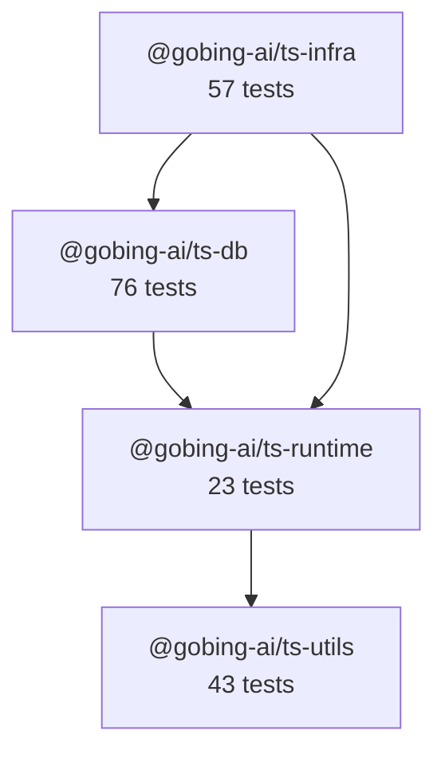

# @gobing-ai/ts-libs

[TOC]

Monorepo of TypeScript libraries — shared runtime abstractions, database layer, and infrastructure backbone for [Gobing.ai](https://gobing.ai) applications. Built on the [ts-base](https://github.com/robinmin/ts-base) template.

## Toolchain

| Tool | Version | Purpose |
|------|---------|---------|
| [Bun](https://bun.sh) | 1.3.14 | Runtime, package manager, test runner |
| [Biome](https://biomejs.dev) | 2.4.16 | Linter + formatter (no ESLint, no Prettier) |
| [TypeScript](https://www.typescriptlang.org) | 6.0 | Type checking |
| [Lefthook](https://github.com/evilmartians/lefthook) | 1.13 | Git hooks (commit-msg, pre-commit, pre-push) |
| [cocogitto](https://github.com/cocogitto/cocogitto) | 6.5 | Conventional commits + changelog generation |
| [proto](https://moonrepo.dev/proto) | — | Tool version manager (`.prototools`) |

Versions are pinned in `.prototools`. Run `proto use` once to install all toolchain binaries.

## Libraries

### Dependency Graph



### Libraries

- **[@gobing-ai/ts-utils](packages/utils/README.md)** : Shared utilities with zero dependencies — error types, date helpers, cursor-based pagination, and role-based access control.
- **[@gobing-ai/ts-runtime](packages/runtime/README.md)** : Runtime abstraction — decouples application code from Bun/Node vs Cloudflare Workers. Provides `RuntimeContext` (service locator), `FileSystem` interface, `ProcessExecutor`, Zod-validated `Config`, and `SpanContext` for distributed tracing.
- **[@gobing-ai/ts-db](packages/db/README.md)** : Database abstraction layer with Drizzle ORM — adapter pattern for Bun SQLite and Cloudflare D1, generic CRUD DAOs, job queue persistence, and migration tooling.
- **[@gobing-ai/ts-infra](packages/infra/README.md)** : Infrastructure backbone — typed event bus, job queue types, cron scheduler, OpenTelemetry telemetry, HTTP API client, and structured logging.

## Getting Started

```bash
# 1. Install toolchain (one-time)
proto use

# 2. Install dependencies
bun install

# 3. Verify everything works
bun run check
## or check with spur rules
bun run spur-check
```

## Commands

| Command | What it does |
|---------|-------------|
| `bun run check` | Full gate: lint (Biome + tsc) → test (all workspaces, parallel) |
| `bun run lint` | Biome check + `tsc --noEmit` across all packages |
| `bun run format` | Biome auto-fix (`--write`) |
| `bun run autofix` | Format then type-check |
| `bun run test` | Run all tests in parallel across workspaces |
| `bun run typecheck` | `tsc --noEmit` across all packages |
| `bun run build` | Build all packages (build order respects dependency graph) |

### Release commands

| Command | What it does |
|---------|-------------|
| `bun run bump-ver <version>` | Bump every workspace manifest to `<version>`, commit (`chore(release):`), and create annotated tags — then stop for review. Packages are discovered dynamically from the `workspaces` globs. |
| `bun run bump-ver <version> --push` | Same, then push the branch and tags (tags as their own push event), triggering the Publish workflow. One-command release. |
| `bun run drop-tags <version>` | Delete the release git tags for `<version>` **locally**. |
| `bun run drop-tags <version> --remote` | Also delete those tags on `origin`. Use to recover from a mis-pushed release tag. |

Releases publish from GitHub Actions via npm Trusted Publishing when the aggregate `@gobing-ai/ts-libs-v<version>` tag is pushed. Per-package tags are still created for traceability, but only the aggregate tag triggers one Publish workflow run — `bump-ver --push` handles all of this. See [docs/PACKAGE_RELEASE.md](docs/PACKAGE_RELEASE.md) for the full flow.

Build and release automation is routed through [`scripts/builder.ts`](scripts/README.md). Shared constants live in `scripts/config.ts`; reusable helpers live in `scripts/lib/`.

### Per-package commands

```bash
cd packages/db
bun run check    # lint + test for this package only
bun run build    # bun build + tsc declarations
```

## Project Structure

```
ts-libs/
├── packages/
│   ├── utils/       # @gobing-ai/ts-utils      (zero deps)
│   ├── runtime/     # @gobing-ai/ts-runtime     (→ utils)
│   ├── db/          # @gobing-ai/ts-db           (→ runtime)
│   └── infra/       # @gobing-ai/ts-infra        (→ runtime, db)
├── tooling/
│   └── typescript/  # shared tsconfig base
├── .prototools      # tool version pins
├── biome.json       # linter + formatter config
├── bun.lock         # dependency lockfile
└── package.json     # workspace root
```

## Adding a New Library

All libraries are scaffolded from [ts-base](https://github.com/robinmin/ts-base) and follow its `lib` mode conventions. Each package shares the same toolchain (Bun, Biome, TypeScript), directory layout (`src/`, `tests/`), and scripts (`build`, `test`, `typecheck`, `lint`, `check`).

### Step 1 — Scaffold from ts-base

```bash
cd packages
bunx degit robinmin/ts-base <new-lib>
cd <new-lib>
```

This pulls the latest ts-base template (all four modes).

### Step 2 — Promote the library scaffold

```bash
bun install
bun run setup   # choose "Library" when prompted
```

After setup, `src-lib/` is promoted to the project root, the other scaffolds (`src-app`, `src-cli`, `src-monorepo`) are deleted, and the `package.json` is rewritten with library-mode scripts. You end up with:

```
packages/<new-lib>/
├── src/
│   ├── index.ts        # barrel (public API)
│   ├── internal.ts     # runtime-agnostic core logic
│   ├── browser.ts      # browser entry point
│   └── types.ts        # shared types
├── tests/
│   └── index.test.ts
├── package.json        # pre-configured with build/test/check scripts
├── tsconfig.json
├── tsconfig.build.json
└── README.md
```

### Step 3 — Adapt for the monorepo

```bash
# Remove ts-base root files — monorepo provides its own
rm -rf .github .prototools biome.json lefthook.yml tsconfig.json .gitignore .git

# Point tsconfig to the monorepo's shared base
cat > tsconfig.json << 'EOF'
{
    "extends": "../../tooling/typescript/base.json",
    "include": ["src/**/*.ts", "tests/**/*.ts"]
}
EOF

# Remove ts-base-specific scripts that don't apply
# Keep: build, test, typecheck, lint, format, check
```

### Step 4 — Customize the package

Edit `package.json`:

```json
{
    "name": "@gobing-ai/ts-<name>",
    "description": "<one-line description>",
    "dependencies": {
        "@gobing-ai/ts-runtime": "^0.1.0"
    },
    "devDependencies": {
        "@types/bun": "1.3.14"
    }
}
```

- Set `name` to `@gobing-ai/ts-<name>` following the monorepo convention.
- Add `dependencies` and `peerDependencies` as needed.
- Remove ts-base devDependencies that the monorepo root already provides (`@biomejs/biome`, `lefthook`, `typescript`).
- Keep scripts (`build`, `test`, `typecheck`, `lint`, `check`) — they work unchanged.

### Step 5 — Install and verify

```bash
# From the ts-libs root
bun install           # picks up the new workspace automatically
cd packages/<new-lib>
bun run check         # lint + test
```

The monorepo's `packages/*` workspace glob picks up the new directory automatically. No root `package.json` changes needed unless the new package has a build-order dependency.

### Step 6 — Wire into the build order (optional)

If the new library is a dependency of other packages, add it to the root build scripts:

```json
{
    "scripts": {
        "build": "... && bun run --filter @gobing-ai/ts-<name> build && ...",
        "typecheck": "... && bun run --filter @gobing-ai/ts-<name> typecheck && ..."
    }
}
```

### Package template checklist

| Item | Required | Notes |
|------|----------|-------|
| `src/index.ts` | Yes | Barrel — export all public API here |
| `tests/*.test.ts` | Yes | Use `bun:test`, ≥ 90% coverage target |
| `README.md` | Yes | Overview, architecture diagram (Mermaid), usage |
| `package.json` | Yes | `name`, `dependencies`, `peerDependencies`, clean devDeps |
| `tsconfig.json` | Yes | Extends `../../tooling/typescript/base.json` |
| `tsconfig.build.json` | Yes | Declaration emit config (kept from scaffold) |

## Development

### Conventional Commits

This project enforces [Conventional Commits](https://www.conventionalcommits.org/) via Lefthook + cocogitto. Each commit message must follow:

```
type(scope): description

feat(ts-db): add batch insert to QueueJobDao
fix(ts-infra): resolve AbortSignal memory leak in APIClient
chore: bump dependencies
```

### Git Hooks

| Hook | Action |
|------|--------|
| `commit-msg` | cocogitto validates commit message format |
| `pre-commit` | Biome checks staged files |
| `pre-push` | Full `bun run check` gate |

### Code Style

4-space indent, 120-char line width, single quotes, semicolons, trailing commas. Enforced by `biome.json` — no configuration drift.

## References

- [ts-base](https://github.com/robinmin/ts-base) — Project template
- [Bun](https://bun.sh/docs) — Runtime & test runner
- [Biome](https://biomejs.dev/guides/getting-started/) — Linter & formatter
- [Drizzle ORM](https://orm.drizzle.team/docs/overview) — SQL toolkit
- [OpenTelemetry JS](https://opentelemetry.io/docs/languages/js/) — Observability framework
