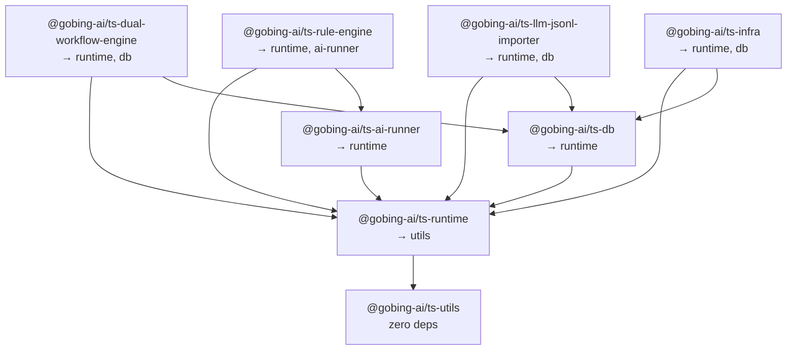

# @gobing-ai/ts-libs

[TOC]

Monorepo of TypeScript libraries — shared runtime abstractions, database facade, infrastructure backbone, workflow engines, and AI tooling for [Gobing.ai](https://gobing.ai) applications.

## Toolchain

| Tool | Version | Purpose |
|------|---------|---------|
| [Bun](https://bun.sh) | 1.3.14 | Runtime, package manager, test runner |
| [Biome](https://biomejs.dev) | 2.4.16 | Linter + formatter (no ESLint, no Prettier) |
| [TypeScript](https://www.typescriptlang.org) | 6.0 | Type checking |
| [Lefthook](https://github.com/evilmartians/lefthook) | 1.13 | Git hooks (commit-msg, pre-commit, pre-push) |
| [spur](https://github.com/gobing-ai/spur) | — | Architecture rule gate + quality enforcement |
| [proto](https://moonrepo.dev/proto) | — | Tool version manager (`.prototools`) |

Versions are pinned in `.prototools`. Run `proto use` once to install all toolchain binaries.

## Libraries

### Dependency Graph


```mermaid
graph TD
    utils["@gobing-ai/ts-utils<br/>zero deps"]
    runtime["@gobing-ai/ts-runtime<br/>→ utils"]
    db["@gobing-ai/ts-db<br/>→ runtime"]
    ai-runner["@gobing-ai/ts-ai-runner<br/>→ runtime"]
    rule-engine["@gobing-ai/ts-rule-engine<br/>→ runtime, ai-runner"]
    dual["@gobing-ai/ts-dual-workflow-engine<br/>→ runtime, db"]
    importer["@gobing-ai/ts-llm-jsonl-importer<br/>→ runtime, db"]
    infra["@gobing-ai/ts-infra<br/>→ runtime, db"]

    runtime --> utils
    db --> runtime
    ai-runner --> runtime
    rule-engine --> runtime
    rule-engine --> ai-runner
    dual --> runtime
    dual --> db
    importer --> runtime
    importer --> db
    infra --> runtime
    infra --> db
```

**592 tests across 8 packages.** All pass. No skipped.

### Core Packages

- **[@gobing-ai/ts-utils](packages/utils/README.md)** — Zero-dependency utilities: error types, date helpers, cursor-based pagination, role-based access control, API response envelopes, and output helpers.
- **[@gobing-ai/ts-runtime](packages/runtime/README.md)** — Runtime abstraction decoupling application code from Bun/Node vs Cloudflare Workers. Provides `RuntimeContext` (service locator), `FileSystem` interface, `ProcessExecutor`, Zod-validated `Config` loader, and `SpanContext` for distributed tracing.
- **[@gobing-ai/ts-db](packages/db/README.md)** — **Drizzle-free** database facade. Adapters for Bun SQLite and Cloudflare D1. `BaseDao` (raw-tier queries over predicate spec), `EntityDao` (typed CRUD), `defineTable` (single-source-of-truth table + Zod schemas), migration tooling, and `QueueJobDao`. Drizzle is an internal detail — consumers never import it. **v0.2.0 — breaking facade rewrite.**
- **[@gobing-ai/ts-infra](packages/infra/README.md)** — Infrastructure backbone: typed event bus, job queue types, cron scheduler, OpenTelemetry telemetry, HTTP API client, and structured logging.

### AI & Workflow Packages

- **[@gobing-ai/ts-ai-runner](packages/ai-runner/README.md)** — Coding-agent command shims, detection heuristics, doctor checks, and prompt execution for Bun/Node CLIs.
- **[@gobing-ai/ts-rule-engine](packages/rule-engine/README.md)** — Constraint rule schemas, preset loading, evaluator orchestration, and result formatting. Powers `spur` and quality gates.
- **[@gobing-ai/ts-dual-workflow-engine](packages/dual-workflow-engine/README.md)** — Standalone workflow runtime combining state-machine and transition-flow engines. Owns workflow definition loading, validation, variable resolution, action execution, persistence schema, and driver loops.
- **[@gobing-ai/ts-llm-jsonl-importer](packages/llm-jsonl-importer/README.md)** — Generic JSONL importer for LLM agent history files. Handles schema validation, source definitions, content redaction, hash-based deduplication, and checkpointed incremental imports.

## Getting Started

```bash
# 1. Install toolchain (one-time)
proto use

# 2. Install dependencies
bun install

# 3. Verify everything works
bun run spur-check
```

## Commands

| Command | What it does |
|---------|-------------|
| `bun run spur-check` | **Canonical gate:** lint (Biome + per-package tsc) → test (coverage) → spur rules (`recommended` + `spur-dev`, `--fail-on warning`) |
| `bun run check` | Quick gate: lint + test (no spur rules) |
| `bun run lint` | Biome check + per-package `tsc --noEmit` |
| `bun run format` | Biome auto-fix (`--write`) |
| `bun run autofix` | Format then type-check |
| `bun run test` | Run all tests in parallel across workspaces |
| `bun run typecheck` | Per-package `tsc --noEmit` in dependency order |
| `bun run build` | Per-package build in dependency order + `dist` smoke-import |

### Release commands

| Command | What it does |
|---------|-------------|
| `bun run bump-ver <version>` | Bump every workspace manifest to `<version>`, commit (`chore(release):`), and create annotated tags — then stop for review. Packages are discovered dynamically from workspace globs. |
| `bun run bump-ver <version> --push` | Same, then push the branch and tags (tags as their own push event), triggering the Publish workflow. |
| `bun run drop-tags <version>` | Delete the release git tags for `<version>` **locally**. |
| `bun run drop-tags <version> --remote` | Also delete those tags on `origin`. |

Releases publish from GitHub Actions via npm Trusted Publishing (OIDC) when the aggregate `@gobing-ai/ts-libs-v<version>` tag is pushed. Internal dependencies use `workspace:*` in source, resolved to `^<version>` during publish. See [docs/PACKAGE_RELEASE.md](docs/PACKAGE_RELEASE.md) for the full flow.

Build and release automation is routed through [`scripts/builder.ts`](scripts/README.md). Shared constants live in `scripts/config.ts`; reusable helpers live in `scripts/lib/`.

### Per-package commands

```bash
cd packages/db
bun run check    # lint + test for this package only
bun run build    # bun build + tsc declarations
```

## Architecture

### Lockstep Versioning

All packages share the same version number. A single `bun run bump-ver` bumps every manifest. This keeps the monorepo's releases cohesive — a version number describes a snapshot of all packages at once. Per-package tags are created for traceability; the aggregate `@gobing-ai/ts-libs-v<version>` tag triggers the publish workflow.

### Internal Dependencies: `workspace:*`

Every internal `@gobing-ai/ts-*` dependency declares `workspace:*` — never a hand-written version range. Bun resolves these locally; the publish step rewrites them to `^<version>`. This eliminates version drift. Enforced by spur rules and ADR-002.

### Cross-Package Type Checking

Each package declares `compilerOptions.paths` mapping `@gobing-ai/ts-<pkg>` → `../<pkg>/src/index`, so `tsc` typechecks against live sibling source — catching cross-package breakage immediately.

### Drizzle Containment

`drizzle-orm` is internal to `ts-db`. No other package may import it. Consumers use the `BaseDao`/`EntityDao` facade + predicate spec. Enforced by the `db-boundaries` spur rule (ADR-005).

### Quality Gates

`bun run spur-check` is the canonical gate. Architectural invariants live as spur rules under `.spur/rules/`, making them checked guarantees rather than review habits (ADR-006).

See [docs/00_ADR.md](docs/00_ADR.md) for all architecture decisions.

## Project Structure

```
ts-libs/
├── packages/
│   ├── utils/                  # @gobing-ai/ts-utils         (zero deps)
│   ├── runtime/                # @gobing-ai/ts-runtime        (→ utils)
│   ├── db/                     # @gobing-ai/ts-db             (→ runtime)
│   ├── infra/                  # @gobing-ai/ts-infra          (→ runtime, db)
│   ├── ai-runner/              # @gobing-ai/ts-ai-runner      (→ runtime)
│   ├── rule-engine/            # @gobing-ai/ts-rule-engine    (→ runtime, ai-runner)
│   ├── dual-workflow-engine/   # @gobing-ai/ts-dual-workflow-engine  (→ runtime, db)
│   └── llm-jsonl-importer/     # @gobing-ai/ts-llm-jsonl-importer    (→ runtime, db)
├── tooling/
│   └── typescript/             # shared tsconfig base
├── .spur/
│   └── rules/                  # architecture rule presets
├── docs/
│   ├── 00_ADR.md               # architecture decision record (authoritative)
│   └── PACKAGE_RELEASE.md      # release flow details
├── scripts/                    # build, release, and workspace utilities
├── .prototools                 # tool version pins
├── biome.json                  # linter + formatter config
├── bun.lock                    # dependency lockfile
└── package.json                # workspace root
```

## Development

### Conventional Commits

This project enforces [Conventional Commits](https://www.conventionalcommits.org/) via Lefthook. Each commit message must follow:

```
type(scope): description

feat(ts-db): add batch insert to QueueJobDao
fix(ts-infra): resolve AbortSignal memory leak in APIClient
chore: bump dependencies
```

### Git Hooks

| Hook | Action |
|------|--------|
| `commit-msg` | Validates conventional commit format |
| `pre-commit` | Biome checks staged files |
| `pre-push` | Full `bun run check` gate |

### Code Style

4-space indent, 120-char line width, single quotes, semicolons, trailing commas. Enforced by `biome.json` — no configuration drift.

## References

- [Bun](https://bun.sh/docs) — Runtime & test runner
- [Biome](https://biomejs.dev/guides/getting-started/) — Linter & formatter
- [Drizzle ORM](https://orm.drizzle.team/docs/overview) — SQL toolkit (internal to ts-db)
- [OpenTelemetry JS](https://opentelemetry.io/docs/languages/js/) — Observability framework
- [spur](https://github.com/gobing-ai/spur) — Architecture rule engine
