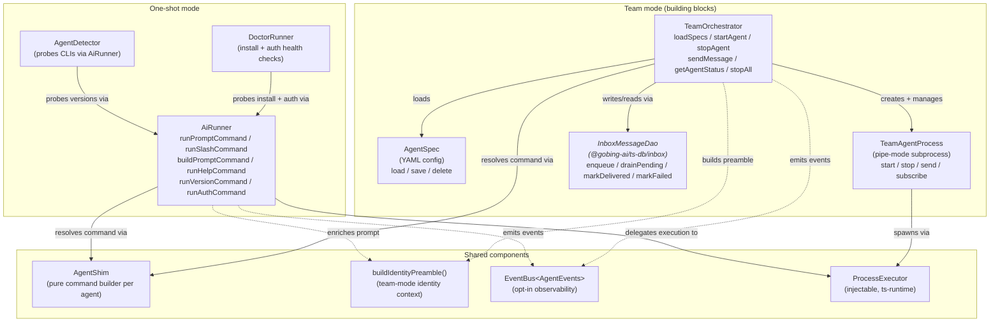
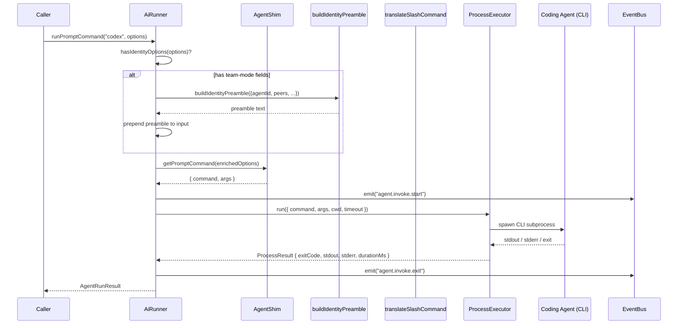
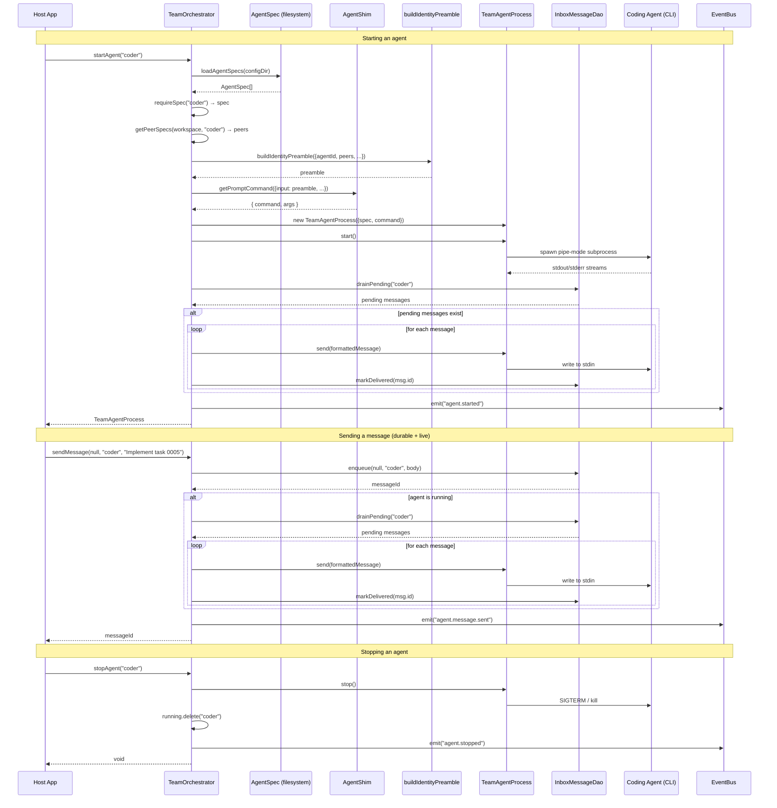

# @gobing-ai/ts-ai-runner

Coding-agent command shims, installation detection, doctor checks, slash-command translation, identity preamble construction, and team-mode orchestration for downstream CLIs.

## Installation

```bash
bun add @gobing-ai/ts-ai-runner
```

## What It Provides

`ts-ai-runner` normalizes the command-line surface of common coding agents so application code can work with stable TypeScript APIs instead of hard-coded executable arguments.

| Export | Purpose |
|--------|---------|
| `AiRunner` | Runs help, version, auth, prompt, and slash commands through a pluggable process executor; can also build a prompt command without executing it. Emits typed events via optional `EventBus<AgentEvents>`. |
| `AgentDetector` | Probes supported agent CLIs and parses version output |
| `DoctorRunner` | Combines installation and authentication checks into a usability report |
| `getAgentShim()` | Returns the pure command builder for one supported agent (resolves aliases to canonical) |
| `resolveAgentName()` | Maps a canonical id or alias to its canonical `AgentName`; warns on deprecated/alias ids |
| `buildAgentCommand()` | Shared command-build seam (identity preamble + shim dispatch) used by both one-shot and team paths |
| `translateSlashCommand()` | Converts Claude-style `/plugin:command` inputs to each agent's dialect |
| `isClaudeStyleSlashCommand()` | Tests whether input matches the `/plugin:command` pattern |
| `buildIdentityPreamble()` / `getGitContext()` | Builds team-mode identity, communication context, and git metadata for prompts |
| `loadAgentSpecs()` / `saveAgentSpec()` / `deleteAgentSpec()` | Persist agent definitions as YAML-compatible config |
| `validateAgentId()` | Enforces agent ID format rules |
| `formatMessage()` | Renders `InboxMessage` into the line injected into an agent's stdin pipe |
| `TeamAgentProcess` | Manages a long-running agent subprocess with pipe-mode stdin/stdout |
| `TeamOrchestrator` | Loads specs, starts/stops agents, routes durable/live messages, and emits lifecycle events |
| `AgentEvents` / `AiRunnerProcessEvents` | Typed event maps for agent and process-level observability |
| `AGENT_SHIMS` / `TIER1_PRIORITY` / `TIER2_AGENTS` / `DISPLAY_ORDER` | Agent registry constants |
| `isAgentName()` | Type guard for supported agent identifiers |

Supported agent identifiers: `claude`, `codex`, `gemini` (deprecated), `pi`, `omp`, `opencode`, `antigravity-cli`, `openclaw`, `hermes`, `grok`. The `antigravity` id is a deprecated alias of `antigravity-cli`. See [Deprecation & Aliases](#deprecation--aliases).

## Architecture



### One-shot prompt flow


`runSlashCommand()` follows the same path with an extra step: it calls `translateSlashCommand()` to convert the slash input to the target agent's dialect before delegating to `runPromptCommand()`.

### Team mode lifecycle



Key design decisions:

- **Shims are pure**: `AgentShim` produces `{ command, args }` without touching the filesystem or launching processes. All side effects live in `AiRunner` and `TeamAgentProcess`.
- **ProcessExecutor is injectable**: tests inject a stub executor; production uses `NodeProcessExecutor` (or the Bun pipe-process seam for team mode).
- **Events are opt-in**: `AiRunnerOptions.events` and `TeamOrchestratorOptions.events` accept an `EventBus<AgentEvents>` for structured observability. Without it, the runner is silent.
- **Team mode is composable**: `AgentSpec`, `TeamAgentProcess`, and `TeamOrchestrator` are small building blocks. `InboxMessageDao` from `@gobing-ai/ts-db/inbox` handles persistence directly — no adapter class. Downstream apps compose them into their own orchestration layer.

The package depends on `@gobing-ai/ts-runtime` for process execution, `@gobing-ai/ts-db` for team-mode inbox types, and `@gobing-ai/ts-infra` for structured logging and EventBus. The target agent CLIs are not bundled; install them separately in the host environment.

## Detect Installed Agents
```ts
import { AgentDetector } from '@gobing-ai/ts-ai-runner';

const detector = new AgentDetector({ timeout: 5_000 });
const agents = await detector.detectAll();

for (const agent of agents) {
    console.log(agent.name, agent.installed, agent.version, agent.error);
}
```

Probe a single agent when you already know the target:

```ts
const codex = await detector.detectOne('codex');
if (!codex.installed) {
    throw new Error(codex.error ?? 'codex is not installed');
}
```

Unknown agent names are reported as unavailable rather than throwing.

## Run Agent Commands

```ts
import { AiRunner } from '@gobing-ai/ts-ai-runner';

const runner = new AiRunner({
    defaultCwd: '/workspace/project',
    defaultTimeout: 60_000,
});

const result = await runner.runPromptCommand('codex', {
    input: 'Review packages/runtime/src/fs.ts',
    model: 'gpt-5',
    mode: 'text',
});

if (result.exitCode !== 0) {
    throw new Error(result.stderr);
}

console.log(result.stdout);
```

`AiRunner` captures `stdout`, `stderr`, `exitCode`, optional termination `signal`, and `durationMs`. It does not throw on non-zero agent exits; callers decide how to handle failures.

Every invocation is logged through an injectable logger (`getLogger('ai-runner')` by default): one `debug` line per dispatch and an `error` line on any non-zero exit. Pass a custom `logger` to the constructor to route diagnostics elsewhere or silence them in tests.

### Slash commands and command preview

`runSlashCommand()` translates a Claude-style `/plugin:command args` input into the target agent's dialect (via `translateSlashCommand()`) and dispatches it as a prompt. Non-slash input passes through unchanged.

```ts
// For codex, "/review:pr 123" becomes "$review-pr 123" before dispatch.
await runner.runSlashCommand('codex', '/review:pr 123', { model: 'gpt-5' });
```

`buildPromptCommand()` returns the resolved `{ command, args }` **without** executing it — useful for previewing, logging, or dry-running the exact argv a prompt would dispatch. It applies the same identity-preamble enrichment as `runPromptCommand()`.

```ts
const { command, args } = runner.buildPromptCommand('pi', { input: 'ship it', mode: 'json' });
// command === 'pi', args === ['--no-session', '-p', 'ship it', '--mode', 'json']
```

### Team identity preambles

`PromptOptions` accepts optional team-mode fields. When any of `purpose`, `systemPrompt`, `taskId`, or non-empty `peers` is supplied, `AiRunner` prepends an identity preamble before dispatching the prompt through the selected agent shim.

```ts
await runner.runPromptCommand('codex', {
    input: 'Implement the inbox DAO tests',
    taskId: '0005',
    purpose: 'Implement scoped code changes',
    systemPrompt: 'Follow repository AGENTS.md rules.',
    peers: [{ id: 'planner', type: 'claude', purpose: 'Plan implementation work' }],
});
```

Use `buildIdentityPreamble()` directly when a host app needs to preview or inject the same context outside `AiRunner`:

```ts
import { buildIdentityPreamble } from '@gobing-ai/ts-ai-runner';

const preamble = buildIdentityPreamble({
    agentId: 'coder',
    agentType: 'codex',
    workspace: '/workspace/spur',
    taskId: '0005',
    taskTitle: 'Implement team mode primitives',
    purpose: 'Make focused code changes',
    peers: [{ id: 'reviewer', type: 'claude', purpose: 'Review correctness and risk' }],
    guardrails: ['Do not commit without operator approval.'],
});
```

Use `getGitContext()` to auto-detect the current branch and dirty state:

```ts
import { getGitContext } from '@gobing-ai/ts-ai-runner';

const gitBlock = getGitContext('/workspace/spur');
// "Git context:\nbranch: feat/team-mode\ndirty: 3 files"
```

## Observability

`AiRunner` and `TeamOrchestrator` emit typed events when an `EventBus<AgentEvents>` is provided:

```ts
import { AiRunner } from '@gobing-ai/ts-ai-runner';
import { EventBus } from '@gobing-ai/ts-infra';
import type { AgentEvents } from '@gobing-ai/ts-ai-runner';

const bus = new EventBus<AgentEvents>();
bus.on('agent.invoke.start', (data) => console.log('starting', data.label));
bus.on('agent.invoke.exit', (data) => console.log('done', data.label, data.exitCode, data.durationMs));

const runner = new AiRunner({ events: bus });
```

Available events:

| Event | When |
|-------|------|
| `agent.invoke.start` | Immediately before an agent CLI invocation starts |
| `agent.invoke.exit` | After an agent CLI invocation exits |
| `agent.started` | When a long-running team agent process starts |
| `agent.stopped` | When a long-running team agent process stops |
| `agent.message.sent` | When a message is sent to a team agent process |

`AiRunnerOptions.processEvents` accepts a separate `EventBus<AiRunnerProcessEvents>` for process-level events from the underlying executor.

## Inject a Process Executor

For tests, dry runs, or sandboxed launchers, inject a `ProcessExecutor` from `@gobing-ai/ts-runtime`:

```ts
import type { ProcessExecutor } from '@gobing-ai/ts-runtime';
import { AiRunner } from '@gobing-ai/ts-ai-runner';

const processExecutor: ProcessExecutor = {
    async run(options) {
        return {
            exitCode: 0,
            stdout: `${options.command} ${options.args.join(' ')}`,
            stderr: '',
            durationMs: 1,
        };
    },
};

const runner = new AiRunner({ processExecutor });
```

## Doctor Checks

`DoctorRunner` verifies both installation and authentication state. Auth checks use each agent's native command when available, and known credential files or environment variables when the CLI has no auth-status command.

```ts
import { DoctorRunner } from '@gobing-ai/ts-ai-runner';

const doctor = new DoctorRunner();
const report = await doctor.runAll();

const usable = report.filter((agent) => agent.usable);
```

Each result includes:

```ts
interface DoctorResult {
    agent: string;
    installed: boolean;
    version: string | null;
    authenticated: boolean;
    usable: boolean;
    tier: 1 | 2;
    channels: string[];
    error: string | null;
}
```

Tier `1` agents support direct prompt-style CLI execution. Tier `2` agents are gateway or TUI constrained and may require adapter logic in the downstream app.

## Slash Command Translation

Claude-style plugin commands use `/plugin:command args`. Other agents expose different command syntaxes. Use `translateSlashCommand()` before sending user-entered slash commands to a target agent:

```ts
import { translateSlashCommand } from '@gobing-ai/ts-ai-runner';

translateSlashCommand('claude', '/rd3:dev-fixall bun run check');
// /rd3:dev-fixall bun run check

translateSlashCommand('codex', '/rd3:dev-fixall bun run check');
// $rd3-dev-fixall bun run check

translateSlashCommand('pi', '/rd3:dev-fixall bun run check');
// /skill:rd3-dev-fixall bun run check
```

Non-slash input is returned unchanged. Use `isClaudeStyleSlashCommand()` to test input before translation.

## Command Shims

If you need to inspect command construction without launching a process, use the pure shim API:

```ts
import { getAgentShim } from '@gobing-ai/ts-ai-runner';

const shim = getAgentShim('codex');
const command = shim.getPromptCommand({ input: 'Summarize this repository' });

console.log(command.command, command.args);
```

Each shim implements the `AgentShim` interface:

```ts
interface AgentShim {
    readonly name: AgentName;
    readonly command: string;
    readonly tier: 1 | 2;
    readonly aliases?: readonly string[];
    readonly deprecated?: { readonly since: string; readonly replacedBy?: AgentName };
    getHelpCommand(): ShimCommand;
    getVersionCommand(): ShimCommand;
    getPromptCommand(options: PromptOptions): ShimCommand;
    getAuthCommand(): ShimCommand | null;
}
```

Agent-specific behavior:

| Agent | CLI | Tier | Auth check | Prompt flags |
|-------|-----|------|------------|--------------|
| `claude` | `claude` | 1 | `claude auth status` | `-p`, `--continue`, `--model`, `--output-format` |
| `codex` | `codex` | 1 | `codex login status` | `exec <prompt>`, `exec resume --last`, `-m`, `--json` |
| `gemini` *(deprecated)* | `gemini` | 1 | env-only | `-p`, `-r latest` (resume), `-m`, `-o` |
| `pi` | `pi` | 1 | `pi --list-models` | `--no-session`, `-p`, `-c` (resume), `--model`, `--mode` |
| `omp` | `omp` | 1 | `omp --list-models` | `--no-session`, `-p`, `-c` (resume), `--model`, `--mode` |
| `opencode` | `opencode` | 1 | `opencode providers` | `run`, `-c`, `-m`, `--format json` |
| `antigravity-cli` | `agy` | 1 | env-only | `-p`, `--continue`, `--model` |
| `openclaw` | `openclaw` | 2 | `openclaw health` | `agent --local -m` |
| `hermes` | `hermes` | 1 | `hermes doctor` | `chat -q`, `--continue`, `-m` |
| `grok` | `grok` | 1 | env/file (`XAI_API_KEY` or `~/.grok/auth.json`) | `-p`, `-c` (resume), `-m`, `--output-format plain\|json` (maps ai-runner `text` → `plain`) |

This is the right layer for UI previews, audit logging, and custom launchers.

## Deprecation & Aliases

The registry carries lifecycle metadata so agent ids can be retired without breaking existing callers.

**`resolveAgentName(input)`** maps any canonical id or alias to its canonical `AgentName`. Resolving a deprecated or aliased id emits exactly one `warn` through the logger seam and never throws.

```ts
import { resolveAgentName } from '@gobing-ai/ts-ai-runner';

resolveAgentName('antigravity');     // → 'antigravity-cli' (alias), warns
resolveAgentName('gemini');          // → 'gemini' (deprecated canonical), warns
resolveAgentName('antigravity-cli'); // → 'antigravity-cli' (canonical, no warn)
resolveAgentName('cursor');          // → undefined
```

**Current deprecation map:**

| Id | Status | Canonical | Notes |
|----|--------|-----------|-------|
| `antigravity` | alias of `antigravity-cli` | `antigravity-cli` | Old tier-2 id; both use binary `agy`. Resolving warns. |
| `gemini` | deprecated | `gemini` (self) → replaced by `antigravity-cli` | Gemini CLI sunset 2026-06-18. Shim stays functional. |
| `omp` | canonical | `omp` | First-class; NOT a pi alias. |
| `hermes` | canonical | `hermes` | First-class; OpenClaw-compatible but distinct binary. |
| `grok` | canonical | `grok` | Grok Build CLI; headless via `-p`; auth is env/file only (no status verb). |

`getAgentShim()` and `isAgentName()` are alias-aware: passing `'antigravity'` resolves to the `antigravity-cli` shim. `DoctorResult` and `DetectedAgent` surface `deprecated` + `replacedBy` when the resolved canonical id is marked deprecated.


## Team Mode Primitives

The team-mode APIs are intentionally small building blocks. They do not implement an HTTP API, dashboard, or product workflow; downstream apps compose them into their own orchestration layer.

### Agent specs

Agent specs define agents as config. The built-in parser supports the repository's constrained YAML subset: scalars, arrays, nested objects, and no anchors/tags/multiline scalars.

```ts
import { loadAgentSpecs, saveAgentSpec } from '@gobing-ai/ts-ai-runner';

await saveAgentSpec(
    {
        id: 'coder',
        name: 'Coder',
        type: 'codex',
        workspace: '/workspace/spur',
        purpose: 'Implement scoped code changes',
        tags: ['code'],
        config: { model: 'gpt-5', systemPrompt: 'Follow repository rules.' },
        autoStart: true,
    },
    './agents',
);

const specs = loadAgentSpecs('./agents');
```

`validateAgentId()` enforces lowercase agent ids with alphanumeric, `_`, and `-` characters (2–64 chars). `deleteAgentSpec()` removes a spec file by id.

### Durable messages

`InboxMessageDao` from `@gobing-ai/ts-db/inbox` persists directed inter-agent messages.
`TeamOrchestrator` consumes the DAO directly — there is no `MessageService` adapter class.
Consumers compose `InboxMessageDao` + `EventBus<InboxMessageEvents>` directly:

```ts
import { type BusLifecycleEvents, EventBus } from '@gobing-ai/ts-infra';
import { InboxMessageDao, type InboxMessageEvents } from '@gobing-ai/ts-db/inbox';
import { formatMessage } from '@gobing-ai/ts-ai-runner';

const lifecycleBus = new EventBus<BusLifecycleEvents>();
const events = new EventBus<InboxMessageEvents>({ lifecycleBus });
const inbox = new InboxMessageDao(adapter, { events });

const id = await inbox.enqueue(null, 'coder', 'Review the runtime process seam');
const pending = await inbox.drainPending('coder');

for (const msg of pending) {
    console.log(formatMessage(msg));
    await inbox.markDelivered(msg.id);
}
```

Message lifecycle events are metadata-only and do not include the durable message body. A
`message.failed` event does include the caller-provided error string; pre-redact it when the
lifecycle bus is attached to persistent System Events observers.

### Persistent agent processes

`TeamAgentProcess` wraps a long-running agent subprocess using the runtime pipe-process seam. It supports start/stop, stdin sends, stdout/stderr subscriptions, status, pid, and exit-code queries.

```ts
import { TeamAgentProcess, type AgentSpec } from '@gobing-ai/ts-ai-runner';

const spec: AgentSpec = {
    id: 'coder',
    name: 'Coder',
    type: 'codex',
    workspace: '/workspace/spur',
    purpose: 'Implement scoped code changes',
    tags: [],
    config: {},
};

const process = new TeamAgentProcess({
    spec,
    command: ['codex', 'exec', 'You are coder. Wait for inbox messages.'],
});

const unsubscribe = process.subscribe((chunk) => {
    console.log(chunk.toString());
});

await process.start();
await process.send('[task from=operator id=msg-1] Inspect packages/db');
await process.stop();
unsubscribe();
```

### Team orchestrator

`TeamOrchestrator` connects specs, shims, processes, and messages. On start it loads an agent spec, builds the agent command through the matching shim, starts the process, drains pending inbox messages, and injects them live. `sendMessage()` always persists first, then injects immediately when the target agent is running.

```ts
import { type BusLifecycleEvents, EventBus } from '@gobing-ai/ts-infra';
import { InboxMessageDao, type InboxMessageEvents } from '@gobing-ai/ts-db/inbox';
import { TeamOrchestrator } from '@gobing-ai/ts-ai-runner';

const lifecycleBus = new EventBus<BusLifecycleEvents>();
const events = new EventBus<InboxMessageEvents>({ lifecycleBus });
const inbox = new InboxMessageDao(adapter, { events });
const team = new TeamOrchestrator('./agents', inbox, { lifecycleBus });

await team.startAgent('coder');
await team.sendMessage(null, 'coder', 'Please implement task 0005');

console.log(await team.getAgentStatus('coder')); // running

await team.stopAll();
```

The orchestrator also provides `restartAgent(id)`, `getRunningAgents()`, `getPeerSpecs(workspace, excludeId?)`, and `on(event, listener)` for event subscription.

## Adding a New Coding Agent

To add support for a new coding agent (e.g. `amp`), follow these steps:

### 1. Add the shim

Edit `src/agents/shims.ts`. Add a new constant implementing the `AgentShim` interface:

```ts
const ampShim: AgentShim = {
    name: 'amp',
    command: 'amp',
    tier: 1,  // or 2 if gateway/TUI-constrained
    getHelpCommand: () => ({ command: 'amp', args: ['--help'] }),
    getVersionCommand: () => ({ command: 'amp', args: ['--version'] }),
    getPromptCommand: (options) => {
        const args = ['run', options.input ?? ''];
        if (options.continue === true) args.push('--resume');
        if (options.model !== undefined) args.push('--model', options.model);
        if ((options.mode ?? 'text') === 'json') args.push('--json');
        return { command: 'amp', args };
    },
    getAuthCommand: () => ({ command: 'amp', args: ['auth', 'status'] }),
};
```

### 2. Register the shim

In the same file, add the new agent to these three places:

```ts
// 1. The AgentName union type (canonical ids only — aliases are metadata, not union members)
export type AgentName = 'claude' | 'codex' | 'gemini' | 'pi' | 'omp' | 'opencode' | 'antigravity-cli' | 'openclaw' | 'hermes' | 'amp';

// 2. The AGENT_SHIMS registry
export const AGENT_SHIMS: Readonly<Record<AgentName, AgentShim>> = {
    // ...existing entries...
    amp: ampShim,
};

// 3. DISPLAY_ORDER (determines doctor/detector output order)
export const DISPLAY_ORDER: readonly AgentName[] = [
    'claude', 'codex', 'gemini', 'pi', 'omp', 'opencode', 'antigravity-cli', 'openclaw', 'hermes', 'amp',
];
```

If the agent is tier 1, add it to `TIER1_PRIORITY`. If tier 2 (gateway/TUI-constrained), add it to `TIER2_AGENTS`.

### 3. Add slash-command dialect (if needed)

If the agent uses a different slash-command syntax than the default `/{plugin}-{command} args` mapping, add a case to `translateSlashCommand()` in `src/slash-command.ts`.

### 4. Add auth detection (if applicable)

If the agent supports an auth-status command, `getAuthCommand()` already returns it and `DoctorRunner` will probe it automatically. For env-only or file-based auth, add a pattern to `AUTH_PATTERNS` in `src/doctor-runner.ts`.

### 5. Add tests

- **Shim tests**: add cases to `tests/agents/` verifying command construction for help, version, prompt (with and without options), and auth.
- **Detector tests**: verify `detectOne('amp')` handles version output and error cases.
- **Doctor tests**: verify auth probe for the new agent.

### Summary checklist

| Step | File | What to change |
|------|------|----------------|
| Shim | `src/agents/shims.ts` | Add `AgentShim` impl, update `AgentName`, `AGENT_SHIMS`, `DISPLAY_ORDER` |
| Tier | `src/agents/shims.ts` | Add to `TIER1_PRIORITY` or `TIER2_AGENTS` |
| Slash | `src/slash-command.ts` | Add case if dialect differs from default |
| Auth | `src/doctor-runner.ts` | Add `AUTH_PATTERNS` entry if file/env-based |
| Tests | `tests/` | Shim, detector, and doctor coverage |

After these changes, the new agent is automatically available to `AiRunner`, `AgentDetector`, `DoctorRunner`, `TeamOrchestrator`, and all downstream consumers — no further registration needed.

## Boundary Notes

- This package is a command adapter, not an agent orchestration framework.
- It does not install agent CLIs or manage credentials.
- It does not parse agent responses beyond process result capture.
- It keeps subprocess launching behind `ProcessExecutor` / `PipeProcess`, so tests can stay deterministic.
- Team-mode persistence is delegated to `@gobing-ai/ts-db/inbox`; host apps own migrations and adapter lifecycle.
- Platform APIs (`node:fs`, `node:path`, `Bun.spawn`, etc.) are confined to `@gobing-ai/ts-runtime` per ADR-011. This package accesses them through the runtime's `FileSystem`, `ProcessExecutor`, and path utilities.
