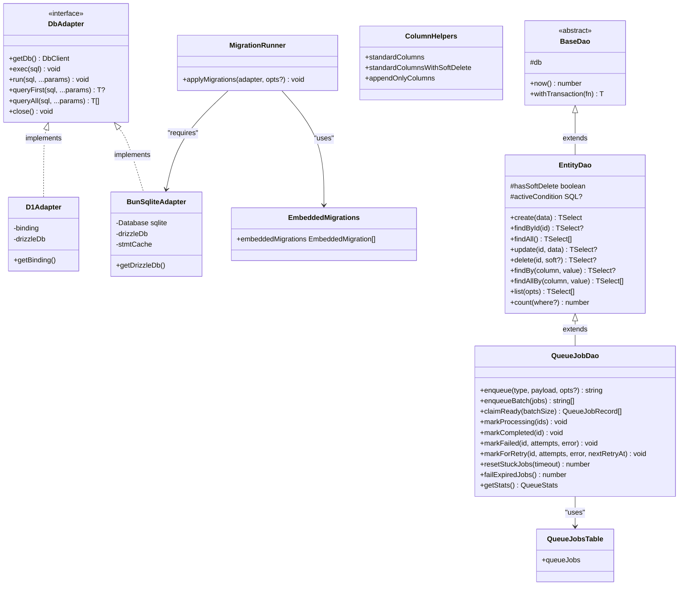

# @gobing-ai/ts-db

Database abstraction layer — adapter pattern with Drizzle ORM, generic CRUD DAOs, job queue persistence, and migration tooling. Supports Bun SQLite (in-memory and file-based) and Cloudflare D1.

## Overview

`ts-db` provides a typed database layer decoupled from any specific storage engine. The `DbAdapter` interface abstracts Bun SQLite and Cloudflare D1 behind a common API, while `BaseDao`, `EntityDao`, and `QueueJobDao` provide progressively richer data access patterns.

| Component | Purpose |
|-----------|---------|
| `DbAdapter` | Unified interface across Bun SQLite and D1 |
| `BunSqliteAdapter` | Bun SQLite implementation with statement caching and WAL pragmas |
| `D1Adapter` | Cloudflare D1 implementation (no `@cloudflare/workers-types` dependency) |
| `BaseDao` | Transaction + timestamp utilities for all DAOs |
| `EntityDao` | Generic CRUD with soft delete, pagination, and `count()` |
| `QueueJobDao` | Job queue persistence — `enqueue`, `claimReady`, `markCompleted`, `failExpiredJobs` |
| `applyMigrations` | Drizzle migration runner (file-based + embedded fallback) |
| `schema` | Reusable Drizzle column helpers + `queue_jobs` table definition |
| `SpanContext` | Re-exported from `@gobing-ai/ts-runtime` for telemetry |

## Architecture



## How It Works

### Adapter pattern

`createDbAdapter()` selects the correct implementation based on driver config:

```ts
import { createDbAdapter } from '@gobing-ai/ts-db';

// Bun SQLite (in-memory)
const adapter = await createDbAdapter({ driver: 'bun-sqlite', url: ':memory:' });

// Bun SQLite (file-based with pragmas)
const adapter = await createDbAdapter({
    driver: 'bun-sqlite',
    url: './data/app.db',
    pragmas: { journalMode: 'PRAGMA journal_mode = WAL' },
});

// Cloudflare D1
const adapter = await createDbAdapter({ driver: 'd1', binding: env.DB });
```

All adapters implement the same `DbAdapter` interface:

```ts
await adapter.exec('CREATE TABLE users (id TEXT PRIMARY KEY, name TEXT)');
await adapter.run('INSERT INTO users VALUES (?, ?)', 'u1', 'Alice');
const user = await adapter.queryFirst<{ name: string }>('SELECT name FROM users WHERE id = ?', 'u1');
const all = await adapter.queryAll<{ name: string }>('SELECT name FROM users');
```

### EntityDao — CRUD with soft delete

Define a Drizzle table, extend `EntityDao`, get full CRUD for free:

```ts
import { sqliteTable, text, integer } from 'drizzle-orm/sqlite-core';
import { EntityDao, standardColumns } from '@gobing-ai/ts-db';

const users = sqliteTable('users', {
    id: text('id').primaryKey(),
    name: text('name').notNull(),
    email: text('email').notNull(),
    ...standardColumns,
});

class UsersDao extends EntityDao<typeof users, typeof users.id> {
    constructor(db: DbClient) {
        super(db, users, users.id, 'users');
    }

    async findByEmail(email: string) {
        return this.findBy(users.email, email);
    }
}

// Usage
const dao = new UsersDao(adapter.getDb());
const user = await dao.create({ id: 'u1', name: 'Alice', email: 'a@test.com' });
const found = await dao.findById('u1');
const updated = await dao.update('u1', { name: 'Alice Updated' });
const page = await dao.list({ limit: 20, offset: 0 });
const total = await dao.count();
await dao.delete('u1'); // soft delete if table has `inUsed` column
```

**Soft delete** is automatic for tables with an `inUsed` column (from `standardColumnsWithSoftDelete`). Call `findById(id, true)` to include soft-deleted records.

### QueueJobDao — job queue persistence

```ts
import { QueueJobDao } from '@gobing-ai/ts-db';

const queue = new QueueJobDao(adapter.getDb());

// Enqueue
const jobId = await queue.enqueue('send-email', { to: 'user@test.com' }, { maxRetries: 5 });

// Consumer: claim ready jobs atomically
const jobs = await queue.claimReady(10);

for (const job of jobs) {
    try {
        await processJob(job);
        await queue.markCompleted(job.id);
    } catch (error) {
        if (job.attempts >= job.maxRetries) {
            await queue.markFailed(job.id, job.attempts + 1, String(error));
        } else {
            const retryAt = Date.now() + Math.pow(2, job.attempts) * 1000;
            await queue.markForRetry(job.id, job.attempts + 1, String(error), retryAt);
        }
    }
}

// Maintenance
await queue.resetStuckJobs(30_000); // reset stuck after 30s
await queue.failExpiredJobs(); // fail expired TTL jobs

const stats = await queue.getStats();
// → { pending: 5, processing: 2, completed: 100, failed: 3 }
```

### Migrations

```ts
import { BunSqliteAdapter, applyMigrations } from '@gobing-ai/ts-db';

const adapter = new BunSqliteAdapter({ databaseUrl: './data/app.db' });

// Applies pending migrations from drizzle/ folder (file-based)
// Falls back to embedded SQL if no folder exists (compiled binaries, CF Workers)
await applyMigrations(adapter);

// Safe to call on every startup — already-applied migrations are skipped
```

### Schema helpers

```ts
import { sqliteTable, text } from 'drizzle-orm/sqlite-core';
import { standardColumns, standardColumnsWithSoftDelete, queueJobs } from '@gobing-ai/ts-db';

// Standard columns (createdAt, updatedAt)
const docs = sqliteTable('docs', {
    id: text('id').primaryKey(),
    title: text('title').notNull(),
    ...standardColumns,
});

// With soft delete (adds inUsed column)
const projects = sqliteTable('projects', {
    id: text('id').primaryKey(),
    name: text('name').notNull(),
    ...standardColumnsWithSoftDelete,
});

// queue_jobs table is pre-built for use with QueueJobDao
```

## Usage

### Install

```bash
bun add @gobing-ai/ts-db drizzle-orm
bun add -D drizzle-kit
```

### Define your schema

```ts
// src/schema.ts
import { sqliteTable, text } from 'drizzle-orm/sqlite-core';
import { standardColumns } from '@gobing-ai/ts-db';

export const todos = sqliteTable('todos', {
    id: text('id').primaryKey(),
    title: text('title').notNull(),
    done: text('done').notNull().default('0'),
    ...standardColumns,
});
```

### Create a DAO

```ts
// src/todos-dao.ts
import type { DbClient } from '@gobing-ai/ts-db';
import { EntityDao } from '@gobing-ai/ts-db';
import { todos } from './schema';

export class TodosDao extends EntityDao<typeof todos, typeof todos.id> {
    constructor(db: DbClient) {
        super(db, todos, todos.id, 'todos');
    }

    async findPending() {
        return this.findAllBy(todos.done, '0');
    }

    async markDone(id: string) {
        return this.update(id, { done: '1' });
    }
}
```

### Wire it up

```ts
// src/index.ts
import { createDbAdapter, applyMigrations } from '@gobing-ai/ts-db';
import { TodosDao } from './todos-dao';

const adapter = await createDbAdapter({ driver: 'bun-sqlite', url: ':memory:' });
await applyMigrations(adapter);

const todos = new TodosDao(adapter.getDb());

await todos.create({ id: '1', title: 'Learn ts-db' });
await todos.create({ id: '2', title: 'Build something' });

const pending = await todos.findPending();
// → [{ id: '1', ... }, { id: '2', ... }]

await todos.markDone('1');
```

### Running with Bun

```bash
# Generate migrations
bun drizzle-kit generate

# Apply at startup
bun run src/index.ts
```
