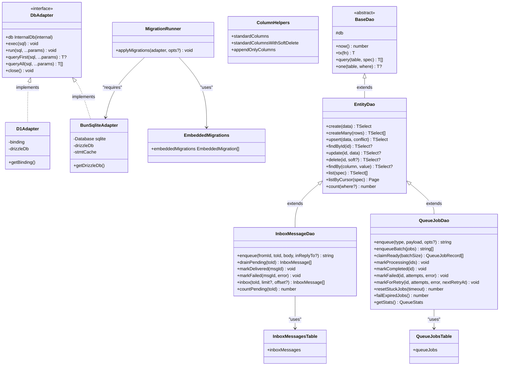

# @gobing-ai/ts-db

A **drizzle-free database facade**: typed DAOs over Bun SQLite / Cloudflare D1, a small predicate query spec, single-source-of-truth tables, and migration tooling. Drizzle ORM powers it internally but never appears in your application code — so the storage layer is swappable without touching call sites.

> **v0.2.x is a breaking redesign from 0.1.x.** The public `DbClient` interface and `adapter.getDb()` are removed; DAOs now take a `DbAdapter`; `where`/`orderBy` use a ts-db predicate spec instead of drizzle expressions. See [Migrating from 0.1.x](#migrating-from-01x).

## Overview

Application code imports only `@gobing-ai/ts-db` — never `drizzle-orm`. drizzle is an internal implementation detail, which keeps the storage engine swappable and the query surface small and auditable. Two tiers, your choice:

- **Structured tier** (`EntityDao`) — typed `create`/`createMany`/`upsert`/`findById`/`findBy`/`update`/`delete`/`list`/`listByCursor`/`count`, filtered by a small predicate spec (`{ col, op, value }`).
- **Raw tier** (`BaseDao`) — `query`/`one`/`tx` for table-agnostic access; ETL/analytics/reporting DAOs extend this directly.
- **String-SQL escape** (`adapter.exec`/`run`/`queryFirst`/`queryAll`) — for DDL and dynamic identifiers only.

| Component | Purpose |
|-----------|---------|
| `createDbAdapter` / `DbAdapter` | Construction + lifecycle + string-SQL escape; exposes an internal typed db to the DAO layer only |
| `BunSqliteAdapter` | Bun SQLite implementation with statement caching and WAL pragmas (`@gobing-ai/ts-db/bun-sqlite`) |
| `D1Adapter` | Cloudflare D1 implementation (no `@cloudflare/workers-types` dependency) |
| `BaseDao` | Raw tier — `query`/`one`/`tx`, drizzle-free signatures |
| `EntityDao` | Structured CRUD — predicate filters, soft delete, RETURNING, batch, upsert, cursor pagination, composite PK |
| `defineTable` | Single source of truth — one table → drizzle table + derived zod insert/select schemas (optional peers) |
| `Predicate` / `ListSpec` / `OrderTerm` | The drizzle-free query vocabulary |
| `QueueJobDao` | Job queue persistence — `enqueue`, `claimReady`, `markCompleted`, `failExpiredJobs` |
| `InboxMessageDao` | Durable inter-agent message persistence (`@gobing-ai/ts-db/inbox`) |
| `applyMigrations` | Drizzle migration runner (file-based + embedded fallback) |
| `schema` helpers | `standardColumns`, `appendOnlyColumns`, soft-delete columns |
| `SpanContext` | Re-exported from `@gobing-ai/ts-runtime` for telemetry |

### Optional peers (validation)

`defineTable`'s `insertSchema`/`selectSchema` and DAO validation require the **optional** peers `zod` and `drizzle-zod`. Install them only if you use validation; the DAOs and queries work without them.

### Migrating from 0.1.x

- `adapter.getDb()` → `adapter.db` (internal typed db; rarely needed directly).
- `new SomeDao(adapter.getDb())` → `new SomeDao(adapter)` — DAOs now take the adapter, not a db handle.
- `EntityDao` PK arg accepts an array: `super(adapter, table, [table.id], 'name')` (enables composite PKs).
- `BaseDao.withTransaction` → `tx`.
- `list({ where: eq(col, v) })` → `list({ where: { col, op: 'eq', value: v } })`.
- `count(eq(col, v))` → `count({ col, op: 'eq', value: v })`.
- `create`/`update` use `RETURNING`, so returned rows include DB-defaulted columns.

## Architecture


```mermaid
classDiagram
    class DbAdapter {
        <<interface>>
        +db InternalDb (internal)
        +exec(sql) void
        +run(sql, ...params) void
        +queryFirst(sql, ...params) T?
        +queryAll(sql, ...params) T[]
        +close() void
    }

    class BunSqliteAdapter {
        -Database sqlite
        -drizzleDb
        -stmtCache
        +getDrizzleDb()
    }

    class D1Adapter {
        -binding
        -drizzleDb
        +getBinding()
    }

    class BaseDao {
        <<abstract>>
        #db
        +now() number
        +tx(fn) T
        +query(table, spec) T[]
        +one(table, where) T?
    }

    class EntityDao {
        +create(data) TSelect
        +createMany(rows) TSelect[]
        +upsert(data, conflict) TSelect
        +findById(id) TSelect?
        +update(id, data) TSelect?
        +delete(id, soft?) TSelect?
        +findBy(column, value) TSelect?
        +list(spec) TSelect[]
        +listByCursor(spec) Page
        +count(where?) number
    }

    class QueueJobDao {
        +enqueue(type, payload, opts?) string
        +enqueueBatch(jobs) string[]
        +claimReady(batchSize) QueueJobRecord[]
        +markProcessing(ids) void
        +markCompleted(id) void
        +markFailed(id, attempts, error) void
        +markForRetry(id, attempts, error, nextRetryAt) void
        +resetStuckJobs(timeout) number
        +failExpiredJobs() number
        +getStats() QueueStats
    }

    class InboxMessageDao {
        +enqueue(fromId, toId, body, inReplyTo?) string
        +drainPending(toId) InboxMessage[]
        +markDelivered(msgId) void
        +markFailed(msgId, error) void
        +inbox(toId, limit?, offset?) InboxMessage[]
        +countPending(toId) number
    }

    class ColumnHelpers {
        +standardColumns
        +standardColumnsWithSoftDelete
        +appendOnlyColumns
    }

    class QueueJobsTable {
        +queueJobs
    }

    class InboxMessagesTable {
        +inboxMessages
    }

    class MigrationRunner {
        +applyMigrations(adapter, opts?) void
    }

    class EmbeddedMigrations {
        +embeddedMigrations EmbeddedMigration[]
    }

    DbAdapter <|.. BunSqliteAdapter : implements
    DbAdapter <|.. D1Adapter : implements
    BaseDao <|-- EntityDao : extends
    EntityDao <|-- QueueJobDao : extends
    EntityDao <|-- InboxMessageDao : extends
    QueueJobDao --> QueueJobsTable : "uses"
    InboxMessageDao --> InboxMessagesTable : "uses"
    MigrationRunner --> EmbeddedMigrations : "uses"
    MigrationRunner --> BunSqliteAdapter : "requires"
```

## How It Works

### Adapter pattern

`createDbAdapter()` selects the correct implementation based on driver config:

```ts
import { createDbAdapter } from '@gobing-ai/ts-db';

// Bun SQLite (in-memory)
const adapter = await createDbAdapter({ driver: 'bun-sqlite', url: ':memory:' });

// Bun SQLite (file-based with pragmas)
const adapter = await createDbAdapter({
    driver: 'bun-sqlite',
    url: './data/app.db',
    pragmas: { journalMode: 'PRAGMA journal_mode = WAL' },
});

// Cloudflare D1
const adapter = await createDbAdapter({ driver: 'd1', binding: env.DB });
```

All adapters implement the same `DbAdapter` interface:

```ts
await adapter.exec('CREATE TABLE users (id TEXT PRIMARY KEY, name TEXT)');
await adapter.run('INSERT INTO users VALUES (?, ?)', 'u1', 'Alice');
const user = await adapter.queryFirst<{ name: string }>('SELECT name FROM users WHERE id = ?', 'u1');
const all = await adapter.queryAll<{ name: string }>('SELECT name FROM users');
```

### EntityDao — CRUD with soft delete

Define a Drizzle table, extend `EntityDao`, get full CRUD for free:

```ts
import { sqliteTable, text, integer } from 'drizzle-orm/sqlite-core';
import { EntityDao, standardColumns } from '@gobing-ai/ts-db';

const users = sqliteTable('users', {
    id: text('id').primaryKey(),
    name: text('name').notNull(),
    email: text('email').notNull(),
    ...standardColumns,
});

class UsersDao extends EntityDao<typeof users, typeof users.id> {
    constructor(adapter: DbAdapter) {
        super(adapter, users, [users.id], 'users');
    }

    async findByEmail(email: string) {
        return this.findBy(users.email, email);
    }
}

// Usage
const dao = new UsersDao(adapter);
const user = await dao.create({ id: 'u1', name: 'Alice', email: 'a@test.com' });
const found = await dao.findById('u1');
const updated = await dao.update('u1', { name: 'Alice Updated' });
const page = await dao.list({ limit: 20, offset: 0 });
const total = await dao.count();
await dao.delete('u1'); // soft delete if table has `inUsed` column
```

**Soft delete** is automatic for tables with an `inUsed` column (from `standardColumnsWithSoftDelete`). Call `findById(id, true)` to include soft-deleted records.

### QueueJobDao — job queue persistence

```ts
import { QueueJobDao } from '@gobing-ai/ts-db';

const queue = new QueueJobDao(adapter);

// Enqueue
const jobId = await queue.enqueue('send-email', { to: 'user@test.com' }, { maxRetries: 5 });

// Consumer: claim ready jobs atomically
const jobs = await queue.claimReady(10);

for (const job of jobs) {
    try {
        await processJob(job);
        await queue.markCompleted(job.id);
    } catch (error) {
        if (job.attempts >= job.maxRetries) {
            await queue.markFailed(job.id, job.attempts + 1, String(error));
        } else {
            const retryAt = Date.now() + Math.pow(2, job.attempts) * 1000;
            await queue.markForRetry(job.id, job.attempts + 1, String(error), retryAt);
        }
    }
}

// Maintenance
await queue.resetStuckJobs(30_000); // reset stuck after 30s
await queue.failExpiredJobs(); // fail expired TTL jobs

const stats = await queue.getStats();
// → { pending: 5, processing: 2, completed: 100, failed: 3 }
```

### InboxMessageDao — durable inter-agent messages

`InboxMessageDao` persists directed messages for team-mode or multi-agent workflows. It lives on the
`@gobing-ai/ts-db/inbox` subpath so consumers can depend on the inbox surface without pulling schema
helpers.

```ts
import { InboxMessageDao } from '@gobing-ai/ts-db/inbox';

const inbox = new InboxMessageDao(adapter);

// Operator sends a task to an agent.
const msgId = await inbox.enqueue(null, 'coder', 'Please inspect packages/db');

// Agent process startup/live-injection path atomically drains queued work.
const pending = await inbox.drainPending('coder');
for (const msg of pending) {
    try {
        await injectIntoAgentStdin(`[task from=${msg.fromId ?? 'operator'} id=${msg.id}] ${msg.body}`);
        await inbox.markDelivered(msg.id);
    } catch (error) {
        await inbox.markFailed(msg.id, String(error));
    }
}

const history = await inbox.inbox('coder', 20);
const queued = await inbox.countPending('coder');
```

The `inbox_messages` table is additive and included in embedded migrations. It stores `from_id`,
`to_id`, `body`, `status`, optional reply linkage, delivery timestamp, injection attempts, and the
last injection error. The indexed access path is `(to_id, status)` for efficient pending drains.

### Migrations

```ts
import { applyMigrations } from '@gobing-ai/ts-db';
import { BunSqliteAdapter } from '@gobing-ai/ts-db/bun-sqlite';

const adapter = new BunSqliteAdapter({ databaseUrl: './data/app.db' });

// Applies pending migrations from drizzle/ folder (file-based)
// Falls back to embedded SQL if no folder exists (compiled binaries, CF Workers)
await applyMigrations(adapter);

// Safe to call on every startup — already-applied migrations are skipped
```

### Schema helpers

```ts
import { sqliteTable, text } from 'drizzle-orm/sqlite-core';
import { standardColumns, standardColumnsWithSoftDelete, queueJobs, inboxMessages } from '@gobing-ai/ts-db';

// Standard columns (createdAt, updatedAt)
const docs = sqliteTable('docs', {
    id: text('id').primaryKey(),
    title: text('title').notNull(),
    ...standardColumns,
});

// With soft delete (adds inUsed column)
const projects = sqliteTable('projects', {
    id: text('id').primaryKey(),
    name: text('name').notNull(),
    ...standardColumnsWithSoftDelete,
});

// queue_jobs table is pre-built for use with QueueJobDao

// inbox_messages table is pre-built for use with InboxMessageDao
```

## Usage

### Install

```bash
bun add @gobing-ai/ts-db drizzle-orm
bun add -D drizzle-kit
```

### Define your schema

```ts
// src/schema.ts
import { sqliteTable, text } from 'drizzle-orm/sqlite-core';
import { standardColumns } from '@gobing-ai/ts-db';

export const todos = sqliteTable('todos', {
    id: text('id').primaryKey(),
    title: text('title').notNull(),
    done: text('done').notNull().default('0'),
    ...standardColumns,
});
```

### Create a DAO

```ts
// src/todos-dao.ts
import type { DbAdapter } from '@gobing-ai/ts-db';
import { EntityDao } from '@gobing-ai/ts-db';
import { todos } from './schema';

export class TodosDao extends EntityDao<typeof todos, typeof todos.id> {
    constructor(adapter: DbAdapter) {
        super(adapter, todos, [todos.id], 'todos');
    }

    async findPending() {
        return this.findAllBy(todos.done, '0');
    }

    async markDone(id: string) {
        return this.update(id, { done: '1' });
    }
}
```

### Wire it up

```ts
// src/index.ts
import { createDbAdapter, applyMigrations } from '@gobing-ai/ts-db';
import { TodosDao } from './todos-dao';

const adapter = await createDbAdapter({ driver: 'bun-sqlite', url: ':memory:' });
await applyMigrations(adapter);

const todos = new TodosDao(adapter);

await todos.create({ id: '1', title: 'Learn ts-db' });
await todos.create({ id: '2', title: 'Build something' });

const pending = await todos.findPending();
// → [{ id: '1', ... }, { id: '2', ... }]

await todos.markDone('1');
```

### Running with Bun

```bash
# Generate migrations
bun drizzle-kit generate

# Apply at startup
bun run src/index.ts
```
