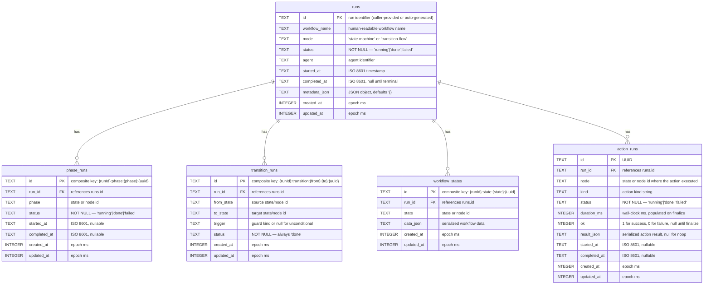
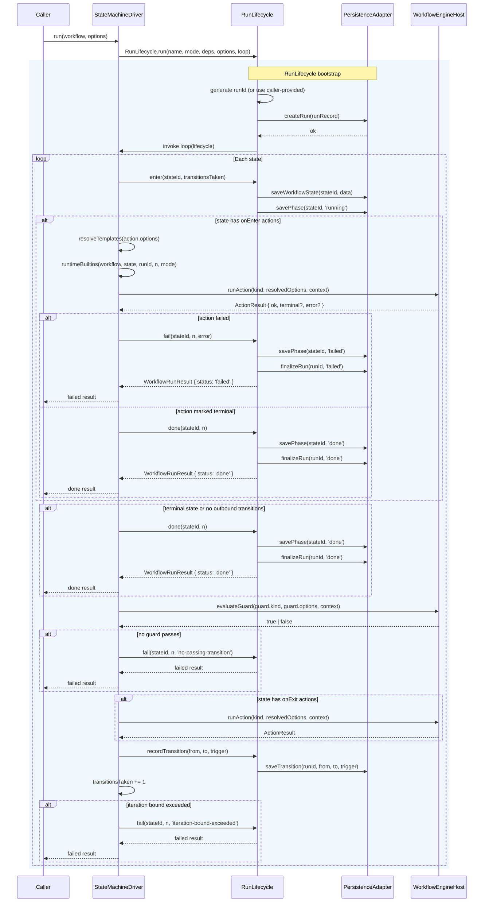
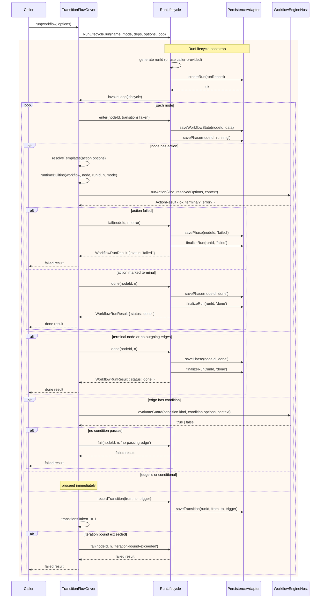

# @gobing-ai/ts-dual-workflow-engine

State-machine and transition-flow workflow runtime with pluggable action runners, guard runners, trust-gated extension loading, memory or database persistence, and rich observability.

## What It Provides

`ts-dual-workflow-engine` runs declarative workflows in two execution modes:

| Mode | Use When |
|------|----------|
| `state-machine` | A run owns one current state and chooses the next state by evaluating ordered transition guards |
| `transition-flow` | A run moves through nodes and edges in a DAG-like flow, executing node actions as it advances |

The package exposes:

### Runners & Host

| Export | Purpose |
|--------|---------|
| `WorkflowService` | High-level loader and runner for both workflow kinds |
| `StateMachineDriver` | Direct state-machine execution |
| `TransitionFlowDriver` | Direct transition-flow execution |
| `WorkflowEngineHost` | Capability registry for action runners and guard runners |
| `createDefaultWorkflowEngineHost()` | Creates a host with built-in `note`, `shell`, `event.emit`, `always`, `never`, and `action-ok` capabilities |

### Built-in Actions & Guards

| Export | Purpose |
|--------|---------|
| `NoteActionRunner` | Records a note in result data and emits `workflow.hitl.note` |
| `ShellActionRunner` | Shell command backed by `@gobing-ai/ts-runtime` `ProcessExecutor` |
| `EventEmitActionRunner` | Emits `workflow.custom` events for user-defined observability |
| `always` guard | Always passes |
| `never` guard | Always rejects |
| `action-ok` guard | Passes when the last action succeeded (`lastActionResult?.ok === true`) |

### Persistence

| Export | Purpose |
|--------|---------|
| `MemoryWorkflowPersistenceAdapter` | In-memory persistence for tests and short-lived runs |
| `DbWorkflowPersistenceAdapter` | DB-backed persistence over `@gobing-ai/ts-db` |
| `applyWorkflowEngineSchema()` | Installs the package-owned DB schema (idempotent; safe to call before every write) |
| `WORKFLOW_ENGINE_SCHEMA_SQL` | Raw SQL DDL for the 5 workflow engine tables |

### Configuration & Validation

| Export | Purpose |
|--------|---------|
| `loadWorkflowDef()` / `loadWorkflowDefFromText()` | YAML/JSON workflow loading and validation |
| `validateWorkflowDef()` | Semantic invariant checking beyond Zod schema |
| `StateMachineWorkflowDefSchema` / `TransitionFlowWorkflowDefSchema` / `WorkflowDefSchema` | Zod schemas for workflow definition validation |
| `ActionDefSchema` / `GuardDefSchema` | Zod schemas for action and guard definitions |

### Extensions

| Export | Purpose |
|--------|---------|
| `loadWorkflowExtensionsIntoHost()` | Trust-gated extension module loading for actions and guards |
| `WorkflowExtensionRef` / `LoadWorkflowExtensionsOptions` / `WorkflowExtensionKind` | Extension loading types |

### Runtime

| Export | Purpose |
|--------|---------|
| `RunLifecycle` | Shared run bookkeeping: identity, persistence sequencing, OTel spans, structured logging, and optional event bus emission |
| `mergeVars()` / `mergeSetVars()` | Variable merging with run-override semantics |
| `resolveTemplates()` / `resolveTemplateString()` | `${...}` template resolution in options objects |
| `runtimeBuiltins()` | Injects runtime template values (`workflow`, `runId`, `state`, `iteration`, etc.) |
| `allowedEnv()` | Environment allowlist projection over `process.env` |
| `resolveOnErrorPolicy()` | Resolves effective `OnErrorPolicy` from action, workflow default, and run options |

### Types & Errors

| Export | Purpose |
|--------|---------|
| `WorkflowEngineEvents` | Typed event map — all events prefixed `workflow.` |
| `OnErrorPolicy` | Type: `'fail' | 'continue'` |
| `HitlRequest` / `HitlAnswer` / `HitlResponder` | Human-in-the-loop interaction contracts (interfaces only; no implementation) |
| `FSMError` / `WorkflowValidationError` / `RunCollisionError` | Structured error classes |
| `ActionRunner` / `GuardRunner` / `WorkflowDef` / `WorkflowRunResult` … | Type-only exports for all domain types |

## DB Schema

The engine owns 5 tables. `applyWorkflowEngineSchema()` installs them idempotently (all `CREATE TABLE IF NOT EXISTS`). The schema applies every write path (`createRun`, `loadRun`, `listRuns`) so late-schema callers always find the tables.



## Architecture

```
┌──────────────────────────────────────────────────────┐
│                   WorkflowService                     │
│  load(path) → WorkflowDef                            │
│  run(WorkflowDef, options) → WorkflowRunResult       │
│  listRuns() → WorkflowRunRecord[]                    │
└──────────────┬───────────────────────┬───────────────┘
               │ dispatches on          │
               │ workflow.kind          │
       ┌───────▼───────┐       ┌───────▼───────┐
       │ StateMachine  │       │ TransitionFlow│
       │   Driver      │       │   Driver      │
       └───────┬───────┘       └───────┬───────┘
               │                       │
               │  both delegate to     │
               │                       │
       ┌───────▼───────────────────────▼───────┐
       │           RunLifecycle                 │
       │  • run identity (runId)                │
       │  • persistence (createRun, savePhase,  │
       │    saveTransition, finalizeRun)        │
       │  • OTel span + structured logging      │
       │  • event bus emission (opt-in)         │
       └───────────────┬───────────────────────┘
                       │
          ┌────────────┼────────────┐
          ▼            ▼            ▼
   ┌──────────┐ ┌──────────┐ ┌──────────┐
   │Persistence│ │  Host    │ │ Variables│
   │ Adapter  │ │ (actions │ │ (merge,  │
   │ (memory  │ │ + guards)│ │ resolve) │
   │  or DB)  │ │          │ │          │
   └──────────┘ └──────────┘ └──────────┘
```

### State-Machine Step Execution

The state-machine driver runs a loop until reaching a terminal state, failure, or iteration bound. Each iteration:

1. Persists the state snapshot and marks its phase `running`
2. Executes the state's `onEnter` actions in declaration order
3. Checks for early termination (action `terminal: true` or terminal state with no outbound transitions)
4. Evaluates transition guards in declaration order; picks the first passing one
5. Executes the state's `onExit` actions
6. Persists the transition and moves to the target state

If an action fails and the resolved `onError` policy is `'fail'` (default), the run stops immediately with
`status: 'failed'`. When `'continue'`, a non-fatal warning is logged via `RunLifecycle.warnActionFailed()`
and the run advances to the next guard evaluation or transition.



### Transition-Flow Step Execution

The transition-flow driver iterates through nodes and edges until reaching a terminal node, failure, or iteration bound. Each iteration:

1. Persists the node snapshot and marks its phase `running`
2. Executes the node's action (if configured)
3. Checks for early termination (action `terminal: true` or terminal node with no outgoing edges)
4. Evaluates edge conditions in declaration order; picks the first passing edge (or unconditionally follows an edge with no condition)
5. Persists the edge transition and moves to the target node



## Installation

```bash
bun add @gobing-ai/ts-dual-workflow-engine @gobing-ai/ts-db
```

Use `@gobing-ai/ts-db` only when you need durable workflow history. Memory persistence has no database requirement.

## State Machine Example

```ts
import {
    MemoryWorkflowPersistenceAdapter,
    StateMachineDriver,
    WorkflowEngineHost,
    type ActionRunner,
} from '@gobing-ai/ts-dual-workflow-engine';

const captureAction: ActionRunner & { seen: string[] } = {
    kind: 'capture',
    seen: [],
    async execute(options) {
        this.seen.push(String(options.message ?? ''));
        return { ok: true };
    },
};

const host = new WorkflowEngineHost()
    .registerAction(captureAction)
    .registerGuard({ kind: 'always', evaluate: async () => true });

const driver = new StateMachineDriver({
    host,
    persistence: new MemoryWorkflowPersistenceAdapter(),
});

const result = await driver.run(
    {
        name: 'approval',
        initialState: 'draft',
        terminalStates: ['done'],
        vars: { message: 'approved' },
        states: [
            { id: 'draft', onEnter: [{ kind: 'capture', options: { message: '${vars.message}' } }] },
            { id: 'done' },
        ],
        transitions: [{ from: 'draft', to: 'done', guard: { kind: 'always' } }],
    },
    { runId: 'approval-1' },
);

result.status; // "done"
result.finalState; // "done"
captureAction.seen; // ["approved"]
```

The driver persists each state snapshot, phase update, transition, and final run status through the configured persistence adapter.

### Error Resilience — `onError: 'continue'`

```ts
const host = new WorkflowEngineHost()
    .registerAction(failableAction)
    .registerGuard({ kind: 'always', evaluate: async () => true });

const driver = new StateMachineDriver({
    host,
    persistence: new MemoryWorkflowPersistenceAdapter(),
});

const result = await driver.run({
    name: 'resilient-approval',
    initialState: 'draft',
    terminalStates: ['done'],
    defaultOnError: 'continue', // workflow-level default
    states: [
        { id: 'draft', onEnter: [{ kind: 'audit', onError: 'fail' }] }, // overrides to fail-fast for audits
        { id: 'done' },
    ],
    transitions: [{ from: 'draft', to: 'done', guard: { kind: 'always' } }],
});
```

## Transition Flow Example

```ts
import {
    createDefaultWorkflowEngineHost,
    MemoryWorkflowPersistenceAdapter,
    WorkflowService,
} from '@gobing-ai/ts-dual-workflow-engine';

const service = new WorkflowService(
    createDefaultWorkflowEngineHost(),
    new MemoryWorkflowPersistenceAdapter(),
);

const result = await service.run({
    kind: 'transition-flow',
    name: 'linear-flow',
    initialNode: 'start',
    terminalNodes: ['done'],
    nodes: [
        { id: 'start', action: { kind: 'note', options: { message: 'started' } } },
        { id: 'done' },
    ],
    edges: [{ from: 'start', to: 'done' }],
});

result.status; // "done"
result.finalState; // "done"
```

The default host includes built-in `note`, `shell`, `event.emit`, `always`, `never`, and `action-ok` capabilities. For production systems, register domain-specific runners and keep shell execution explicit.

## Load Workflows from YAML

```ts
import { loadWorkflowDef, WorkflowService } from '@gobing-ai/ts-dual-workflow-engine';

const workflow = await loadWorkflowDef('./workflows/approval.yaml');
await service.run(workflow, { runId: 'approval-1' });
```

`loadWorkflowDef(path)` reads YAML or JSON from disk. File loads honor a top-level `$schema` ref by default, then validate the internal structural schema and semantic references before returning a `WorkflowDef`. The `$schema` value resolves from the bundled package schema — no network access; quote the value, since YAML treats a leading `@` as reserved. `loadWorkflowDefFromText(text, source)` handles inline definitions with internal validation only.

### State-machine YAML

`kind: state-machine` is optional because state-machine is the default shape, but including it makes the file easier to scan.

```yaml
# workflows/approval.yaml
$schema: "@gobing-ai/ts-dual-workflow-engine/schemas/state-machine-workflow.schema.json"
kind: state-machine
name: approval
initialState: draft
terminalStates: [done]
vars:
  reviewer: robin
env:
  allow: [APP_ENV]
states:
  - id: draft
    onEnter:
      - kind: note
        options:
          message: "review requested by ${vars.reviewer} in ${env.APP_ENV}"
  - id: approved
    onEnter:
      - kind: note
        options:
          message: approved
  - id: done
transitions:
  - from: draft
    to: approved
    guard:
      kind: always
  - from: approved
    to: done
```

```ts
import {
    createDefaultWorkflowEngineHost,
    loadWorkflowDef,
    MemoryWorkflowPersistenceAdapter,
    WorkflowService,
} from '@gobing-ai/ts-dual-workflow-engine';

const service = new WorkflowService(
    createDefaultWorkflowEngineHost(),
    new MemoryWorkflowPersistenceAdapter(),
);

const workflow = await loadWorkflowDef('./workflows/approval.yaml');
const result = await service.run(workflow, {
    runId: 'approval-1',
    env: { APP_ENV: 'development' },
});
```

### Transition-flow YAML

Transition-flow definitions must declare `kind: transition-flow`.

```yaml
# workflows/import-file.yaml
$schema: "@gobing-ai/ts-dual-workflow-engine/schemas/transition-flow-workflow.schema.json"
kind: transition-flow
name: import-file
initialNode: read
terminalNodes: [done]
vars:
  file: events.jsonl
nodes:
  - id: read
    type: action
    action:
      kind: note
      options:
        message: "reading ${vars.file}"
  - id: validate
    type: gate
  - id: done
edges:
  - from: read
    to: validate
  - from: validate
    to: done
    condition:
      kind: always
```

```ts
const workflow = await loadWorkflowDef('./workflows/import-file.yaml');
const result = await service.run(workflow, {
    runId: 'import-1',
    vars: { file: 'override.jsonl' },
});
```

`validateWorkflowDef()` is available when the caller already has an object and only needs validation.

## Variables and Environment

Actions receive resolved template values. The engine supports:

| Template | Source |
|----------|--------|
| `${vars.name}` | Workflow vars merged with run vars |
| `${env.NAME}` | Environment values explicitly allowed by workflow config |
| `${runId}` | Current run ID |
| `${workflow}` | Workflow name |
| `${state}` / `${node}` | Current state or node ID |
| `${task}` | Workflow name (alias) |
| `${iteration}` | Current transition count |
| `${run}` | Run ID (alias) |
| `${runtime}` | Execution mode (`state-machine` or `transition-flow`) |

```ts
await service.run(workflow, {
    vars: { file: 'events.jsonl' },
    env: { API_TOKEN: process.env.API_TOKEN },
    metadata: { requestedBy: 'scheduler' },
});
```

The workflow definition controls which environment names are visible through `env.allow`.

## DB Persistence

```ts
import { createDbAdapter } from '@gobing-ai/ts-db';
import {
    applyWorkflowEngineSchema,
    createDefaultWorkflowEngineHost,
    DbWorkflowPersistenceAdapter,
    WorkflowService,
} from '@gobing-ai/ts-dual-workflow-engine';

const db = await createDbAdapter({ driver: 'bun-sqlite', url: './workflow.db' });
await applyWorkflowEngineSchema(db);

const service = new WorkflowService(
    createDefaultWorkflowEngineHost(),
    new DbWorkflowPersistenceAdapter(db),
);
```

Use `service.listRuns()` to read persisted run records. The adapter stores runs, phase snapshots, transition records, workflow state snapshots, and action runs across 5 tables. Schema is applied idempotently on every write path — late callers always find the tables. `DbWorkflowPersistenceAdapter` throws `RunCollisionError` on duplicate run ids. Corrupt payloads or DB errors during `processOnce()`/poll cycles on a queue consumer (when used with `@gobing-ai/ts-infra`'s `EventBus.createJobHandler()` bridge) are handled gracefully.

## Custom Actions and Guards

Register domain-specific runners directly on the host:

```ts
import { WorkflowEngineHost } from '@gobing-ai/ts-dual-workflow-engine';

const host = new WorkflowEngineHost();

// Custom action
host.registerAction({
  kind: 'send-email',
  async execute(options, context) {
    await mailer.send(String(options.to), String(options.subject));
    return { ok: true };
  },
});

// Custom guard
host.registerGuard({
  kind: 'isBusinessHours',
  async evaluate() {
    const hour = new Date().getHours();
    return hour >= 9 && hour < 17;
  },
});
```

Registered actions and guards are available to any workflow definition by their `kind` string. Internally, the host uses `CapabilityRegistry` from `@gobing-ai/ts-runtime/extension` to track registrations with origin metadata (`'builtin'`, `'extension'`, or `'core'`). Query origin with `host.actionOrigin(kind)` / `host.guardOrigin(kind)`.

## Extension Loading

For modules that bundle multiple actions and/or guards together, use the trust-gated extension loader. Each extension module must export an object with a string `name` and an `actions[]` and/or `guards[]` array:

```ts
// my-extension.ts — extension module (compiled separately or in-project)
export default {
  name: 'my-workflow-extensions',
  actions: [
    {
      kind: 'audit-log',
      async execute(options) {
        console.log('AUDIT', options.event);
        return { ok: true };
      },
    },
  ],
  guards: [
    {
      kind: 'feature-flag',
      async evaluate(options) {
        return featureFlags.isEnabled(String(options.flag));
      },
    },
  ],
};
```

```ts
import {
  loadWorkflowExtensionsIntoHost,
  WorkflowEngineHost,
} from '@gobing-ai/ts-dual-workflow-engine';

const host = new WorkflowEngineHost();

await loadWorkflowExtensionsIntoHost(
  host,
  [{ kind: 'actions', absPath: '/path/to/my-extension.ts', sourceName: 'my-config' }],
  {
    allowExtensions: true,        // required — disabled by default
    moduleLoader: (absPath) => import(absPath),
  },
);
```

When a ref has `kind: 'actions'`, only the module's `actions[]` entries are registered; `guards[]` in the same module are ignored (and vice versa). Override warnings are emitted through an optional `logger.warn` callback when an extension replaces a built-in capability.

### Security

**Extension modules execute arbitrary code.** The trust gate is fail-closed:

- `allowExtensions` defaults to `false`. When refs are present and loading is not explicitly allowed, the loader throws **before any import** — a declared extension is never silently dropped.
- Extension paths are validated at load time; `..` traversal is rejected.
- The caller controls the `moduleLoader` function. Tests use a stub; production callers use `(absPath) => import(absPath)`. The loader itself has no ambient code-loading capability.

## Zod Schemas

```ts
import { StateMachineWorkflowDefSchema, WorkflowDefSchema } from '@gobing-ai/ts-dual-workflow-engine';

// Parse and validate an unknown object as a state-machine workflow
const workflow = StateMachineWorkflowDefSchema.parse(rawObject);

// Parse and validate as either workflow kind
const def = WorkflowDefSchema.parse(rawObject);
```

`WorkflowDefSchema` is a `z.union` of `StateMachineWorkflowDefSchema` and `TransitionFlowWorkflowDefSchema`. `ActionDefSchema` and `GuardDefSchema` validate individual action/guard definitions.

## Variable Utilities

Low-level template resolution is available for callers that build workflow-adjacent tooling:

```ts
import { mergeVars, resolveTemplates, resolveTemplateString, runtimeBuiltins } from '@gobing-ai/ts-dual-workflow-engine';

// Merge workflow-level vars with per-run overrides
const vars = mergeVars({ file: 'default.jsonl' }, { file: 'override.jsonl' });
// { file: 'override.jsonl' }

// Resolve templates in an options object
const resolved = resolveTemplates(
  { message: 'Hello ${vars.name}', count: '${iteration}' },
  { vars: { name: 'Robin' }, env: {}, builtins: { iteration: 3 } },
);
// { message: 'Hello Robin', count: '3' }

// Single-string resolution
resolveTemplateString('Run ${runId} in ${runtime}', {
  vars: {}, env: {},
  builtins: { runId: 'abc', runtime: 'state-machine' },
});
// "Run abc in state-machine"
```

## Observability

The workflow engine uses a **three-layer observability model**:

| Layer | Tool | Consumer |
|-------|------|----------|
| Logs | `getLogger('workflow')` (run-scoped via `child()`) | Human-readable debugging / file output |
| Traces | `traceAsync('workflow.run')` + `addSpanEvent` per step | Distributed perf correlation (OTel) |
| Events | `EventBus<WorkflowEngineEvents>` | Programmatic in-process subscription (progress bars, CI dashboards) |

All three layers are **additive** — EventBus does not replace logging or tracing. A consumer who wants a progress bar subscribes to events; a consumer who wants traces attaches an OTel collector; both work independently.

### Event Map

`WorkflowEngineEvents` is a typed event map. All events are prefixed `workflow.`:

| Event | Payload | When |
|-------|---------|------|
| `workflow.run.started` | `{ workflowName, mode, runId, dryRun }` | When a run begins (inside the span) |
| `workflow.run.done` | `{ runId, finalState, transitionsTaken }` | When a run completes successfully |
| `workflow.run.failed` | `{ runId, finalState, reason }` | When a run fails |
| `workflow.node.enter` | `{ runId, node, transitionsTaken }` | When entering a state or node |
| `workflow.node.transition` | `{ runId, from, to, trigger }` | On a state/node transition |
| `workflow.action.start` | `{ runId, node, kind }` | When an action starts executing |
| `workflow.action.done` | `{ runId, node, kind, durationMs, ok }` | When an action finishes (success or failure) |
| `workflow.action.failed_continue` | `{ runId, node, transitionsTaken, error? }` | When a non-fatal action failure is continued past |
| `workflow.custom` | `{ name, payload }` | Emitted by the builtin `event.emit` action |
| `workflow.hitl.note` | `{ runId, node, message }` | Emitted by the builtin `note` action |
| `workflow.guard.evaluated` | `{ runId, from, to, kind, passed }` | When a guard condition is evaluated (fires for every guard) |
| `workflow.hitl.ask` | `{ runId, node, kind, message }` | When an interactive HITL prompt is presented |
| `workflow.hitl.response` | `{ runId, node, ok }` | When a HITL prompt receives a response |

### Compatibility Policy

The event map is a **cross-package public contract**. Policy: **additive-only** — new events allowed, new optional payload fields allowed; never rename, remove, or repurpose an existing event or field.

### Subscriber Contract

Event handlers registered via `EventBus.on()` or `EventBus.once()` **must** be:
- **Fast** — handlers run synchronously on the emit call path; slow handlers stall the workflow execution
- **Non-throwing** — handler errors are swallowed by `EventBus`; durable behavior must never depend on event delivery
- **Best-effort** — the engine emits via `void emit()` (fire-and-forget); async handlers are not awaited

For **durable** audit/history/telemetry, use the persistence layer — every record is written incrementally during the run via direct adapter calls, not through the event bus.

### Usage

Pass an `EventBus` via `WorkflowRunOptions.events`:

```ts
import { EventBus } from '@gobing-ai/ts-infra';
import type { WorkflowEngineEvents } from '@gobing-ai/ts-dual-workflow-engine';

const events = new EventBus<WorkflowEngineEvents>();
events.on('workflow.action.done', ({ runId, kind, durationMs, ok }) => {
    console.log(`Action ${kind} in run ${runId}: ${durationMs}ms, ok=${ok}`);
});

await service.run(workflow, { runId: 'r1', events });
```

When no `events` option is provided, the engine incurs zero observability overhead — no emit calls, no handler invocations. The event bus is purely opt-in.

## RunLifecycle

`RunLifecycle` is the shared bookkeeping layer both drivers delegate to. It manages:

- **Run identity** — generates a `runId` (or honors caller-provided), timestamps, and run record
- **Persistence sequencing** — `createRun` → `savePhase`/`saveWorkflowState` per step → `finalizeRun` at the end
- **Observability** — wraps the full run in an OTel span, emits span events, logs each lifecycle event through `@gobing-ai/ts-infra` logger, and optionally emits `WorkflowEngineEvents` via an injected `EventBus`
- **Error resilience** — `warnActionFailed()` logs non-fatal warnings for `onError: 'continue'` actions

```ts
import { RunLifecycle, type RunLifecycleDeps } from '@gobing-ai/ts-dual-workflow-engine';

// Direct usage (typically only for custom driver implementations)
const result = await RunLifecycle.run(
  'my-workflow',
  'state-machine',
  { persistence: adapter },
  { runId: 'custom-1' },
  async (lifecycle) => {
    await lifecycle.enter('step-1', 0);
    // ... execute actions ...
    return await lifecycle.done('step-1', 1);
  },
);
```

## Error Handling

| Error Class | When |
|-------------|------|
| `WorkflowValidationError` | Definition validation fails (schema, semantics, template references) |
| `FSMError` | Runtime state-machine driver error (missing state/node, invalid target) |
| `RunCollisionError` | Duplicate `runId` when creating a new run |

Run failures caused by actions or guards are returned as `WorkflowRunResult` with `status: 'failed'`, preserving the run record — they do not throw.

### Error Policy (`onError`)

Actions, workflow definitions, and `WorkflowRunOptions` accept `onError?: 'fail' | 'continue'`.
The resolved policy follows precedence `action.onError ?? workflow.defaultOnError ?? runOptions.onError ?? 'fail'`.

- **`'fail'`** (default): the run halts immediately with `status: 'failed'`.
- **`'continue'`**: logs a structured warning through `RunLifecycle.warnActionFailed()` and advances to the next
  state, node, guard, or edge evaluation. A node with no outbound edges that fails with `'continue'` still
  terminates as `done`.

## Boundary Notes

- The engine executes workflows; it does not provide a scheduler. Use `@gobing-ai/ts-infra` scheduler or an external cron trigger to start runs.
- Persistence is adapter-based. Downstream apps own DB lifecycle and migration ordering.
- Action and guard runners are the extension points. Keep domain behavior there, not in workflow parsing.
- The host's `CapabilityRegistry` tracks the origin (`'builtin'`, `'extension'`, `'core'`) of every registered action and guard — query it with `host.actionOrigin(kind)` / `host.guardOrigin(kind)`.
- HITL types (`HitlRequest`, `HitlAnswer`, `HitlResponder`) are interfaces only — this package ships no HITL implementation.
