# @gobing-ai/ts-infra

Infrastructure backbone — typed event bus, job queue (types), cron scheduler, OpenTelemetry telemetry, HTTP API client, and structured logging. Designed to be wired together at bootstrap via `RuntimeContext`.

## Overview

`ts-infra` provides seven subsystems that form the application backbone:

| Subsystem | Module | Purpose |
|-----------|--------|---------|
| **Event Bus** | `event-bus/` | Typed pub/sub with sync + async dispatch, lifecycle self-observability |
| **Events** | `events/` | Typed event map pattern + system bus factory |
| **Job Queue** | `job-queue/` | Types for DB-backed job processing (`JobQueue`, `QueueConsumer`, `Job`) |
| **Scheduler** | `scheduler/` | Cron-like scheduled actions — Node (interval), Cloudflare (Cron Triggers), Noop (test) |
| **Telemetry** | `telemetry/` | OpenTelemetry SDK wrapper — tracing (`traceAsync`), metrics (17 instruments), SQL sanitizer |
| **API Client** | `api-client.ts` | Typed HTTP client with OTel tracing, retry, timeout, error handling |
| **Logger** | `logger.ts` | Structured JSON logger with levels, child loggers, and mute toggle |

## Architecture

```mermaid
classDiagram
    namespace event-bus {
        class EventBus~TEvents~ {
            +on(event, handler, opts?) void
            +once(event, handler, opts?) void
            +off(event, handler) void
            +emit(event, ...args) Promise~void~
            +removeAllListeners(event?) void
            +listenerCount(event) number
            +eventNames() string[]
        }
    }

    namespace events {
        class EventFactory {
            +createSystemBus() EventBus
        }
    }

    namespace job-queue {
        class JobQueue~T~ {
            <<interface>>
            +enqueue(type, payload, opts?) Promise~string~
            +enqueueBatch(jobs) Promise~string[]~
        }
        class QueueConsumer~T~ {
            <<interface>>
            +register(type, handler) void
            +start() Promise~void~
            +stop() Promise~void~
            +stats() Promise~QueueStats~
        }
        class Job~T~ {
            <<interface>>
        }
        class QueueStats {
            <<interface>>
        }
    }

    namespace scheduler {
        class SchedulerAdapter {
            <<interface>>
            +register(cron, action) void
            +start() Promise~void~
            +stop() Promise~void~
        }
        class NodeSchedulerAdapter {
        }
        class CloudflareSchedulerAdapter {
        }
        class NoopSchedulerAdapter {
        }
        class SchedulerFactory {
            +initScheduler(cronEntries?) SchedulerAdapter
            +setSchedulerAdapter(adapter) void
            +getSchedulerAdapter() SchedulerAdapter
        }
    }

    namespace telemetry {
        class TelemetrySDK {
            +initTelemetry(config?) void
            +shutdownTelemetry() Promise~void~
            +getTracer() Tracer
        }
        class Tracing {
            +traceAsync~T~(name, fn) Promise~T~
            +traceSync~T~(name, fn) T
            +addSpanAttributes(attrs) void
            +getActiveSpan() Span
        }
        class Metrics {
            +getHttpServerRequestTotal() Counter
            +getHttpServerRequestDuration() Histogram
            +getDbOperationTotal() Counter
            +getQueueJobEnqueuedTotal() Counter
            +getSchedulerJobExecutedTotal() Counter
        }
        class DbSanitize {
            +sanitizeSql(sql) string
            +extractSqlOperation(sql) string
        }
    }

    namespace api-client {
        class APIClient {
            +get~T~(path, opts?) Promise~T~
            +post~T~(path, body?, opts?) Promise~T~
            +put~T~(path, body?, opts?) Promise~T~
            +delete~T~(path, opts?) Promise~T~
        }
        class APIError {
            +number status
            +string body
        }
    }

    namespace logger {
        class Logger {
            <<interface>>
            +trace(msg, data?) void
            +debug(msg, data?) void
            +info(msg, data?) void
            +warn(msg, data?) void
            +error(msg, data?) void
            +fatal(msg, data?) void
            +child(context) Logger
        }
        class LoggerFactory {
            +getLogger(category) Logger
            +initializeLogger(level) void
        }
    }

    SchedulerAdapter <|.. NodeSchedulerAdapter : implements
    SchedulerAdapter <|.. CloudflareSchedulerAdapter : implements
    SchedulerAdapter <|.. NoopSchedulerAdapter : implements
    SchedulerFactory --> NodeSchedulerAdapter
    SchedulerFactory --> CloudflareSchedulerAdapter
    SchedulerFactory --> NoopSchedulerAdapter
    EventBus --> JobQueue : "async dispatch"
    EventBus --> Logger : "self-observability"
    APIClient --> Tracing : "traceAsync"
    APIClient --> Metrics : "counters + histograms"
```



## How It Works

### Event Bus — typed pub/sub

```ts
import { EventBus, type EventMap } from '@gobing-ai/ts-infra';

// Define your event map
type AppEvents = {
    'user.signed_up': (email: string, plan: string) => void;
    'order.placed': (orderId: string, total: number) => void;
};

const bus = new EventBus<AppEvents>();

// Sync handler (runs in-process immediately)
bus.on('user.signed_up', (email, plan) => {
    console.log(`Welcome ${email} on ${plan} plan!`);
});

// Async handler (runs through the async handler path)
bus.on('order.placed', (orderId) => {
    console.log(`Order placed: ${orderId}`);
}, { async: true });

// Emit
await bus.emit('user.signed_up', 'alice@test.com', 'pro');
// → "Welcome alice@test.com on pro plan!"

// Once (auto-removes after first emit)
bus.once('user.signed_up', () => console.log('one-time'));
```

**Lifecycle events** — inject a second `EventBus` to observe bus internals:

```ts
const lifecycleBus = new EventBus<BusLifecycleEvents>();
lifecycleBus.on('bus.emit.done', (detail) => {
    // { event, syncCount, asyncCount, emitDurationMs, errors }
    metrics.recordEmit(detail);
});

const bus = new EventBus<AppEvents>({ lifecycleBus });
```

### Scheduler — cron-like actions

```ts
import { NodeSchedulerAdapter, initScheduler } from '@gobing-ai/ts-infra';

// Node.js (interval-based)
const scheduler = new NodeSchedulerAdapter();
scheduler.register('60000', async () => {
    console.log('Runs every 60 seconds');
});
scheduler.register('*/5 * * * *', async () => {
    console.log('Runs every 5 minutes');
});
await scheduler.start();

// Or use factory
const sched = initScheduler([
    ['300000', async () => cleanupExpiredSessions()],
    ['3600000', async () => generateReports()],
]);
await sched.start();

// Cloudflare Workers
import { CloudflareSchedulerAdapter } from '@gobing-ai/ts-infra';
const cfScheduler = new CloudflareSchedulerAdapter();
cfScheduler.register('* * * * *', async () => { /* ... */ });

export default {
    async scheduled(event, env, ctx) {
        cfScheduler.handleScheduledEvent(event, ctx);
    },
};
```

### API Client — typed HTTP with tracing

```ts
import { APIClient, APIError } from '@gobing-ai/ts-infra';

const api = new APIClient({
    baseUrl: 'https://api.example.com',
    defaultHeaders: { Authorization: `Bearer ${token}` },
    timeout: 10_000,
});

// Typed response — spans are auto-created
const user = await api.get<{ id: string; name: string }>('/users/me');

try {
    await api.post('/orders', { productId: 'p1', quantity: 2 });
} catch (error) {
    if (error instanceof APIError) {
        console.error(`HTTP ${error.status}: ${error.body}`);
    }
}

// Custom operation name for tracing
const items = await api.get<Item[]>('/items', { operationName: 'inventory.list' });
```

The client auto-instruments every request: creates a `CLIENT` span, records method/URL/status attributes, emits request count + duration metrics, and records errors.

### Logger — structured JSON

```ts
import { getLogger, initializeLogger } from '@gobing-ai/ts-infra';

initializeLogger('debug'); // set minimum level

const log = getLogger('auth');
log.info('User logged in', { userId: 'u1', method: 'password' });
// → {"level":"info","message":"User logged in",...,"category":"auth","userId":"u1"}

// Child loggers carry context
const reqLog = log.child({ requestId: 'req-123' });
reqLog.error('Validation failed', { field: 'email' });
// → {...,"category":"auth","requestId":"req-123","field":"email"}

// Mute during tests
import { setLoggerMuted } from './logger.js'; // internal import
setLoggerMuted(true);
```

### Telemetry — OpenTelemetry

```ts
import {
    initTelemetry, shutdownTelemetry,
    traceAsync, addSpanAttributes, getActiveSpan,
    sanitizeSql,
} from '@gobing-ai/ts-infra';

// Initialize at startup
initTelemetry({
    enabled: true,
    serviceName: 'my-api',
    environment: 'production',
    exporterEndpoint: 'http://otel-collector:4318/v1/traces',
});

// Trace an operation
const result = await traceAsync('db.query', async (span) => {
    addSpanAttributes({ 'db.system': 'sqlite', 'db.operation': 'SELECT' });
    return db.select().from(users);
});

// Sanitize SQL before export
const safe = sanitizeSql("SELECT * FROM users WHERE email = 'alice@test.com'");
// → "SELECT * FROM users WHERE email = ?"

// Shutdown gracefully
process.on('SIGTERM', async () => {
    await shutdownTelemetry();
});
```

Metrics are lazy-initialized — no configuration needed beyond `initTelemetry()`:

```ts
import { getQueueJobEnqueuedTotal, getQueueJobProcessingDuration } from '@gobing-ai/ts-infra';

getQueueJobEnqueuedTotal().add(1, { 'queue.job_type': 'send-email' });
getQueueJobProcessingDuration().record(42, { 'queue.job_type': 'send-email' });
```

## Usage

### Install

```bash
bun add @gobing-ai/ts-infra @gobing-ai/ts-runtime @gobing-ai/ts-db
```

### Full bootstrap example

```ts
import { createRuntimeContext } from '@gobing-ai/ts-runtime';
import { createDbAdapter, applyMigrations } from '@gobing-ai/ts-db';
import {
    EventBus,
    NodeSchedulerAdapter,
    initTelemetry,
    APIClient,
    getLogger,
    initializeLogger,
} from '@gobing-ai/ts-infra';

// 1. Runtime
const ctx = createRuntimeContext({ runtimeName: 'node-bun' });

// 2. Database
const db = await createDbAdapter({ driver: 'bun-sqlite', url: './data/app.db' });
await applyMigrations(db);
ctx.register('db', db);

// 3. Logging
initializeLogger('info');
const log = getLogger('app');

// 4. Telemetry
initTelemetry({ serviceName: 'my-app', environment: 'production' });

// 5. Event bus
const bus = new EventBus<AppEvents>();

// 6. Scheduler
const scheduler = new NodeSchedulerAdapter();
scheduler.register('3600000', async () => {
    log.info('Hourly cleanup running');
});
await scheduler.start();

// 7. API client
const stripeApi = new APIClient({
    baseUrl: 'https://api.stripe.com/v1',
    defaultHeaders: { Authorization: `Bearer ${process.env.STRIPE_KEY}` },
});

log.info('Application started');
```

### Graceful shutdown

```ts
async function shutdown() {
    log.info('Shutting down...');
    await scheduler.stop();
    db.close();
    await shutdownTelemetry();
    await ctx.dispose();
    process.exit(0);
}

process.on('SIGTERM', shutdown);
process.on('SIGINT', shutdown);
```
