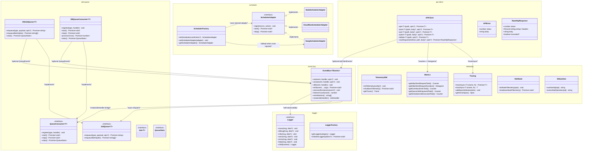

# @gobing-ai/ts-infra

Infrastructure backbone — typed event bus, queue/scheduler contracts, adapter subpaths, OpenTelemetry instrumentation, HTTP API client, and structured logging.

## Overview

`ts-infra` provides the subsystems that form the application backbone:

| Subsystem | Module | Purpose |
|-----------|--------|---------|
| **Event Bus** | `event-bus/` | Typed pub/sub with sync + async dispatch, named async handlers, queue consumer bridge, lifecycle self-observability |
| **Job Queue** | core + `/job-queue-db` | Queue interfaces in core; DB-backed enqueue/consume flow (`DBJobQueue`, `DBQueueConsumer`) via opt-in subpath; optional typed event emission |
| **Scheduler** | core + scheduler subpaths | Scheduler contracts, registry, built-in actions, noop adapter in core; Node and Cloudflare adapters via opt-in subpaths |
| **Telemetry** | `telemetry/` | OTel instrumentation — tracing (`traceAsync`) with master switch, metrics (12 instruments), SQL sanitizer; opt-in OTLP export via the `/otel-node` subpath |
| **API Client** | `api-client.ts` | Typed HTTP client with OTel tracing, timeout, per-request abort, optional event emission |
| **Logger** | `logger.ts` | LogTape-backed structured logger with levels, child loggers, injectable sinks, and mute toggle |
| **Application Bootstrap** | `application/` | Plugin-driven lifecycle: deterministic startup → shutdown, DI orchestration, services as plugins |
| **Plugin Host** | `application/plugins/` | Insertion-ordered plugin registry, fail-fast/fail-soft lifecycle fan-out, reason-carrying teardown |

## Architecture


```mermaid
classDiagram
    namespace event-bus {
        class EventBus~TEvents~ {
            +on(event, handler, opts?) void
            +once(event, handler, opts?) void
            +off(event, handler) void
            +emit(event, ...args) Promise~void~
            +removeAllListeners(event?) void
            +listenerCount(event) number
            +eventNames() string[]
            +createJobHandler() JobHandler<AsyncEventJobPayload>
        }
    }

    namespace job-queue {
        class JobQueue~T~ {
            <<interface>>
            +enqueue(type, payload, opts?) Promise~string~
            +enqueueBatch(jobs) Promise~string[]~
        }
        class QueueConsumer~T~ {
            <<interface>>
            +register(type, handler) void
            +start() Promise~void~
            +stop() Promise~void~
            +stats() Promise~QueueStats~
        }
        class DBJobQueue~T~ {
            +enqueue(type, payload, opts?) Promise~string~
            +enqueueBatch(jobs) Promise~string[]~
            +stats() Promise~QueueStats~
        }
        class DBQueueConsumer~T~ {
            +register(type, handler) void
            +start() Promise~void~
            +stop() Promise~void~
            +processOnce() Promise~number~
            +stats() Promise~QueueStats~
        }
        class Job~T~ {
            <<interface>>
        }
        class QueueStats {
            <<interface>>
        }
    }

    namespace scheduler {
        class SchedulerAdapter {
            <<interface>>
            +register(cron, action) void
            +start() Promise~void~
            +stop() Promise~void~
        }
        class NodeSchedulerAdapter {
        }
        class CloudflareSchedulerAdapter {
        }
        class NoopSchedulerAdapter {
        }
        class SchedulerFactory {
            +initScheduler(cronEntries?) SchedulerAdapter
            +setSchedulerAdapter(adapter) void
            +getSchedulerAdapter() SchedulerAdapter
        }
    }

    namespace telemetry {
        class TelemetrySDK {
            +initTelemetry(config?) void
            +shutdownTelemetry() Promise~void~
            +getTracer() Tracer
        }
        class Tracing {
            +traceAsync~T~(name, fn) Promise~T~
            +traceSync~T~(name, fn) T
            +addSpanAttributes(attrs) void
            +getActiveSpan() Span
        }
        class Metrics {
            +getHttpClientRequestTotal() Counter
            +getHttpClientRequestDuration() Histogram
            +getEventbusEmitsTotal() Counter
            +getQueueJobEnqueuedTotal() Counter
            +getSchedulerJobExecutedTotal() Counter
        }
        class OtelNode {
            +initNodeTelemetry(opts) void
            +shutdownNodeTelemetry() Promise~void~
        }
        class DbSanitize {
            +sanitizeSql(sql) string
            +extractSqlOperation(sql) string
        }
    }

    namespace api-client {
        class APIClient {
            +get~T~(path, opts?) Promise~T~
            +post~T~(path, body?, opts?) Promise~T~
            +put~T~(path, body?, opts?) Promise~T~
            +patch~T~(path, body?, opts?) Promise~T~
            +delete~T~(path, opts?) Promise~T~
            +rawRequest(method, path, body?, opts?) Promise~RawHttpResponse~
        }
        class APIError {
            +number status
            +string body
        }
        class RawHttpResponse {
            +number status
            +Record&lt;string,string&gt; headers
            +string body
            +boolean truncated?
        }
    }

    namespace logger {
        class Logger {
            <<interface>>
            +trace(msg, data?) void
            +debug(msg, data?) void
            +info(msg, data?) void
            +warn(msg, data?) void
            +error(msg, data?) void
            +fatal(msg, data?) void
            +child(context) Logger
        }
        class LoggerFactory {
            +getLogger(category) Logger
            +initializeLogger(options?) Promise~void~
        }
    }

    SchedulerAdapter <|.. NodeSchedulerAdapter : implements
    SchedulerAdapter <|.. CloudflareSchedulerAdapter : implements
    SchedulerAdapter <|.. NoopSchedulerAdapter : implements
    SchedulerFactory --> SchedulerAdapter : "uses injected adapter"
    SchedulerFactory --> NoopSchedulerAdapter : "default when none injected"
    EventBus --> JobQueue : "async dispatch"
    EventBus --> QueueConsumer : "createJobHandler bridge"
    DBJobQueue --> JobQueue : "implements"
    DBQueueConsumer --> QueueConsumer : "implements"
    DBJobQueue --> EventBus : "optional QueueEvents"
    DBQueueConsumer --> EventBus : "optional QueueEvents"
    EventBus --> Logger : "self-observability"
    APIClient --> Tracing : "traceAsync"
    APIClient --> Metrics : "counters + histograms"
    APIClient --> EventBus : "optional ApiClientEvents"
```

## How It Works

### Event Bus — typed pub/sub

```ts
import { attachDefaultObservers, createLifecycleBus, EventBus, type EventMap } from '@gobing-ai/ts-infra';

// Define your event map
type AppEvents = {
    'user.signed_up': (email: string, plan: string) => void;
    'order.placed': (orderId: string, total: number) => void;
};

const bus = new EventBus<AppEvents>();

// Sync handler (runs in-process immediately)
bus.on('user.signed_up', (email, plan) => {
    console.log(`Welcome ${email} on ${plan} plan!`);
});

// Async handler (runs through the async handler path)
bus.on('order.placed', (orderId) => {
    console.log(`Order placed: ${orderId}`);
}, { async: true });

// Emit
await bus.emit('user.signed_up', 'alice@test.com', 'pro');
// → "Welcome alice@test.com on pro plan!"

// Once (auto-removes after first emit)
bus.once('user.signed_up', () => console.log('one-time'));
```

**Named async handlers** enable queue-backed dispatch. Use `name` to assign a stable id for jobs consumed across process restarts, and `createJobHandler()` to register the bridge on a queue consumer:

```ts
// Producer side: register async handlers with stable names
bus.on('order.placed', (orderId) => {
    console.log(`Order: ${orderId}`);
}, { async: true, name: 'order-handler' });

// Consumer side: register createJobHandler on your DBQueueConsumer
const jobHandler = bus.createJobHandler();
queueConsumer.register('order.placed', jobHandler);
queueConsumer.register('order.updated', jobHandler);
// → enqueued { event, args, handlerId } jobs dispatch to the matching named handler
```

**Lifecycle events** — inject a second `EventBus` to observe bus internals:

```ts
const lifecycleBus = createLifecycleBus();
attachDefaultObservers(lifecycleBus); // log + telemetry spans; metrics are emitted by EventBus itself
lifecycleBus.on('bus.emit.done', (detail) => {
    // { event, syncCount, asyncCount, emitDurationMs, errors }
    console.debug('EventBus emit complete', detail);
});

const bus = new EventBus<AppEvents>({ lifecycleBus });
```

### Job Queue — DB-backed async work

`DBJobQueue` and `DBQueueConsumer` live behind the `@gobing-ai/ts-infra/job-queue-db` subpath and run over `@gobing-ai/ts-db`'s `QueueJobDao`. Use this when event handlers, schedulers, or API handlers need durable background work with retries.

```ts
import { createDbAdapter, QueueJobDao } from '@gobing-ai/ts-db';
import { DBJobQueue, DBQueueConsumer } from '@gobing-ai/ts-infra/job-queue-db';

const db = await createDbAdapter({ driver: 'bun-sqlite', url: './jobs.db' });
const dao = new QueueJobDao(db);

const queue = new DBJobQueue<{ to: string; subject: string }>(dao);
await queue.enqueue(
    'send-email',
    { to: 'alice@example.com', subject: 'Welcome' },
    { maxRetries: 5, delay: 1_000, ttlMs: 86_400_000 },
);

const consumer = new DBQueueConsumer<{ to: string; subject: string }>(dao, {
    batchSize: 10,
    maxConcurrency: 4,
    visibilityTimeout: 30_000,
});

consumer.register('send-email', async (job) => {
    await sendEmail(job.payload.to, job.payload.subject);
});

await consumer.start();
```

For scheduled drains and tests, call `processOnce()` instead of starting the polling loop:

```ts
const processed = await consumer.processOnce();
```

The consumer claims ready jobs, resets stuck processing jobs after the visibility timeout, retries failed jobs with exponential backoff, and marks expired jobs failed through `QueueJobDao`. Corrupt payloads are failed individually without rejecting the batch. Poll-cycle errors are logged and retried on the next cycle — a single DAO hiccup will not crash the process.

**Queue lifecycle events** are opt-in through the injected `EventBus`:

```ts
import { EventBus } from '@gobing-ai/ts-infra';
import type { QueueEvents } from '@gobing-ai/ts-infra';
import { DBJobQueue, DBQueueConsumer } from '@gobing-ai/ts-infra/job-queue-db';

const events = new EventBus<QueueEvents>();
events.on('queue.job.enqueued', ({ jobId, type }) => { /* ... */ });
events.on('queue.job.completed', ({ jobId, type }) => { /* ... */ });
events.on('queue.job.failed', ({ jobId, type, error, attempt }) => { /* ... */ });
events.on('queue.job.retrying', ({ jobId, type, attempt, nextRetryAt }) => { /* ... */ });
events.on('queue.consumer.started', () => { /* ... */ });
events.on('queue.consumer.stopped', () => { /* ... */ });

const queue = new DBJobQueue<Payload>(dao, events);                // emits enqueued
const consumer = new DBQueueConsumer<Payload>(dao, { events });    // emits the rest
```

### Scheduler — cron-like actions

```ts
import { initScheduler } from '@gobing-ai/ts-infra';
import { NodeSchedulerAdapter } from '@gobing-ai/ts-infra/scheduler-node';

// Core factory — pass the adapter and entries in one call
const sched = initScheduler(new NodeSchedulerAdapter(), [
    ['300000', async () => cleanupExpiredSessions()],
    ['3600000', async () => generateReports()],
]);
await sched.start();

// Or register directly on the adapter
const sched2 = new NodeSchedulerAdapter();
sched2.register('*/5 * * * *', async () => {
    console.log('Runs every 5 minutes');
});
await sched2.start();

// Cloudflare Workers
import { CloudflareSchedulerAdapter } from '@gobing-ai/ts-infra/scheduler-cloudflare';
const cfScheduler = new CloudflareSchedulerAdapter();
cfScheduler.register('* * * * *', async () => { /* ... */ });

export default {
    async scheduled(event, env, ctx) {
        cfScheduler.handleScheduledEvent(event, ctx);
    },
};
```

### API Client — typed HTTP with tracing

```ts
import { APIClient, APIError } from '@gobing-ai/ts-infra';

const api = new APIClient({
    baseUrl: 'https://api.example.com',
    defaultHeaders: { Authorization: `Bearer ${token}` },
    timeout: 10_000,
});

// Typed response — spans are auto-created
const user = await api.get<{ id: string; name: string }>('/users/me');

try {
    await api.post('/orders', { productId: 'p1', quantity: 2 });
} catch (error) {
    if (error instanceof APIError) {
        console.error(`HTTP ${error.status}: ${error.body}`);
    }
}

// PATCH method
await api.patch('/users/1', { name: 'updated' });

// Raw request — returns status/headers/body for ALL status codes (no throw on 4xx/5xx)
const { status, headers, body, truncated } = await api.rawRequest('GET', '/debug', undefined, {
    redirect: 'follow',
    maxResponseBytes: 10_000,  // cap response body; truncated === true when exceeded
});

// Per-request abort signal (not confused with timeouts)
const controller = new AbortController();
setTimeout(() => controller.abort(), 2_000);
await api.get('/slow', { signal: controller.signal }); // throws DOMException AbortError

// Custom operation name for tracing
const items = await api.get<Item[]>('/items', { operationName: 'inventory.list' });
```

The client auto-instruments every request: creates a `CLIENT` span, records method/URL/status attributes, emits request count + duration metrics, and records errors. Timeouts throw `APIError(0, "Request timed out after …ms")` — never a raw `DOMException`. Caller-initiated aborts rethrow the original `AbortError`.

**API client events** are opt-in through the constructor:

```ts
import { EventBus } from '@gobing-ai/ts-infra';
import type { ApiClientEvents } from '@gobing-ai/ts-infra';

const events = new EventBus<ApiClientEvents>();
events.on('api.request.error', ({ url, method, status, error }) => {
    console.error(`HTTP error — ${method} ${url}: ${error}`);
});

const api = new APIClient({ baseUrl: '...', events });
```

### Logger — structured JSON

```ts
import { getLogger, initializeLogger } from '@gobing-ai/ts-infra';

await initializeLogger({
    level: 'debug',
    console: true,
    json: true,
});

const log = getLogger('auth');
log.info('User logged in', { userId: 'u1', method: 'password' });
// → {"level":"info","message":"User logged in",...,"category":"auth","userId":"u1"}

// Child loggers carry context
const reqLog = log.child({ requestId: 'req-123' });
reqLog.error('Validation failed', { field: 'email' });
// → {...,"category":"auth","requestId":"req-123","field":"email"}

// File logging is also injectable; ts-infra never opens files directly.
await initializeLogger({
    console: false,
    fileSink: (line) => {
        // Append `line` using the host runtime's FileSystem / stream owner.
    },
});

// In tests, prefer injecting a logger boundary or initializing with console: false.
```

### Telemetry — OpenTelemetry

```ts
import {
    initTelemetry, shutdownTelemetry,
    traceAsync, addSpanAttributes, getActiveSpan,
    sanitizeSql,
} from '@gobing-ai/ts-infra';

// Initialize at startup — the master switch is real:
// enabled: false short-circuits ALL infra tracing + metrics to shared noop instruments
initTelemetry({
    enabled: true,
    serviceName: 'my-api',
    environment: 'production',
});

// Trace an operation
const result = await traceAsync('db.query', async (span) => {
    addSpanAttributes({ 'db.system': 'sqlite', 'db.operation': 'SELECT' });
    return db.select().from(users);
});

// Sanitize SQL before export
const safe = sanitizeSql("SELECT * FROM users WHERE email = 'alice@test.com'");
// → "SELECT * FROM users WHERE email = ?"

// Shutdown gracefully
process.on('SIGTERM', async () => {
    await shutdownTelemetry();
});
```

Metrics are lazy-initialized — no configuration needed beyond `initTelemetry()`:

```ts
import { getQueueJobEnqueuedTotal, getQueueJobProcessingDuration } from '@gobing-ai/ts-infra';

getQueueJobEnqueuedTotal().add(1, { 'queue.job_type': 'send-email' });
getQueueJobProcessingDuration().record(42, { 'queue.job_type': 'send-email' });
```

#### Instrumentation vs. export

The main barrel only **instruments** — it records spans and metrics against the
globally-registered OpenTelemetry provider, and degrades to no-ops when none is
registered. It does **not** ship an exporter, so it never forces an OTel SDK or a
collector opinion on consumers. Two ways to actually export:

1. **BYO** — register your own OTel SDK (tracer + meter providers, exporters) at
   process startup. ts-infra's spans/metrics flow into it automatically.
2. **Turnkey OTLP** — opt into the `@gobing-ai/ts-infra/otel-node` subpath, which
   wires Node OTLP/HTTP export for both signals and registers the providers
   globally.

```ts
// Node-only convenience: pulls the optional OTLP exporter peers.
import { initNodeTelemetry, shutdownNodeTelemetry } from '@gobing-ai/ts-infra/otel-node';

initNodeTelemetry({
    serviceName: 'my-api',
    serviceVersion: '1.4.0',
    endpoint: 'http://otel-collector:4318', // signal paths (/v1/traces, /v1/metrics) appended
    headers: { authorization: `Bearer ${process.env.OTEL_TOKEN}` },
});

process.on('SIGTERM', async () => {
    await shutdownNodeTelemetry(); // flush + drain buffered spans/metrics
});
```

The exporter packages are **optional peers** — only consumers of `/otel-node`
need them installed. `@opentelemetry/api` and semantic conventions are the only
OTel packages used by the core instrumentation surface. The main
`@gobing-ai/ts-infra` import never pulls exporter/provider SDKs, so BYO and
browser/edge consumers stay lean. To use the subpath:

```bash
bun add @opentelemetry/sdk-trace-node @opentelemetry/sdk-metrics \
        @opentelemetry/resources \
        @opentelemetry/exporter-trace-otlp-http \
        @opentelemetry/exporter-metrics-otlp-http
```


### Application Bootstrap

The application bootstrap API provides a deterministic lifecycle for wiring
infrastructure services. Two layers:

1. **Portable DI bootstrap** (`@gobing-ai/ts-infra/application`) — orchestrates
   injected dependencies. Never opens files, creates DB connections, or wires
   runtime-specific exporters.
2. **Node/Bun convenience** (`@gobing-ai/ts-infra/application-node`) — composes
   the portable bootstrap with runtime-specific adapters: YAML config loading,
   file log sink, Bun SQLite DB creation, Node OTel export, Node scheduler.

#### Portable DI bootstrap

```ts
import { runApplication } from '@gobing-ai/ts-infra/application';

const app = await runApplication({
    config: {
        logging: { level: 'info', console: true },
        telemetry: { enabled: true, serviceName: 'my-api' },
    },
    appConfig: { port: 3000 },
    async start(app) {
        app.logger.info('started', { port: app.appConfig.port });
    },
});

// Graceful shutdown — idempotent
await app.stop();
```

The portable `runApplication` accepts pre-built services via `services` and
never reads files. The lifecycle is **plugin-driven**: infra services (logger,
telemetry, scheduler) and the user `start`/`stop` callbacks are registered as
built-in plugins on a `PluginHost`, in dependency order:

```
logger → telemetry → [your plugins] → user-callback → scheduler
```

`loadAll()` then `startAll()` run them forward (A→Z). Plugins marked `failFast`
(the built-in services) abort the bootstrap if their `onStart` throws; other
plugins are fail-soft. Shutdown is the reverse fan-out — `stop(reason)` calls
each plugin's `onStop(host, reason)` in reverse registration order (scheduler
stop, your `stop(app, reason)`, telemetry shutdown). `stop()` is idempotent —
safe to call from multiple signal handlers.

**DB ownership.** The portable layer **never closes a caller-injected
`services.db`** — you own its lifecycle and must close it yourself. Only an
adapter the bootstrap *creates* (e.g. the Node subpath's Bun SQLite adapter) is
closed automatically, via a built-in DB plugin. (Changed in 0.x — previously the
portable layer closed injected adapters unconditionally.)

#### Node/Bun convenience bootstrap

```ts
import { runNodeApplication } from '@gobing-ai/ts-infra/application-node';

await runNodeApplication({
    configLoader: {
        configFile: 'config/app.yaml',
        bootstrapSection: 'bootstrap',
        appSection: 'billing',
        appConfig: {
            // Structural safeParse adapter — works with Zod or any validator
            safeParse(raw) {
                return billingSchema.safeParse(raw);
            },
        },
    },
    async start(app) {
        app.logger.info('billing app started', {
            settlementWindowMinutes: app.appConfig.settlementWindowMinutes,
        });
    },
});
```

Example YAML config file:

```yaml
app:
  name: billing-api
  env: production

bootstrap:
  logging:
    level: info
    console: true
    filePath: ./logs/app.jsonl
  telemetry:
    enabled: true
    serviceName: billing-api
    endpoint: http://otel-collector:4318
    headers:
      authorization: Bearer ${OTEL_TOKEN}
  database:
    enabled: true
    driver: bun-sqlite
    url: ./data/app.db

billing:
  settlementWindowMinutes: 15
  riskLimit: 100000
```

Config validators accept four shapes:
- `{ safeParse(raw) → { success, data?, errors? } }` — Zod-compatible
- `(raw) => TAppConfig` — bare function
- `{ validate(raw) => TAppConfig }` — method form
- `{ parse(raw) => TAppConfig }` — method form

Validation errors include the config file path and section name for diagnostics.

**What is intentionally NOT in the main barrel:** `runApplication` and
`runNodeApplication` live behind explicit subpaths so the main
`@gobing-ai/ts-infra` import stays portable and adapter-light. A future ADR
may decide whether type-only re-exports are acceptable.

#### CLI convenience bootstrap

For fire-and-forget CLIs (Commander, Yargs, etc.), `@gobing-ai/ts-infra/application-cli`
wraps `runNodeApplication` with the one thing every CLI does at the end: map the
command result to a process exit code, and terminate. Same option shape, same
defaults, same callback contract — no surprises.

```ts
import { runCliApplication } from '@gobing-ai/ts-infra/application-cli';
import { Command } from 'commander';

await runCliApplication({
    async start(app) {
        const program = new Command().name('mycli');
        // ...register commands...
        program.parse();               // Commander sets exit code on error
        return process.exitCode;       // forward to runCliApplication
    },
});
```

Differences from `runNodeApplication`:
- `start` returns `number | void` — the number becomes the exit code (void = 0)
- On success, calls `app.stop('shutdown')` then `process.exit(code)`
- On error, writes the message to stderr and exits 1 (after graceful teardown)

Use this for CLIs. For long-running services (servers, daemons, workers), use
`runNodeApplication` directly — it returns a runtime handle you control.

## Usage

### Install

```bash
bun add @gobing-ai/ts-infra

# Only needed when using @gobing-ai/ts-infra/job-queue-db.
bun add @gobing-ai/ts-db

# Only needed when using @gobing-ai/ts-infra/otel-node.
bun add @opentelemetry/sdk-trace-node @opentelemetry/sdk-metrics \
        @opentelemetry/resources \
        @opentelemetry/exporter-trace-otlp-http \
        @opentelemetry/exporter-metrics-otlp-http
```

### Full bootstrap example (recommended: `runApplication` or `runNodeApplication`)

Prefer the plugin-driven bootstrap over manual wiring — the host lifecycle handles
startup ordering, reverse-order teardown, fail-fast/fail-soft policies, and idempotent
stop. Two entry points:

```ts
// Portable — inject everything yourself:
import { runApplication } from '@gobing-ai/ts-infra/application';

const app = await runApplication({
    config: {
        logging: { level: 'info', console: true },
        telemetry: { enabled: true, serviceName: 'my-app' },
    },
    services: { db }, // caller-owned — you close it
    async start(app) {
        app.logger.info('started');
    },
    async stop(app, reason) {
        app.logger.info('shutting down', { reason });
    },
});

await app.stop('signal');
```

```ts
// Node / Bun — YAML config, file logs, OTel export, Bun SQLite, Node scheduler:
import { runNodeApplication } from '@gobing-ai/ts-infra/application-node';

const app = await runNodeApplication({
    configLoader: {
        configFile: 'config/app.yaml',
        bootstrapSection: 'bootstrap',
        appSection: 'billing',
        appConfig: { safeParse: (raw) => mySchema.safeParse(raw) },
    },
    async start(app) {
        app.logger.info('started', { port: app.appConfig.port });
    },
});
```

### System Events — lifecycle bus propagation contract

`runApplication` creates a single `lifecycleBus` (`EventBus<BusLifecycleEvents>`)
and parents the application event bus to it. Downstream consumers join the same
stream when callers pass `app.lifecycleBus` into their constructors. Domain emits
fan out as `bus.*` lifecycle events on the parent and — when a file observer is
attached — land in the JSONL System Events log alongside the domain event itself.

**Six System Events prefixes and where they originate:**

| Prefix | Source | Constructed when `events` is omitted |
|--------|--------|---------------------------------------|
| `bus.*` | `EventBus` lifecycle self-observability (the `lifecycleBus` itself) | always — `runApplication` creates it |
| `api.*` | `APIClient` (`api.request.error`) | `new EventBus<ApiClientEvents>({ lifecycleBus })` (R5) |
| `rule.*` | `RuleEngine` (rule-run structured observability) | `new EventBus<RuleEngineEvents>({ lifecycleBus })` (R2) |
| `workflow.*` | `WorkflowService` (workflow-run observability) | `new EventBus<WorkflowEngineEvents>({ lifecycleBus })` via `resolveEvents` (R3) |
| `agent.*` | `AiRunner` / `TeamOrchestrator` (agent invocation observability) | `new EventBus<AgentEvents>({ lifecycleBus })` (R4) |
| `process.*` | `AiRunner` default-executor process events | `new EventBus<AiRunnerProcessEvents>({ lifecycleBus })` (R4) |

**Caller-supplied `events` always wins.** Every consumer accepts an explicit
`events?: EventBus<TEvents>` (or equivalent) and an optional `lifecycleBus?`.
When `events` is provided the consumer uses it as-is; when `events` is omitted
and `lifecycleBus` is provided, the consumer constructs an internal bus
parented to the lifecycle bus. This keeps standalone use zero-config and lets
the bootstrap opt every consumer into the System Events stream by passing a
single `lifecycleBus`.

**Portable vs Node subpath split (ADR-011).** `runApplication` (portable)
never opens files: it calls `attachFileObserver(lifecycleBus, filePath, writer)`
only when `services.fileObserverWriter` is provided; its portable default path is
`logs/system-events.jsonl`. The Node subpath `runNodeApplication` constructs a
Node writer and uses `createNodeFileSystem()` to resolve the path to
`<projectRoot>/logs/system-events.jsonl`. Set `config.events.fileObserver: false`
to disable; supply a custom `filePath` (or a test-stub writer via
`services.fileObserverWriter`) to override.

**Wiring a consumer manually.** When you construct a consumer outside the
bootstrap (or want to share the bootstrap's bus), pass the exposed
`app.lifecycleBus`:

```ts
import { RuleEngine } from '@gobing-ai/ts-rule-engine';

const engine = new RuleEngine({ lifecycleBus: app.lifecycleBus });
// engine now emits `rule.*` events into the same JSONL log as the bootstrap.
```

If you prefer manual wiring (e.g. you already have an init sequence), the individual
subsystems still work standalone — `EventBus`, `APIClient`, `getLogger`, etc. are
all importable directly from the main barrel and do not require the bootstrap.

#### Custom plugins

Plugins run in registration order forward (`loadAll → startAll`) and reverse order
on teardown (`stopAll → unloadAll`):

```ts
import { runApplication } from '@gobing-ai/ts-infra/application';
import type { Plugin } from '@gobing-ai/ts-infra';

const auditPlugin: Plugin = {
    name: 'audit-logger',
    version: '1.0.0',
    failFast: false, // fail-soft: a throwing onStart is logged, boot continues
    onLoad: async (host) => { /* validate preconditions — throws abort boot */ },
    onStart: async (host) => { host.events.on('order.placed', auditHandler); },
    onStop: async (host, reason) => { host.logger.info('persisting audit buffer', { reason }); },
    onUnload: async () => { /* release resources */ },
};

const app = await runApplication({
    plugins: [auditPlugin],
    config: { logging: { console: true } },
});
```

The host forwards the optional teardown `reason` (a plain `string` on the core contract,
`ApplicationStopReason` — `'manual' | 'signal' | 'error' | 'shutdown'` — at the app level)
to every plugin's `onStop`/`onUnload`. Built-in service plugins use this for log context;
the user-callback plugin delivers it to your `stop(app, reason)`.
```

### Graceful shutdown

With `runApplication` or `runNodeApplication`, shutdown is a single idempotent call:

```ts
process.on('SIGTERM', () => app.stop('signal'));
process.on('SIGINT', () => app.stop('signal'));
```

The host runs `stopAll(reason) → unloadAll(reason)` in reverse registration order:
scheduler stops, your `stop` callback fires, telemetry flushes, and the optional
DB adapter closes (if the bootstrap created it — caller-injected adapters are
your responsibility). Idempotent: safe from overlapping signal handlers.
