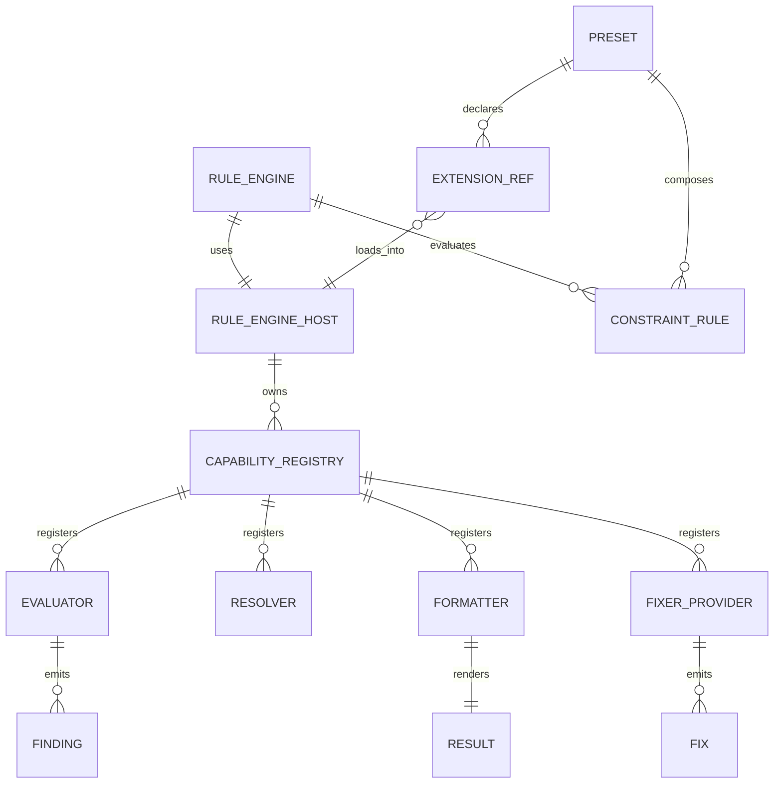
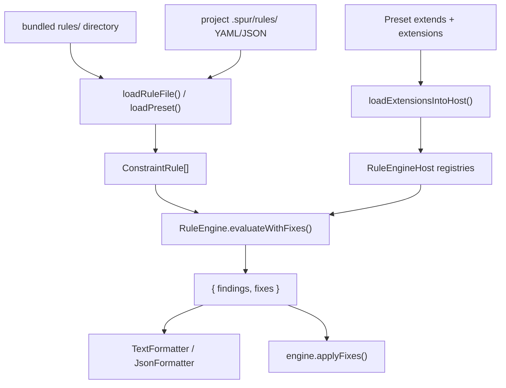
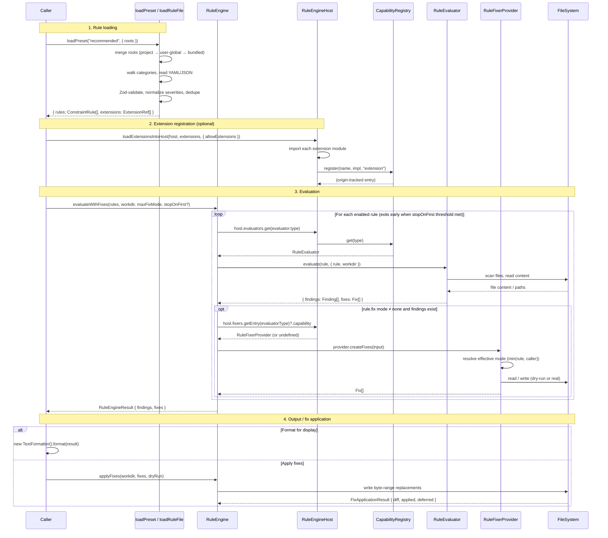
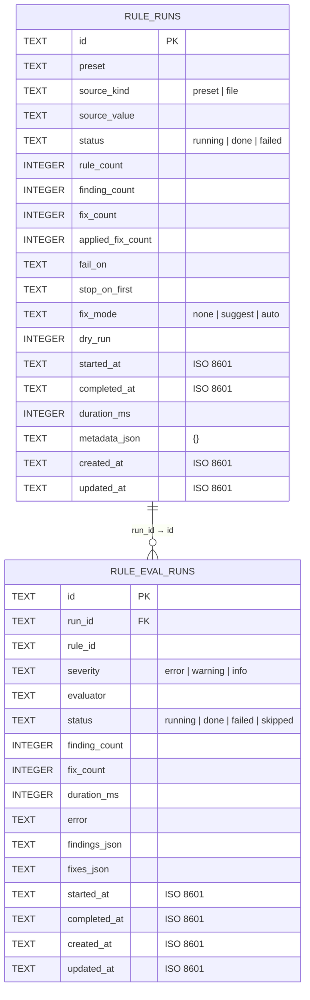

# @gobing-ai/ts-rule-engine

Constraint rule loading, evaluation, formatting, and fix generation for Bun/TypeScript projects. Rules are defined as declarative YAML/JSON, evaluated through a typed evaluator host, and results are rendered or converted into candidate fixes. Preset composition, extension loading, and bundled rule categories make the engine zero-config ready out of the box.

## Install

```bash
bun add @gobing-ai/ts-rule-engine
```

## Briefing

`ts-rule-engine` is a policy workflow engine: loaders turn rule files and presets into `ConstraintRule` objects, `RuleEngine` dispatches each rule to a matching evaluator through `RuleEngineHost`, and the result can be formatted for users or converted into fix candidates for controlled application.



| Entity | One-line Description |
|--------|----------------------|
| `RuleEngine` | Orchestrates evaluation of enabled rules against a workspace directory. Constructor accepts `RuleEngineOptions` (host, persistence, events, runId, runMeta, etc.). Supports opt-in early exit via `stopOnFirst` parameter. |
| `RuleEngineHost` | Capability host backed by `CapabilityRegistry` from `@gobing-ai/ts-runtime/extension` — holds evaluators, resolvers, formatters, and fixer providers, each with origin tracking for safe override detection. |
| `CapabilityRegistry<T>` | Generic named registry (shared with `ts-rule-engine`, `ts-dual-workflow-engine`) that tags each entry with its `origin` (`'builtin'`, `'extension'`, `'caller'`). |
| `ConstraintRule` | Declarative policy unit: id, severity, include/exclude globs, evaluator type + config, and optional fix config. |
| `Preset` | YAML/JSON composition: extends rule categories and other presets, declares `disable`/`overrides`, and exposes extension modules. |
| `ExtensionRef` | Resolved extension: a capability kind (`resolvers` / `evaluators` / `fixers` / `formatters`), an absolute module path, and its source preset name. |
| `Evaluator` | Implements one rule type (e.g. `regex`, `coverage-gate`, `import-boundary`), emitting findings and optional evaluator-native fixes. |
| `Resolver` | Maps a source file path to an expected test path for rules such as `test-location`; supports TypeScript, Python, Go, and Rust conventions. |
| `Formatter` | Renders a `RuleEngineResult` as text (for CLI) or JSON (for automation). |
| `FixerProvider` | Produces byte-range file edits from findings and a fix config; invoked when a rule's fix mode is non-`none` and the caller's authority allows it. |
| `Finding` | Structured policy violation or evaluator error with severity, location, and machine-readable code. |
| `Fix` | Candidate byte-range replacement; collected separately from findings, written only on explicit `applyFixes()`. |
| `RuleEngineResult` | Aggregate `{ findings, fixes }` returned from a single evaluation run. |
| `RuleEngineEvents` | Typed event map for rule-engine observability. All events prefixed `rule.` — see [Observability](#observability). |
| `RulePersistenceAdapter` | Durable adapter contract. Engine calls `insertRun`/`updateRunStatus` for the run, `insertEvalRun`/`updateEvalRun` per rule. DB-backed and memory-backed implementations included. |
| `RULE_ENGINE_SCHEMA_SQL` | Engine-owned DDL export: `rule_runs` + `rule_eval_runs` tables plus the FK index. Consumers apply it up-front before creating a `DbRulePersistenceAdapter`. |
| `bundledRulesRoot()` | Resolves the absolute path to the bundled `rules/` directory shipped with this package — portable defaults usable as the lowest-priority preset root. |
## Mental Model



Core concepts:

- `ConstraintRule`: one policy check. It has an `id`, `severity`, evaluator type/config, optional include/exclude globs, and optional fix config.
- `RuleEngine`: runs enabled rules against a `workdir`. The constructor auto-registers built-in evaluators, formatters, resolvers, and fixer providers. Accepts `RuleEngineOptions` for a custom host, `EventBus`, `processExecutor`, `persistence` adapter, `runId`, and `runMeta`.
- `RuleEngineHost`: capability container backed by four `CapabilityRegistry` instances from `@gobing-ai/ts-runtime/extension`. Each entry tracks its origin (`'builtin'` / `'extension'` / `'caller'`) so the engine can detect and report conflicting registrations.
- `RuleEvaluator`: implementation of one rule type, such as `regex`, `path`, or `coverage-gate`.
- `Fix`: byte-range replacement candidate. Fixes are collected separately from findings and only written when you call `applyFixes()`.
- Preset: YAML/JSON file that composes rule categories and can expose extension modules.
- `RulePersistenceAdapter`: durable run/eval history. The engine writes directly to the adapter at lifecycle boundaries; a DB-backed adapter and a test-friendly memory adapter ship with the package.
- `bundledRulesRoot()`: resolves the path to the `rules/` directory shipped with this package. Pass it as the lowest-priority root to `loadPreset()` so project-local and user-global roots shadow individual files while inheriting the rest.

## Execution Flow

When a rule is evaluated, the following sequence shows how the loader, host, engine, evaluator, and (optionally) the fixer pipeline cooperate.



The key design decisions visible in this flow:

- **Rule loading is lazy**: `loadPreset()` resolves and validates rules at load time but does not evaluate. No filesystem scanning happens until `evaluate()`.
- **Evaluators are stateless plugins**: each evaluator receives `(rule, context)` and returns findings. The engine owns the loop, error boundary, and fixer dispatch.
- **Fixes are opt-in and authority-gated**: the effective fix mode is `min(rule.fix.mode, caller.maxFixMode)`. Fixes are never written during evaluation — only when the caller explicitly calls `applyFixes()`.
- **Extension loading is trust-gated**: the `allowExtensions` flag must be explicitly `true`. Without it, `loadExtensionsIntoHost()` throws, preventing untrusted code from registering capabilities.
- **Origins prevent silent override**: each `CapabilityRegistry` entry records its origin. A preset extension cannot silently replace a built-in capability (evaluator, resolver, formatter, or fixer) — conflicts are surfaced.

## Quick Start

```ts
import { RuleEngine, TextFormatter, type ConstraintRule } from '@gobing-ai/ts-rule-engine';

const rules: ConstraintRule[] = [
  {
    id: 'no-console-log',
    description: 'Do not commit console.log calls',
    enabled: true,
    severity: 'error',
    include: ['src/**/*.ts'],
    evaluator: {
      type: 'regex',
      config: {
        mode: 'forbid',
        pattern: 'console\\.log\\(',
      },
    },
  },
];

const engine = new RuleEngine();
const result = await engine.evaluate(rules, process.cwd());

// Or stop early after the first error finding:
const fastResult = await engine.evaluate(rules, process.cwd(), 'error');

console.log(new TextFormatter().format(result));
```

## Rule Files
Rule files can be YAML, JSON, or a single rule object. File loads honor a top-level `$schema` ref by default, then validate the internal Zod schema. The `$schema` value is resolved from the bundled package schema (shipped under `node_modules/@gobing-ai/ts-rule-engine/schemas/`) — no network access. Quote the value, since YAML treats a leading `@` as reserved. Relative paths and (opt-in) remote URLs are also supported; see `@gobing-ai/ts-runtime` → *Structured config* for the full resolution rules. A multi-rule YAML file looks like this:

```yaml
$schema: "@gobing-ai/ts-rule-engine/schemas/rule-file.schema.json"
include:
  - "packages/*/src/**/*.ts"
exclude:
  - "**/*.test.ts"
severity: error
rules:
  - id: no-console-log
    description: Do not commit console.log calls
    evaluator:
      type: regex
      config:
        mode: forbid
        pattern: "console\\.log\\("

  - id: source-files-have-tests
    description: Source files should have matching tests
    evaluator:
      type: test-location
      config:
        expected: "packages/*/tests/**/*.test.ts"
        requireCorrespondingTest: true
        resolver: typescript
    include:
      - "packages/*/src/**/*.ts"
```

Load a rule file directly:

```ts
import { loadRuleFile } from '@gobing-ai/ts-rule-engine';

// Returns { rules, extensions } — same shape as loadPreset(). A rule file may
// declare an `extensions` block; the refs are gated by allowExtensions at load time.
const { rules, extensions } = await loadRuleFile('.rules/typescript.yaml');
```

## Presets

Presets compose category folders, other presets, and rule-file subpaths across one or more roots. Preset loads honor top-level `$schema` refs resolved from the bundled `schemas/` directory — no network access.

### Bundled Rules

The package ships a `rules/` directory with portable defaults. Call `bundledRulesRoot()` to get its absolute path and pass it as the lowest-priority root:

```ts
import { loadPreset, bundledRulesRoot } from '@gobing-ai/ts-rule-engine';

const roots = ['.spur/rules', bundledRulesRoot()].filter(Boolean);
const { rules, extensions } = await loadPreset('recommended', { roots });
```

Shipped categories:

| Preset / Category | Path | What it covers |
|-------------------|------|----------------|
| `recommended` | `rules/recommended.yaml` | Extends `typescript` + `structure` + `quality` — general-use baseline. |
| `spur-dev` | `rules/spur-dev.yaml` | Extends `typescript` + `quality` — stricter development preset, no `test-location`. |
| `typescript/` | `rules/typescript/` | TypeScript hygiene rules (e.g. no `biome-ignore` suppressions). |
| `structure/` | `rules/structure/` | Project structure rules (e.g. `test-location`). |
| `quality/` | `rules/quality/` | Quality gates (e.g. `coverage-gate`, `tsdoc-exports`). |

Use `listBundledRuleFiles()` to enumerate all shipped rule assets, useful for copying them into a writable user-global rules directory on first run.

### Project-Local Presets

Example layout:

```text
.spur/rules/
  recommended.yaml
  quality/
    coverage.yaml
  architecture/
    imports.yaml
```

Example preset:

```yaml
$schema: "@gobing-ai/ts-rule-engine/schemas/preset.schema.json"
name: recommended
extends:
  - quality
  - architecture/imports
disable:
  - legacy-rule
overrides:
  no-console-log:
    fix:
      mode: suggest
```

Load just the rules:

```ts
import { loadPresetRules } from '@gobing-ai/ts-rule-engine';

const rules = await loadPresetRules('recommended', {
  roots: ['.spur/rules'],
});
```

Load rules plus extension refs:

```ts
import { loadPreset, loadExtensionsIntoHost, RuleEngine } from '@gobing-ai/ts-rule-engine';

const loaded = await loadPreset('recommended', {
  roots: ['.spur/rules'],
});

const engine = new RuleEngine();
await loadExtensionsIntoHost(engine.host, loaded.extensions, {
  allowExtensions: true,
});

const result = await engine.evaluate(loaded.rules, process.cwd());
```

Roots are ordered highest priority first. If two roots contain the same relative rule file, the first root wins and lower-priority roots fill gaps.

## Evaluating With Fixes

Some evaluators have built-in fixer providers. Fixes are never written during evaluation; they are returned as candidates.

```ts
import { RuleEngine } from '@gobing-ai/ts-rule-engine';

const engine = new RuleEngine();
const result = await engine.evaluateWithFixes(rules, process.cwd(), 'auto');

const preview = await engine.applyFixes(process.cwd(), result.fixes, true);
console.log(preview.diff);

// Write changes after you have decided to apply them.
await engine.applyFixes(process.cwd(), result.fixes);
```

Fix authority levels:

| Mode | Meaning |
| ---- | ------- |
| `none` | Do not emit provider fixes. This is the default when `rule.fix` is absent. |
| `suggest` | Emit fixes only when caller allows at least `suggest`. |
| `auto` | Emit fixes when caller allows `auto`. |

The effective fix mode is the lower authority between `rule.fix.mode` and the caller's `maxFixMode` argument.

Example rule with regex replacement:

```yaml
$schema: "@gobing-ai/ts-rule-engine/schemas/rule-file.schema.json"
rules:
  - id: rename-foo
    description: Replace foo with bar
    evaluator:
      type: regex
      config:
        mode: forbid
        pattern: "\\bfoo\\b"
        flags: g
    fix:
      mode: auto
      replacement: bar
    include:
      - "src/**/*.ts"
```

Built-in fixer providers (`RegexFixerProvider`, `PathFixerProvider`, `TestStubFixer`):

| Evaluator type | Fix behavior |
| -------------- | ------------ |
| `regex`, `rg` | Replaces line matches using `fix.replacement` (`RegexFixerProvider`). |
| `path`, `file-exist` | Deletes files for `must: absent` rules in `auto` mode (`PathFixerProvider`). |
| `test-location` | Creates a missing test file using the selected resolver's skeleton (`TestStubFixer`). Never overwrites existing files. |

## Built-in Evaluators

| Type | Purpose | Notes |
| ---- | ------- | ----- |
| `regex` | Match or require text patterns in files (JS `RegExp` engine). | Pure JS file scanning. Supports lookbehind/backreferences, inline `(?i)` flags, and `multiline`. Not ReDoS-bounded. |
| `rg` | Match or require text patterns in files (real ripgrep engine). | Runs the `rg` CLI: ReDoS-immune, parallel, prunes heavy trees (`node_modules`, `dist`, …) during traversal. Ripgrep dialect — **no** lookbehind/backreferences. Requires the `rg` CLI. See [Rules Migration](#rules-migration). |
| `path`, `file-exist` | Check required or forbidden paths. | Supports explicit `paths` or glob-style `must: present/absent`. |
| `exit-code` | Run a command and evaluate its exit code. | Uses `ProcessExecutor`; inject one through `new RuleEngine({ processExecutor })` for tests. |
| `forbidden-import` | Block forbidden imports/usages. | Useful for package boundary rules. |
| `import-boundary` | Enforce scoped architectural import boundaries. | Supports per-boundary scope, excludes, and forbidden patterns. |
| `secrets-scanner` | Detect hardcoded secrets. | Built-in categories plus custom patterns. |
| `agent-detection` | Detect coding-agent related files. | Project hygiene use case. |
| `coverage-gate` | Enforce per-file lcov line coverage thresholds. | Reads `lcov.info`. Supports exemptions. |
| `tsdoc-export` | Require JSDoc/TSDoc before exported declarations. | TypeScript source scanning. |
| `test-location` | Enforce test placement and matching source/test pairs. | Uses named test-path resolvers. |
| `schema-artifact` | Validate JSON schema artifact structure. | Checks existence, JSON validity, title, properties, defs, required array. |
| `sg` | Run an ast-grep pattern. | Requires the `sg` CLI in the execution environment. |

### Common Evaluator Examples

Regex forbid:

```yaml
$schema: "@gobing-ai/ts-rule-engine/schemas/rule-file.schema.json"
rules:
  - id: no-debugger
    description: Do not commit debugger statements
    evaluator:
      type: regex
      config:
        mode: forbid
        pattern: "\\bdebugger\\b"
    include: ["src/**/*.ts"]
```

Path presence:

```yaml
$schema: "@gobing-ai/ts-rule-engine/schemas/rule-file.schema.json"
rules:
  - id: package-readme-required
    description: Each package should document its public API
    evaluator:
      type: path
      config:
        paths: ["README.md"]
```

Glob absence:

```yaml
$schema: "@gobing-ai/ts-rule-engine/schemas/rule-file.schema.json"
rules:
  - id: no-dist-in-source
    description: Built artifacts should not be committed
    evaluator:
      type: path
      config:
        must: absent
    include: ["dist/**"]
```

Coverage gate:

```yaml
$schema: "@gobing-ai/ts-rule-engine/schemas/rule-file.schema.json"
rules:
  - id: coverage-gate
    description: Source files must meet coverage threshold
    evaluator:
      type: coverage-gate
      config:
        lcovPath: .coverage/lcov.info
        threshold: 90
        exemptions:
          - path: packages/legacy/src/adapter.ts
            threshold: 70
            reason: legacy branch coverage tracked separately
```

Import boundary:

```yaml
$schema: "@gobing-ai/ts-rule-engine/schemas/rule-file.schema.json"
rules:
  - id: db-boundary
    description: Only ts-db may import drizzle
    evaluator:
      type: import-boundary
      config:
        boundaries:
          - scope: "packages/*/src/**/*.ts"
            exclude:
              - "packages/db/src/**"
            forbidden:
              - drizzle-orm
```

Schema artifact:

```yaml
$schema: "@gobing-ai/ts-rule-engine/schemas/rule-file.schema.json"
rules:
  - id: rule-schema-artifact
    description: Rule JSON schema artifact is complete
    evaluator:
      type: schema-artifact
      config:
        file: schema/rules.schema.json
        requiredTitle: ConstraintRule
        requiredProperties: ["rules"]
        requiredDefs: ["evaluator"]
        requireRequiredArray: true
```

ast-grep:

```yaml
$schema: "@gobing-ai/ts-rule-engine/schemas/rule-file.schema.json"
rules:
  - id: no-throw-string
    description: Throw Error objects, not strings
    evaluator:
      type: sg
      config:
        pattern: throw "$MSG"
        language: typescript
    include: ["src/**/*.ts"]
```

## Rules Migration

The `rg` evaluator now runs the **real ripgrep CLI** instead of being a JS-`RegExp` alias of `regex`. Ripgrep's Rust regex engine is ReDoS-immune, runs in parallel, and prunes heavy trees (`node_modules`, `dist`, …) during traversal — a meaningful speedup on large workspaces. The trade-off is a stricter dialect: ripgrep has **no lookbehind and no backreferences**.

This section explains how to move existing `regex` rules onto `rg` safely.

### What changed

| | `regex` (JS `RegExp`) | `rg` (ripgrep) |
| --- | --- | --- |
| Engine | In-process `new RegExp(...)` | `rg` CLI subprocess |
| Performance | Walks files in-process | Parallel, prunes `node_modules`/`dist`/… during traversal |
| ReDoS | Not bounded — a pathological pattern can hang | Linear-time — immune |
| Lookbehind `(?<=…)` / `(?<!…)` | Supported | **Not supported** |
| Backreferences `\1`, `\k<name>` | Supported | **Not supported** |
| Inline `(?i)` flags, `multiline` | Supported | Supported (`(?i)` is native; `multiline` → `rg -U --multiline-dotall`) |
| `mode: forbid` / `mode: require` | Supported | Supported (`require` → `rg --files-without-match`) |

The rule config shape is identical (`pattern`, `mode`, `multiline`, `include`, `exclude`), so most rules migrate by changing one word: `type: regex` → `type: rg`.

### The migration guard: `rg-evaluator-patterns-are-ripgrep-dialect`

A built-in meta rule scans your `.spur/rules/**/*.yaml` and **fails the gate** if any `type: rg` rule uses a construct ripgrep cannot compile (lookbehind or backreference). This catches an incompatible migration at lint time instead of letting it explode at scan time. A violation looks like:

```text
INVALID: .spur/rules/typescript/my-rule.yaml: rules[0] rg pattern uses lookbehind (unsupported by ripgrep) — use type: regex
```

The fix is exactly what the message says: keep that rule on `type: regex`. The two evaluators coexist — use `rg` for the speed/safety win where the pattern allows, and `regex` where you genuinely need lookbehind/backreferences.

### Migration steps

1. **Ensure `rg` is installed** in every environment that runs the gate (CI included), the same way `sg` is required. A missing `rg` makes the rule fail loud, not silently pass.

2. **Convert eligible rules.** For each `type: regex` rule, change it to `type: rg` *unless* its `pattern` uses lookbehind or a backreference:

   ```yaml
   # Before — JS RegExp engine
   - id: no-debugger
     description: Do not commit debugger statements
     evaluator:
       type: regex
       config:
         mode: forbid
         pattern: "\\bdebugger\\b"
     include: ["src/**/*.ts"]

   # After — real ripgrep (pattern is dialect-compatible)
   - id: no-debugger
     description: Do not commit debugger statements
     evaluator:
       type: rg
       config:
         mode: forbid
         pattern: "\\bdebugger\\b"
     include: ["src/**/*.ts"]
   ```

3. **Leave incompatible rules on `regex`.** A pattern such as `(?<=const\s)X` (lookbehind) or `(\w+)\s+\1` (backreference) stays `type: regex`. The migration guard will flag it if you convert it by mistake.

4. **Run the gate.** `rg-evaluator-patterns-are-ripgrep-dialect` runs as part of `spur rule run` (the pre-check preset). A clean run means every `rg` rule is dialect-safe.

   ```bash
   spur rule run --preset recommended-pre-check --fail-on warning
   ```

### Automated conversion

`@gobing-ai/ts-rule-engine` exports `isRipgrepCompatiblePattern(pattern)` so a downstream tool can decide per rule whether to rewrite `type: regex` → `type: rg`:

```ts
import { isRipgrepCompatiblePattern } from "@gobing-ai/ts-rule-engine";

const verdict = isRipgrepCompatiblePattern("(?<=foo)bar");
// → { compatible: false, feature: "lookbehind" }  → keep this rule on `type: regex`

isRipgrepCompatiblePattern("\\bdebugger\\b");
// → { compatible: true }  → safe to rewrite to `type: rg`
```

This is the same check the migration guard uses, so a converter built on it and the spur rule never disagree.

## Test-Path Resolvers

The `test-location` evaluator can require source files to have corresponding test files. The resolver is selected by `evaluator.config.resolver`.

| Resolver | Source path | Expected test path |
| -------- | ----------- | ------------------ |
| `typescript` | `src/foo/bar.ts` | `tests/foo/bar.test.ts` |
| `typescript` | `packages/core/src/foo.ts` | `packages/core/tests/foo.test.ts` |
| `python` | `src/foo/bar.py` | `tests/foo/test_bar.py` |
| `go` | `foo/bar.go` | `foo/bar_test.go` |
| `rust` | `crate/src/foo.rs` | `crate/tests/foo.rs` |

Example:

```yaml
$schema: "@gobing-ai/ts-rule-engine/schemas/rule-file.schema.json"
rules:
  - id: python-sources-have-tests
    description: Python sources should have pytest files
    evaluator:
      type: test-location
      config:
        expected: "tests/**/*.py"
        resolver: python
        requireCorrespondingTest: true
    include: ["src/**/*.py"]
```

## Custom Evaluators

Register a custom evaluator directly:

```ts
import {
  RuleEngine,
  createFinding,
  type RuleEvaluator,
} from '@gobing-ai/ts-rule-engine';

const evaluator: RuleEvaluator = {
  async evaluate(rule, context) {
    if (!context.workdir.includes('service')) {
      return {
        findings: [
          createFinding(rule, 'workspace path must include "service"', null, {
            code: 'custom:not-service',
          }),
        ],
        fixes: [],
      };
    }
    return { findings: [], fixes: [] };
  },
};

const engine = new RuleEngine();
engine.registerEvaluator('workspace-name', evaluator);
```

Then use it in a rule:

```yaml
$schema: "@gobing-ai/ts-rule-engine/schemas/rule-file.schema.json"
rules:
  - id: workspace-name
    description: Check workspace naming convention
    evaluator:
      type: workspace-name
```

## Preset Extensions

Preset extensions are trusted local modules. They are disabled unless the caller explicitly passes `allowExtensions: true` to `loadExtensionsIntoHost()`.

Preset:

```yaml
$schema: "@gobing-ai/ts-rule-engine/schemas/preset.schema.json"
name: local
extends:
  - quality
extensions:
  resolvers:
    - ./extensions/custom-resolver.ts
  evaluators:
    - ./extensions/custom-evaluator.ts
  fixers:
    - ./extensions/custom-fixer.ts
  formatters:
    - ./extensions/compact-formatter.ts
```

Resolver extension:

```ts
export default {
  name: 'custom',
  resolveTestPath(srcRelPath: string): string {
    return srcRelPath.replace(/^src\//, 'tests/').replace(/\.ts$/, '.spec.ts');
  },
};
```

Evaluator extension:

```ts
import type { RuleEvaluator } from '@gobing-ai/ts-rule-engine';

const evaluator: RuleEvaluator & { name: string } = {
  name: 'custom-check',
  async evaluate() {
    return { findings: [], fixes: [] };
  },
};

export default evaluator;
```

Fixer extension (keyed by the evaluator type it handles):

```ts
import type { RuleFixerProvider } from '@gobing-ai/ts-rule-engine';

const fixer: RuleFixerProvider & { name: string } = {
  name: 'custom-fixer',
  async createFixes(input) {
    // Return Fix[] (byte-range replacements) based on findings and fix config.
    return [];
  },
};

export default fixer;
```

Load extensions (uses the shared `loadExtensionModules` from `@gobing-ai/ts-runtime/extension`):

```ts
const loaded = await loadPreset('local', { roots: ['.spur/rules'] });
const engine = new RuleEngine();

await loadExtensionsIntoHost(engine.host, loaded.extensions, {
  allowExtensions: true,
  logger: { warn: console.warn },
});
```

Supported extension kinds:

| Kind | Host Registry | Required shape | Origin |
| ---- | ------------ | -------------- | ------ |
| `resolvers` | `host.resolvers` (`CapabilityRegistry<TestPathResolver>`) | object with `name` and `resolveTestPath()` | `'extension'` |
| `evaluators` | `host.evaluators` (`CapabilityRegistry<RuleEvaluator>`) | object with `name` and `evaluate()` | `'extension'` |
| `fixers` | `host.fixers` (`CapabilityRegistry<RuleFixerProvider>`) | object with `name` and `createFixes()`, keyed by evaluator type | `'extension'` |
| `formatters` | `host.formatters` (`CapabilityRegistry<ResultFormatter>`) | object with `name` and `format()` | `'extension'` |
## Traversal Control (`stopOnFirst`)

By default, the engine evaluates every enabled rule exhaustively. Pass `stopOnFirst: 'error' | 'warning' | 'info'` to break early when the severity threshold is met:

```ts
// Stop after the first error-level finding — skip remaining rules.
await engine.evaluate(rules, workdir, 'error');

// Same behavior via evaluateWithFixes.
await engine.evaluateWithFixes(rules, workdir, 'auto', 'error');
```

The threshold compares findings against `SEVERITY_RANK` (`error: 3 > warning: 2 > info: 1`). Omitting the parameter preserves exhaustive evaluation.

## Formatting Results

```ts
import { JsonFormatter, TextFormatter } from '@gobing-ai/ts-rule-engine';

const text = new TextFormatter().format(result);
const json = new JsonFormatter().format(result);
```

Text output is intended for humans:

```text
ERROR no-console-log src/index.ts:12 forbidden pattern found: console\.log\(
```

JSON output is the full `RuleEngineResult` object.

## Error Handling

Evaluator runtime errors are captured as findings with:

- `kind: "error"`
- `code: "evaluator:<type>"`
- `filePath: null`

That lets downstream tools distinguish policy violations from misconfigured or failing evaluators.

```ts
const errors = result.findings.filter((finding) => finding.kind === 'error');
const violations = result.findings.filter((finding) => finding.kind !== 'error');
```

## Observability

The rule engine uses a **three-layer observability model** (ADR-015):

| Layer | Tool | Consumer |
|-------|------|----------|
| Logs | `getLogger('rule-engine')` | Human-readable debugging / file output |
| Traces | `traceAsync('rule.run')` + `addSpanEvent` per rule | Distributed perf correlation (OTel) |
| Events | `EventBus<RuleEngineEvents>` | Programmatic in-process subscription (progress bars, CI dashboards) |

All three layers are **additive** — EventBus does not replace logging or tracing. A consumer who wants a progress bar subscribes to events; a consumer who wants traces attaches an OTel collector; both work independently.

### Event Map

`RuleEngineEvents` is a typed event map. All events are prefixed `rule.`:

| Event | Payload | When |
|-------|---------|------|
| `rule.run.start` | `{ rules, total }` | Before the first rule is evaluated |
| `rule.eval.start` | `{ ruleId, index, total }` | Before a single rule's evaluator is invoked |
| `rule.eval.done` | `{ ruleId, findings, durationMs }` | After a single rule evaluation finishes successfully |
| `rule.eval.error` | `{ ruleId, error }` | When a rule evaluator throws (distinct from a violation finding) |
| `rule.run.done` | `{ rules, findings, durationMs, stoppedEarly }` | After the last rule finishes (or short-circuited) |

### Usage

Pass an `EventBus` to the engine constructor:

```ts
import { RuleEngine } from '@gobing-ai/ts-rule-engine';
import { EventBus } from '@gobing-ai/ts-infra';
import type { RuleEngineEvents } from '@gobing-ai/ts-rule-engine';

const bus = new EventBus<RuleEngineEvents>();

bus.on('rule.eval.done', (data) => {
  console.log(`Rule ${data.ruleId}: ${data.findings} findings (${data.durationMs}ms)`);
});

bus.on('rule.run.done', (data) => {
  console.log(`Run complete: ${data.findings} total findings${data.stoppedEarly ? ' (stopped early)' : ''}`);
});

const engine = new RuleEngine({ events: bus });
const result = await engine.evaluate(rules, workdir);
```

### Zero-overhead default

When no `events` option is provided, the engine incurs zero observability overhead — no emit calls, no handler invocations. The event bus is purely opt-in.

### `rule.eval.error` vs violation findings

`rule.eval.error` is emitted when an evaluator **throws** — it signals a crash, not a policy violation. The engine still produces a `kind: 'error'` finding for the thrown rule. A normal policy violation emits **no** `rule.eval.error`. Don't conflate the two: subscribe to `rule.eval.error` for crash alerting, and inspect findings for policy results.

## Persistence

The engine supports a **durable persistence adapter** pattern (mirrors `@gobing-ai/ts-dual-workflow-engine`). When a `RulePersistenceAdapter` is injected via `RuleEngineOptions`, the engine writes run and per-rule evaluation rows directly — no EventBus subscriber needed.

### DB Schema



- **`rule_runs`** is the list/query unit — one row per engine invocation.
- **`rule_eval_runs`** is the per-rule detail unit — one row per evaluated rule, FK'd to `rule_runs`.
- Timestamps are `TEXT` (ISO 8601) for portability across SQLite drivers including D1.
- `status`: `running` during evaluation, `done` on normal completion (including policy failures), `failed` for engine/runtime errors. `skipped` when `stopOnFirst` prevents later rules from running.

### Adapter Contract

```ts
interface RulePersistenceAdapter {
    insertRun(input: RuleRunInput): Promise<void>;
    updateRunStatus(runId, status, findingCount, fixCount, appliedFixCount, durationMs): Promise<void>;
    insertEvalRun(input: RuleEvalRunInput): Promise<void>;
    updateEvalRun(input: RuleEvalRunUpdate): Promise<void>;
}
```

Two implementations ship with the package:

| Adapter | What it does |
|---------|-------------|
| `DbRulePersistenceAdapter` | Writes directly to SQLite via a `@gobing-ai/ts-db` `DbAdapter`. Consumers apply the schema up-front with `RULE_ENGINE_SCHEMA_SQL`. |
| `MemoryRulePersistenceAdapter` | Stores rows in `Map<string, Row>` — designed for unit tests. Lets test code assert on persisted run/eval state. |

### Usage

```ts
import { RuleEngine, DbRulePersistenceAdapter, RULE_ENGINE_SCHEMA_SQL } from '@gobing-ai/ts-rule-engine';
import { createDbAdapter } from '@gobing-ai/ts-db';

const db = await createDbAdapter({ driver: 'bun-sqlite', url: ':memory:' });
await db.exec(RULE_ENGINE_SCHEMA_SQL);

const engine = new RuleEngine({
    persistence: new DbRulePersistenceAdapter(db),
    runId: 'my-run-1',
    runMeta: {
        sourceKind: 'preset',
        sourceValue: 'recommended',
        preset: 'recommended',
        failOn: 'error',
        stopOnFirst: 'false',
        fixMode: 'none',
        dryRun: false,
    },
});

const result = await engine.evaluate(rules, process.cwd());
// At this point, rule_runs has 'my-run-1' with status='done', findings, and duration.
```

- `runId`: caller-provided or engine-generated (`crypto.randomUUID()`). Persisted so downstream tools like `spur rule trace` can query history.
- `runMeta`: metadata written to the initial run row — preset name, source/file info, fix mode, dry-run flag.
- Persistence is **incremental**: the run row is inserted before the first rule, finalized after the last. Per-rule eval rows are inserted as each rule starts and updated when it finishes. A polling `trace` can surface partial progress.
- When `persistence` is absent, the engine works normally — zero persistence overhead.

## Package Boundary

This package owns rule definitions, preset loading, evaluators, formatters, test-path resolvers, fixer providers, extension loading, the `CapabilityRegistry` re-export from `@gobing-ai/ts-runtime/extension`, the persistence adapter contract and implementations, the engine-owned schema SQL, and bundled rule presets.

It does **not** own:

- CLI argument parsing or process exit policy
- `ProcessExecutor` implementation (injected via `RuleEngineOptions`)
- `DbAdapter` creation and lifecycle (injected via `RulePersistenceAdapter`)
- Repository-specific rule catalogs (project rules live in `.spur/rules/`)
- CI integration or publishing workflows

Downstream tools (e.g. `spur`) consume the library and add their own CLI, config discovery, run-id stamping, and execution policy.