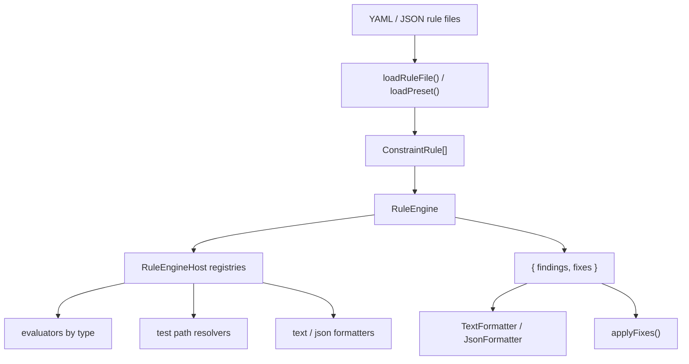

# @gobing-ai/ts-rule-engine

Constraint rule loading, evaluation, formatting, and fix generation for Bun/TypeScript projects.

This package is a library. It does not ship a CLI. Downstream tools can use it to load rule presets, evaluate a workspace, format findings, collect fix candidates, and optionally apply those fixes.

## Install

```bash
bun add @gobing-ai/ts-rule-engine
```

## Mental Model



Core concepts:

- `ConstraintRule`: one policy check. It has an `id`, `severity`, evaluator type/config, optional include/exclude globs, and optional fix config.
- `RuleEngine`: runs enabled rules against a `workdir`.
- `RuleEngineHost`: registry container for evaluators, formatters, and test-path resolvers.
- `RuleEvaluator`: implementation of one rule type, such as `regex`, `path`, or `coverage-gate`.
- `Fix`: byte-range replacement candidate. Fixes are collected separately from findings and are only written when you call `applyFixes()`.
- Preset: YAML/JSON file that composes rule categories and can expose extension modules.

## Quick Start

```ts
import { RuleEngine, TextFormatter, type ConstraintRule } from '@gobing-ai/ts-rule-engine';

const rules: ConstraintRule[] = [
  {
    id: 'no-console-log',
    description: 'Do not commit console.log calls',
    enabled: true,
    severity: 'error',
    include: ['src/**/*.ts'],
    evaluator: {
      type: 'regex',
      config: {
        mode: 'forbid',
        pattern: 'console\\.log\\(',
      },
    },
  },
];

const engine = new RuleEngine();
const result = await engine.evaluate(rules, process.cwd());

console.log(new TextFormatter().format(result));
process.exitCode = result.findings.some((finding) => finding.severity === 'error') ? 1 : 0;
```

## Rule Files

Rule files can be YAML, JSON, or a single rule object. A multi-rule YAML file looks like this:

```yaml
include:
  - "packages/*/src/**/*.ts"
exclude:
  - "**/*.test.ts"
severity: error
rules:
  - id: no-console-log
    description: Do not commit console.log calls
    evaluator:
      type: regex
      config:
        mode: forbid
        pattern: "console\\.log\\("

  - id: source-files-have-tests
    description: Source files should have matching tests
    evaluator:
      type: test-location
      config:
        expected: "packages/*/tests/**/*.test.ts"
        requireCorrespondingTest: true
        resolver: typescript
    include:
      - "packages/*/src/**/*.ts"
```

Load a rule file directly:

```ts
import { loadRuleFile } from '@gobing-ai/ts-rule-engine';

const rules = await loadRuleFile('.rules/typescript.yaml');
```

## Presets

Presets compose category folders, other presets, and rule-file subpaths across one or more roots.

Example layout:

```text
.spur/rules/
  recommended.yaml
  quality/
    coverage.yaml
  architecture/
    imports.yaml
```

Example preset:

```yaml
name: recommended
extends:
  - quality
  - architecture/imports
disable:
  - legacy-rule
overrides:
  no-console-log:
    fix:
      mode: suggest
```

Load just the rules:

```ts
import { loadPresetRules } from '@gobing-ai/ts-rule-engine';

const rules = await loadPresetRules('recommended', {
  roots: ['.spur/rules'],
});
```

Load rules plus extension refs:

```ts
import { loadPreset, loadExtensionsIntoHost, RuleEngine } from '@gobing-ai/ts-rule-engine';

const loaded = await loadPreset('recommended', {
  roots: ['.spur/rules'],
});

const engine = new RuleEngine();
await loadExtensionsIntoHost(engine.host, loaded.extensions, {
  allowExtensions: true,
});

const result = await engine.evaluate(loaded.rules, process.cwd());
```

Roots are ordered highest priority first. If two roots contain the same relative rule file, the first root wins and lower-priority roots fill gaps.

## Evaluating With Fixes

Some evaluators have built-in fixer providers. Fixes are never written during evaluation; they are returned as candidates.

```ts
import { RuleEngine } from '@gobing-ai/ts-rule-engine';

const engine = new RuleEngine();
const result = await engine.evaluateWithFixes(rules, process.cwd(), 'auto');

const preview = await engine.applyFixes(process.cwd(), result.fixes, true);
console.log(preview.diff);

// Write changes after you have decided to apply them.
await engine.applyFixes(process.cwd(), result.fixes);
```

Fix authority levels:

| Mode | Meaning |
| ---- | ------- |
| `none` | Do not emit provider fixes. This is the default when `rule.fix` is absent. |
| `suggest` | Emit fixes only when caller allows at least `suggest`. |
| `auto` | Emit fixes when caller allows `auto`. |

The effective fix mode is the lower authority between `rule.fix.mode` and the caller's `maxFixMode` argument.

Example rule with regex replacement:

```yaml
rules:
  - id: rename-foo
    description: Replace foo with bar
    evaluator:
      type: regex
      config:
        mode: forbid
        pattern: "\\bfoo\\b"
        flags: g
    fix:
      mode: auto
      replacement: bar
    include:
      - "src/**/*.ts"
```

Built-in fixer providers:

| Evaluator type | Fix behavior |
| -------------- | ------------ |
| `regex`, `rg` | Replaces line matches using `fix.replacement`. |
| `path`, `file-exist` | Deletes files for `must: absent` rules in `auto` mode. |
| `test-location` | Creates a missing test file using the selected resolver's skeleton when available. |

## Built-in Evaluators

| Type | Purpose | Notes |
| ---- | ------- | ----- |
| `regex`, `rg` | Match or require text patterns in files. | Pure JS file scanning. Supports inline `(?i)` flags and `multiline`. |
| `path`, `file-exist` | Check required or forbidden paths. | Supports explicit `paths` or glob-style `must: present/absent`. |
| `exit-code` | Run a command and evaluate its exit code. | Uses `ProcessExecutor`; inject one through `new RuleEngine({ processExecutor })` for tests. |
| `forbidden-import` | Block forbidden imports/usages. | Useful for package boundary rules. |
| `import-boundary` | Enforce scoped architectural import boundaries. | Supports per-boundary scope, excludes, and forbidden patterns. |
| `secrets-scanner` | Detect hardcoded secrets. | Built-in categories plus custom patterns. |
| `agent-detection` | Detect coding-agent related files. | Project hygiene use case. |
| `coverage-gate` | Enforce per-file lcov line coverage thresholds. | Reads `lcov.info`. Supports exemptions. |
| `tsdoc-export` | Require JSDoc/TSDoc before exported declarations. | TypeScript source scanning. |
| `test-location` | Enforce test placement and matching source/test pairs. | Uses named test-path resolvers. |
| `schema-artifact` | Validate JSON schema artifact structure. | Checks existence, JSON validity, title, properties, defs, required array. |
| `sg` | Run an ast-grep pattern. | Requires the `sg` CLI in the execution environment. |

### Common Evaluator Examples

Regex forbid:

```yaml
rules:
  - id: no-debugger
    description: Do not commit debugger statements
    evaluator:
      type: regex
      config:
        mode: forbid
        pattern: "\\bdebugger\\b"
    include: ["src/**/*.ts"]
```

Path presence:

```yaml
rules:
  - id: package-readme-required
    description: Each package should document its public API
    evaluator:
      type: path
      config:
        paths: ["README.md"]
```

Glob absence:

```yaml
rules:
  - id: no-dist-in-source
    description: Built artifacts should not be committed
    evaluator:
      type: path
      config:
        must: absent
    include: ["dist/**"]
```

Coverage gate:

```yaml
rules:
  - id: coverage-gate
    description: Source files must meet coverage threshold
    evaluator:
      type: coverage-gate
      config:
        lcovPath: .coverage/lcov.info
        threshold: 90
        exemptions:
          - path: packages/legacy/src/adapter.ts
            threshold: 70
            reason: legacy branch coverage tracked separately
```

Import boundary:

```yaml
rules:
  - id: db-boundary
    description: Only ts-db may import drizzle
    evaluator:
      type: import-boundary
      config:
        boundaries:
          - scope: "packages/*/src/**/*.ts"
            exclude:
              - "packages/db/src/**"
            forbidden:
              - drizzle-orm
```

Schema artifact:

```yaml
rules:
  - id: rule-schema-artifact
    description: Rule JSON schema artifact is complete
    evaluator:
      type: schema-artifact
      config:
        file: schema/rules.schema.json
        requiredTitle: ConstraintRule
        requiredProperties: ["rules"]
        requiredDefs: ["evaluator"]
        requireRequiredArray: true
```

ast-grep:

```yaml
rules:
  - id: no-throw-string
    description: Throw Error objects, not strings
    evaluator:
      type: sg
      config:
        pattern: throw "$MSG"
        language: typescript
    include: ["src/**/*.ts"]
```

## Test-Path Resolvers

The `test-location` evaluator can require source files to have corresponding test files. The resolver is selected by `evaluator.config.resolver`.

| Resolver | Source path | Expected test path |
| -------- | ----------- | ------------------ |
| `typescript` | `src/foo/bar.ts` | `tests/foo/bar.test.ts` |
| `typescript` | `packages/core/src/foo.ts` | `packages/core/tests/foo.test.ts` |
| `python` | `src/foo/bar.py` | `tests/foo/test_bar.py` |
| `go` | `foo/bar.go` | `foo/bar_test.go` |
| `rust` | `crate/src/foo.rs` | `crate/tests/foo.rs` |

Example:

```yaml
rules:
  - id: python-sources-have-tests
    description: Python sources should have pytest files
    evaluator:
      type: test-location
      config:
        expected: "tests/**/*.py"
        resolver: python
        requireCorrespondingTest: true
    include: ["src/**/*.py"]
```

## Custom Evaluators

Register a custom evaluator directly:

```ts
import {
  RuleEngine,
  createFinding,
  type RuleEvaluator,
} from '@gobing-ai/ts-rule-engine';

const evaluator: RuleEvaluator = {
  async evaluate(rule, context) {
    if (!context.workdir.includes('service')) {
      return {
        findings: [
          createFinding(rule, 'workspace path must include "service"', null, {
            code: 'custom:not-service',
          }),
        ],
        fixes: [],
      };
    }
    return { findings: [], fixes: [] };
  },
};

const engine = new RuleEngine();
engine.registerEvaluator('workspace-name', evaluator);
```

Then use it in a rule:

```yaml
rules:
  - id: workspace-name
    description: Check workspace naming convention
    evaluator:
      type: workspace-name
```

## Preset Extensions

Preset extensions are trusted local modules. They are disabled unless the caller explicitly passes `allowExtensions: true` to `loadExtensionsIntoHost()`.

Preset:

```yaml
name: local
extends:
  - quality
extensions:
  resolvers:
    - ./extensions/custom-resolver.ts
  evaluators:
    - ./extensions/custom-evaluator.ts
  formatters:
    - ./extensions/compact-formatter.ts
```

Resolver extension:

```ts
export default {
  name: 'custom',
  resolveTestPath(srcRelPath: string): string {
    return srcRelPath.replace(/^src\//, 'tests/').replace(/\.ts$/, '.spec.ts');
  },
};
```

Evaluator extension:

```ts
import type { RuleEvaluator } from '@gobing-ai/ts-rule-engine';

const evaluator: RuleEvaluator & { name: string } = {
  name: 'custom-check',
  async evaluate() {
    return { findings: [], fixes: [] };
  },
};

export default evaluator;
```

Load extensions:

```ts
const loaded = await loadPreset('local', { roots: ['.spur/rules'] });
const engine = new RuleEngine();

await loadExtensionsIntoHost(engine.host, loaded.extensions, {
  allowExtensions: true,
  logger: { warn: console.warn },
});
```

Supported extension kinds:

| Kind | Registry | Required shape |
| ---- | -------- | -------------- |
| `resolvers` | `host.resolvers` | object with `name` and `resolveTestPath()` |
| `evaluators` | `host.evaluators` | object with `name` and `evaluate()` |
| `formatters` | `host.formatters` | object with `name` and `format()` |

`fixers` can be declared in preset metadata but are not loaded into `RuleEngineHost` by `loadExtensionsIntoHost()` because fixer providers live on the engine's fixer map.

## Formatting Results

```ts
import { JsonFormatter, TextFormatter } from '@gobing-ai/ts-rule-engine';

const text = new TextFormatter().format(result);
const json = new JsonFormatter().format(result);
```

Text output is intended for humans:

```text
ERROR no-console-log src/index.ts:12 forbidden pattern found: console\.log\(
```

JSON output is the full `RuleEngineResult` object.

## Error Handling

Evaluator runtime errors are captured as findings with:

- `kind: "error"`
- `code: "evaluator:<type>"`
- `filePath: null`

That lets downstream tools distinguish policy violations from misconfigured or failing evaluators.

```ts
const errors = result.findings.filter((finding) => finding.kind === 'error');
const violations = result.findings.filter((finding) => finding.kind !== 'error');
```

## Package Boundary

This package owns rule definitions, preset loading, evaluators, formatters, test-path resolvers, and fix application. It does not own:

- CLI argument parsing
- process exit policy
- repository-specific rule catalogs
- publishing or CI integration

Those concerns should live in downstream tools that consume this library.
