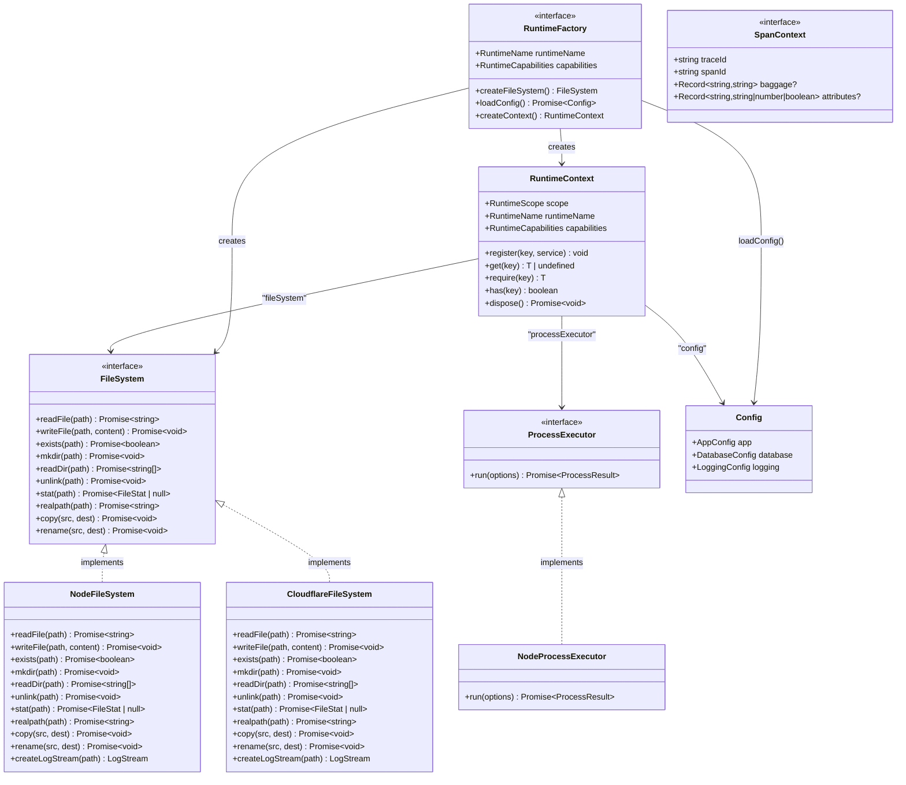

# @gobing-ai/ts-runtime

Runtime abstraction layer — environment detection, file system, process execution, configuration, and context management. Works on Bun/Node and Cloudflare Workers.

## Overview

`ts-runtime` decouples application code from platform specifics. Instead of importing `node:fs` or `node:child_process` directly, consumers go through interfaces (`FileSystem`, `ProcessExecutor`) that resolve to the correct implementation at startup based on `RuntimeContext`.

**Key abstractions:**

| Concept | Interface | Bun/Node impl | Cloudflare impl |
|---------|-----------|---------------|-----------------|
| File system | `FileSystem` | `NodeFileSystem` | `CloudflareFileSystem` (stub) |
| Process execution | `ProcessExecutor` | `NodeProcessExecutor` | — |
| Configuration | `Config` (Zod schema) | YAML + env vars | YAML + env vars |
| Context | `RuntimeContext` | service locator | service locator |
| Tracing | `SpanContext` | `{ traceId, spanId }` | `{ traceId, spanId }` |

## Architecture



## How It Works

### 1. Runtime detection

At startup, a `RuntimeFactory` is selected based on the environment:

```ts
import { createRuntimeContext } from '@gobing-ai/ts-runtime';

const ctx = createRuntimeContext({
    runtimeName: 'node-bun',
    capabilities: {
        hasFilesystem: true,
        hasProcessExecution: true,
        hasPersistentStorage: true,
    },
});
```

### 2. Service registration

Services are registered into `RuntimeContext` and accessed by key:

```ts
ctx.register('db', drizzleAdapter);
ctx.register('cache', redisClient);

const db = ctx.require('db'); // throws if missing
const cache = ctx.get('cache'); // undefined if missing
```

### 3. Configuration

Config is loaded from YAML with environment variable interpolation and Zod validation:

```yaml
# config.yaml
app:
  name: my-app
  env: ${APP_ENV}
  port: ${PORT}
database:
  url: ${DATABASE_URL}
logging:
  level: debug
```

```ts
import { buildConfigFromYaml } from '@gobing-ai/ts-runtime';

const yaml = await fs.readFile('config.yaml');
const config = buildConfigFromYaml(yaml, {
    overrides: { app: { port: 8080 } },
});
// config.app.port === 8080 (overridden)
// config.logging.level === 'debug' (from YAML)
```

### 4. File system abstraction

All file operations go through the `FileSystem` interface. Swap implementations for testing:

```ts
import { getFs } from '@gobing-ai/ts-runtime';

const fs = getFs();
await fs.writeFile('output.json', JSON.stringify(data));
const content = await fs.readFile('output.json');
```

### 5. Graceful disposal

`RuntimeContext.dispose()` calls `dispose()` on every registered service that implements the pattern:

```ts
process.on('SIGTERM', async () => {
    await ctx.dispose();
    process.exit(0);
});
```

## Usage

### Install

```bash
bun add @gobing-ai/ts-runtime
```

### Basic setup (Bun/Node)

```ts
import { createRuntimeContext, getFs, NodeFileSystem } from '@gobing-ai/ts-runtime';

const ctx = createRuntimeContext({
    runtimeName: 'node-bun',
    services: {
        fileSystem: new NodeFileSystem(),
    },
});

const fs = ctx.require('fileSystem');
await fs.writeFile('hello.txt', 'Hello, world!');
```

### Cloudflare Workers

```ts
import { createRuntimeContext, CloudflareFileSystem } from '@gobing-ai/ts-runtime';

export default {
    async fetch(request: Request, env: Env): Promise<Response> {
        const ctx = createRuntimeContext({
            runtimeName: 'cloudflare-workers',
            capabilities: {
                hasFilesystem: false,
                hasProcessExecution: false,
                hasPersistentStorage: false,
            },
            services: {
                fileSystem: new CloudflareFileSystem(),
            },
        });
        // ...
    },
};
```

### Config with env interpolation

```ts
import { buildConfigFromYaml, buildConfigFromObject } from '@gobing-ai/ts-runtime';

// From YAML file
const config = buildConfigFromYaml(yamlText);

// From plain object (programmatic config)
const config = buildConfigFromObject({
    app: { name: 'api', env: 'production', port: 3000 },
    database: { url: ':memory:' },
});
```

### Process execution

```ts
import { NodeProcessExecutor } from '@gobing-ai/ts-runtime';

const exec = new NodeProcessExecutor({ defaultTimeout: 30_000 });

const result = await exec.run({
    command: 'git',
    args: ['status', '--short'],
    cwd: '/path/to/repo',
    rejectOnError: true,
});

console.log(result.stdout);
console.log(`Duration: ${result.durationMs}ms`);
```

### SpanContext (for telemetry)

```ts
import type { SpanContext } from '@gobing-ai/ts-runtime';

function processRequest(ctx: SpanContext) {
    console.log(`Trace: ${ctx.traceId}, Span: ${ctx.spanId}`);
}
```
