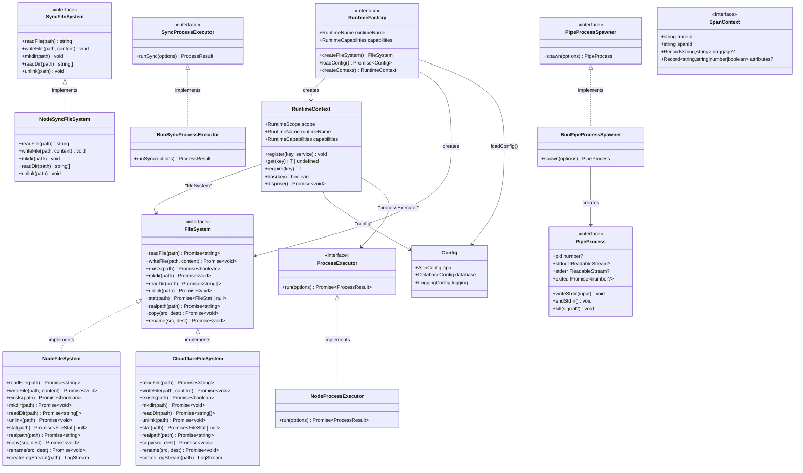

# @gobing-ai/ts-runtime

Runtime abstraction layer — environment detection, file system, process execution, configuration, and context management. Works on Bun/Node and Cloudflare Workers.

## Overview

`ts-runtime` decouples application code from platform specifics. Instead of importing `node:fs` or `node:child_process` directly, consumers go through interfaces (`FileSystem`, `SyncFileSystem`, `ProcessExecutor`, `SyncProcessExecutor`, `PipeProcessSpawner`) that resolve to the correct implementation at startup based on `RuntimeContext`. Node filesystem modules are loaded lazily by `NodeFileSystem`, so importing the package remains safe for Worker bundles that select `CloudflareFileSystem`.

**Key abstractions:**

| Concept | Interface | Bun/Node impl | Cloudflare impl |
|---------|-----------|---------------|-----------------|
| Async file system | `FileSystem` | `NodeFileSystem` | `CloudflareFileSystem` (unsupported filesystem facade) |
| Sync file system | `SyncFileSystem` | `NodeSyncFileSystem` | — |
| Buffered process execution | `ProcessExecutor` | `NodeProcessExecutor` | — |
| Sync process execution | `SyncProcessExecutor` | `BunSyncProcessExecutor` | — |
| Pipe process spawning | `PipeProcessSpawner` | `BunPipeProcessSpawner` | — |
| Configuration | `Config` (Zod schema) | YAML + env vars | YAML + env vars |
| Context | `RuntimeContext` | service locator | service locator |
| Tracing | `SpanContext` | `{ traceId, spanId }` | `{ traceId, spanId }` |

## Architecture


```mermaid
classDiagram
    class RuntimeFactory {
        <<interface>>
        +RuntimeName runtimeName
        +RuntimeCapabilities capabilities
        +createFileSystem() FileSystem
        +loadConfig() Promise~Config~
        +createContext() RuntimeContext
    }

    class RuntimeContext {
        +RuntimeScope scope
        +RuntimeName runtimeName
        +RuntimeCapabilities capabilities
        +register(key, service) void
        +get(key) T | undefined
        +require(key) T
        +has(key) boolean
        +dispose() Promise~void~
    }

    class FileSystem {
        <<interface>>
        +readFile(path) Promise~string~
        +writeFile(path, content) Promise~void~
        +exists(path) Promise~boolean~
        +mkdir(path) Promise~void~
        +readDir(path) Promise~string[]~
        +unlink(path) Promise~void~
        +stat(path) Promise~FileStat | null~
        +realpath(path) Promise~string~
        +copy(src, dest) Promise~void~
        +rename(src, dest) Promise~void~
    }

    class NodeFileSystem {
        +readFile(path) Promise~string~
        +writeFile(path, content) Promise~void~
        +exists(path) Promise~boolean~
        +mkdir(path) Promise~void~
        +readDir(path) Promise~string[]~
        +unlink(path) Promise~void~
        +stat(path) Promise~FileStat | null~
        +realpath(path) Promise~string~
        +copy(src, dest) Promise~void~
        +rename(src, dest) Promise~void~
        +createLogStream(path) LogStream
    }

    class CloudflareFileSystem {
        +readFile(path) Promise~string~
        +writeFile(path, content) Promise~void~
        +exists(path) Promise~boolean~
        +mkdir(path) Promise~void~
        +readDir(path) Promise~string[]~
        +unlink(path) Promise~void~
        +stat(path) Promise~FileStat | null~
        +realpath(path) Promise~string~
        +copy(src, dest) Promise~void~
        +rename(src, dest) Promise~void~
        +createLogStream(path) LogStream
    }

    class SyncFileSystem {
        <<interface>>
        +readFile(path) string
        +writeFile(path, content) void
        +mkdir(path) void
        +readDir(path) string[]
        +unlink(path) void
    }

    class NodeSyncFileSystem {
        +readFile(path) string
        +writeFile(path, content) void
        +mkdir(path) void
        +readDir(path) string[]
        +unlink(path) void
    }

    class ProcessExecutor {
        <<interface>>
        +run(options) Promise~ProcessResult~
    }

    class NodeProcessExecutor {
        +run(options) Promise~ProcessResult~
    }

    class SyncProcessExecutor {
        <<interface>>
        +runSync(options) ProcessResult
    }

    class BunSyncProcessExecutor {
        +runSync(options) ProcessResult
    }

    class PipeProcessSpawner {
        <<interface>>
        +spawn(options) PipeProcess
    }

    class BunPipeProcessSpawner {
        +spawn(options) PipeProcess
    }

    class PipeProcess {
        <<interface>>
        +pid number?
        +stdout ReadableStream?
        +stderr ReadableStream?
        +exited Promise~number?~
        +writeStdin(input) void
        +endStdin() void
        +kill(signal?) void
    }

    class Config {
        +AppConfig app
        +DatabaseConfig database
        +LoggingConfig logging
    }

    class SpanContext {
        <<interface>>
        +string traceId
        +string spanId
        +Record~string,string~ baggage?
        +Record~string,string|number|boolean~ attributes?
    }

    FileSystem <|.. NodeFileSystem : implements
    FileSystem <|.. CloudflareFileSystem : implements
    SyncFileSystem <|.. NodeSyncFileSystem : implements
    ProcessExecutor <|.. NodeProcessExecutor : implements
    SyncProcessExecutor <|.. BunSyncProcessExecutor : implements
    PipeProcessSpawner <|.. BunPipeProcessSpawner : implements
    BunPipeProcessSpawner --> PipeProcess : creates
    RuntimeContext --> FileSystem : "fileSystem"
    RuntimeContext --> Config : "config"
    RuntimeContext --> ProcessExecutor : "processExecutor"
    RuntimeFactory --> RuntimeContext : creates
    RuntimeFactory --> FileSystem : creates
    RuntimeFactory --> Config : loadConfig()
```

## How It Works

### 1. Runtime detection

At startup, a `RuntimeFactory` is selected based on the environment:

```ts
import { createRuntimeContext } from '@gobing-ai/ts-runtime';

const ctx = createRuntimeContext({
    runtimeName: 'node-bun',
    capabilities: {
        hasFilesystem: true,
        hasProcessExecution: true,
        hasPersistentStorage: true,
    },
});
```

### 2. Service registration

Services are registered into `RuntimeContext` and accessed by key:

```ts
ctx.register('db', drizzleAdapter);
ctx.register('cache', redisClient);

const db = ctx.require('db'); // throws if missing
const cache = ctx.get('cache'); // undefined if missing
```

### 3. Configuration

Config is loaded from YAML with environment variable interpolation and Zod validation:

```yaml
# config.yaml
app:
  name: my-app
  env: ${APP_ENV}
  port: ${PORT}
database:
  url: ${DATABASE_URL}
logging:
  level: debug
```

```ts
import { buildConfigFromYaml } from '@gobing-ai/ts-runtime';

const yaml = await fs.readFile('config.yaml');
const config = buildConfigFromYaml(yaml, {
    overrides: { app: { port: 8080 } },
});
// config.app.port === 8080 (overridden)
// config.logging.level === 'debug' (from YAML)
```

### 4. Structured config + JSON-schema validation

`loadStructuredConfig` reads a `.json`/`.yaml` file and — if it declares a top-level `$schema` — validates
it against that schema before returning. This powers schema-checked rule and workflow files in
`ts-rule-engine` and `ts-dual-workflow-engine`.

```ts
import { loadStructuredConfig } from '@gobing-ai/ts-runtime';

const config = await loadStructuredConfig('rules.yaml'); // validates against its $schema, throws on violation
const raw = await loadStructuredConfig('rules.yaml', { validateSchema: false }); // skip validation
```

A `StructuredConfigSchemaError` (with a `violations` array of `{ path, message }`) is thrown on any
schema violation.

#### `$schema` reference styles

There are three ways a config file can name its schema. **Prefer the bundled package specifier** — it is
the most secure and performant default:

| Style | Example | Resolution | Notes |
|-------|---------|------------|-------|
| **Package specifier** (recommended) | `$schema: "@gobing-ai/ts-rule-engine/schemas/rule-file.schema.json"` | Resolved through `node_modules` via the module resolver, then read from disk | No network, no path guessing; survives hoisting/pnpm/monorepo layouts. Schemas ship in each package's `schemas/` (declared in `files`). **Quote the value** — YAML treats a leading `@` as reserved. |
| Relative path | `$schema: ./schemas/rule-file.schema.json` | Resolved against the config file's directory | Fine for repo-local schemas; brittle if the config moves. |
| Remote URL | `$schema: https://json-schema.org/.../rule-file.schema.json` | Fetched over HTTP(S) — **off by default** | SSRF/DoS surface for third-party configs. Opt in with `{ allowRemote: true }` (5s timeout) or supply your own `fetch`. |

```ts
// Bundled package schema (default path — no extra options needed):
//   $schema: "@gobing-ai/ts-rule-engine/schemas/rule-file.schema.json"
await loadStructuredConfig('rules.yaml');

// Remote schema is refused unless explicitly enabled:
await loadStructuredConfig('rules.yaml', { allowRemote: true });        // built-in fetch, time-bounded
await loadStructuredConfig('rules.yaml', { fetch: myFetch });           // or inject your own
```

> **Security:** remote schema fetching is disabled by default. Resolving a bundled schema from
> `node_modules` keeps validation entirely local — no outbound request, no dependency on a schema host's
> availability, and no chance for a malicious config to point validation at an internal URL.

### 5. File system abstraction

Most file operations go through the async `FileSystem` interface. Swap implementations for testing:

```ts
import { getFs } from '@gobing-ai/ts-runtime';

const fs = getFs();
await fs.writeFile('output.json', JSON.stringify(data));
const content = await fs.readFile('output.json');
```

Use `SyncFileSystem` only for APIs that must stay synchronous, such as config discovery at module
boundaries or compatibility wrappers. The sync seam still keeps direct `node:fs` access inside
`ts-runtime`.

```ts
import { NodeSyncFileSystem } from '@gobing-ai/ts-runtime';

const fs = new NodeSyncFileSystem();
fs.writeFile('agents/coder.yaml', 'id: coder\n');
const files = fs.readDir('agents');
```

### 6. Graceful disposal

`RuntimeContext.dispose()` calls `dispose()` on every registered service that implements the pattern:

```ts
process.on('SIGTERM', async () => {
    await ctx.dispose();
    process.exit(0);
});
```

## Usage

### Install

```bash
bun add @gobing-ai/ts-runtime
```

### Basic setup (Bun/Node)

```ts
import { createRuntimeContext, getFs, NodeFileSystem } from '@gobing-ai/ts-runtime';

const ctx = createRuntimeContext({
    runtimeName: 'node-bun',
    services: {
        fileSystem: new NodeFileSystem(),
    },
});

const fs = ctx.require('fileSystem');
await fs.writeFile('hello.txt', 'Hello, world!');
```

### Cloudflare Workers

```ts
import { createRuntimeContext, CloudflareFileSystem } from '@gobing-ai/ts-runtime';

export default {
    async fetch(request: Request, env: Env): Promise<Response> {
        const ctx = createRuntimeContext({
            runtimeName: 'cloudflare-workers',
            capabilities: {
                hasFilesystem: false,
                hasProcessExecution: false,
                hasPersistentStorage: false,
            },
            services: {
                fileSystem: new CloudflareFileSystem(),
            },
        });
        // ...
    },
};
```

### Config with env interpolation

```ts
import { buildConfigFromYaml, buildConfigFromObject } from '@gobing-ai/ts-runtime';

// From YAML file
const config = buildConfigFromYaml(yamlText);

// From plain object (programmatic config)
const config = buildConfigFromObject({
    app: { name: 'api', env: 'production', port: 3000 },
    database: { url: ':memory:' },
});
```

### Process execution

`NodeProcessExecutor` is the default buffered async executor. It returns a `ProcessResult` and only
throws on non-zero exits when `rejectOnError` is set.

```ts
import { NodeProcessExecutor } from '@gobing-ai/ts-runtime';

const exec = new NodeProcessExecutor({ defaultTimeout: 30_000 });

const result = await exec.run({
    command: 'git',
    args: ['status', '--short'],
    cwd: '/path/to/repo',
    rejectOnError: true,
});

console.log(result.stdout);
console.log(`Duration: ${result.durationMs}ms`);
```

Use `BunSyncProcessExecutor` for synchronous command probes where the caller needs an immediate
result, for example checking git state while building a prompt preamble.

```ts
import { BunSyncProcessExecutor } from '@gobing-ai/ts-runtime';

const exec = new BunSyncProcessExecutor();

const branch = exec.runSync({
    command: 'git',
    args: ['branch', '--show-current'],
    cwd: '/path/to/repo',
    rejectOnError: false,
});

if (branch.exitCode === 0) {
    console.log(branch.stdout);
}
```

Use `BunPipeProcessSpawner` when the host needs a long-running subprocess with writable stdin and
readable stdout/stderr streams. This is the primitive used by team-mode agent processes.

```ts
import { BunPipeProcessSpawner } from '@gobing-ai/ts-runtime';

const process = new BunPipeProcessSpawner().spawn({
    command: 'codex',
    args: ['exec', 'Wait for task messages.'],
    cwd: '/path/to/repo',
});

process.writeStdin('[task from=operator id=msg-1] Inspect packages/runtime\n');
process.endStdin();

const exitCode = await process.exited;
```

Cloudflare Workers do not expose process execution; do not register process executors there.

### SpanContext (for telemetry)

```ts
import type { SpanContext } from '@gobing-ai/ts-runtime';

function processRequest(ctx: SpanContext) {
    console.log(`Trace: ${ctx.traceId}, Span: ${ctx.spanId}`);
}
```
