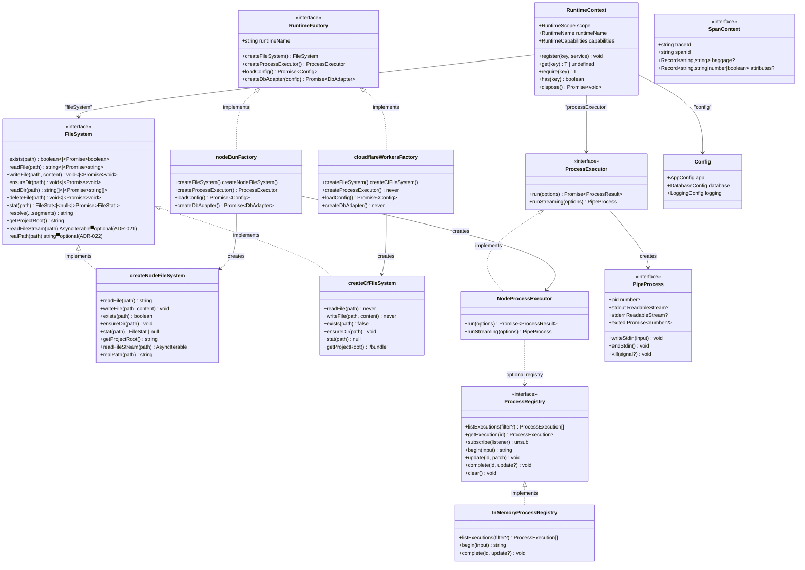

# @gobing-ai/ts-runtime

Runtime abstraction layer — platform detection, file system, process execution, configuration,
context management, path utilities, and a shared plugin/capability core. Works on Node.js, Bun,
and Cloudflare Workers through a factory pattern that auto-detects the runtime.

`ts-runtime` decouples application code from platform specifics. Instead of importing `node:fs` or `node:child_process` directly, consumers use interfaces (`FileSystem`, `ProcessExecutor`) resolved by `loadRuntimeFactory()` at startup. The factory auto-detects the platform and wires the correct implementations — `createNodeFileSystem` (real `node:fs`) for Node/Bun, `createCfFileSystem` (stub) for Workers. Node filesystem modules are loaded lazily, so importing the package remains safe for Worker bundles.

## Overview

**Key abstractions:**

| Concept | Interface | Bun/Node impl | Cloudflare impl |
| --------- | ----------- | --------------- | ----------------- |
| Runtime factory | `RuntimeFactory` → `loadRuntimeFactory()` | `nodeBunFactory` | `cloudflareWorkersFactory` |
| File system | `FileSystem` | `createNodeFileSystem()` (sync `node:fs`) | `createCfFileSystem()` (stub) |
| Process execution | `ProcessExecutor` (interface) | `NodeProcessExecutor` — `run()` via execa, `runStreaming()` via `Bun.spawn` | throws |
| Process registry | `ProcessRegistry` (optional) | `InMemoryProcessRegistry` / `createInMemoryProcessRegistry()` — list + subscribe all spawns | n/a (no process exec) |
| SQL database | `createDbAdapter(config)` → `DbAdapter` | Bun SQLite via `@gobing-ai/ts-db` (optional peer) | throws `D1NotConfiguredError` (D1 round pending) |
| Configuration | `Config` (Zod schema) | YAML + env vars | CONFIG_YAML blob + env vars |
| Context | `RuntimeContext` | service locator | service locator |
| Path utilities | `SEP`, `basenamePath`, `dirnamePath`, `joinPath`, `resolvePath`, `relativePath`, … | runtime-portable (zero `node:*`) | runtime-portable (zero `node:*`) |
| Schema validation | `loadStructuredConfig` | JSON-Schema + YAML | JSON-Schema + YAML |
| Plugin core (`./plugin`) | `CapabilityRegistry`, `loadExtensionModules` | trust-gated module loading | — |
| Tracing | `SpanContext` | `{ traceId, spanId }` | `{ traceId, spanId }` |

## Architecture


```mermaid
classDiagram
    class RuntimeFactory {
        <<interface>>
        +string runtimeName
        +createFileSystem() FileSystem
        +createProcessExecutor() ProcessExecutor
        +loadConfig() Promise~Config~
        +createDbAdapter(config) Promise~DbAdapter~
    }

    class nodeBunFactory {
        +createFileSystem() createNodeFileSystem()
        +createProcessExecutor() ProcessExecutor
        +loadConfig() Promise~Config~
        +createDbAdapter() Promise~DbAdapter~
    }

    class cloudflareWorkersFactory {
        +createFileSystem() createCfFileSystem()
        +createProcessExecutor() never
        +loadConfig() Promise~Config~
        +createDbAdapter() never
    }

    class FileSystem {
        <<interface>>
        +exists(path) boolean~|~Promise~boolean~
        +readFile(path) string~|~Promise~string~
        +writeFile(path, content) void~|~Promise~void~
        +ensureDir(path) void~|~Promise~void~
        +readDir(path) string[]~|~Promise~string[]~
        +deleteFile(path) void~|~Promise~void~
        +stat(path) FileStat~|~null~|~Promise~FileStat|~
        +resolve(...segments) string
        +getProjectRoot() string
        +readFileStream(path) AsyncIterable<string>▀optional (ADR-021)
        +realPath(path) string▀optional (ADR-022)
    }

    class createNodeFileSystem {
        +readFile(path) string
        +writeFile(path, content) void
        +exists(path) boolean
        +ensureDir(path) void
        +stat(path) FileStat | null
        +getProjectRoot() string
        +readFileStream(path) AsyncIterable<string>
        +realPath(path) string
    }

    class createCfFileSystem {
        +readFile(path) never
        +writeFile(path, content) never
        +exists(path) false
        +ensureDir(path) void
        +stat(path) null
        +getProjectRoot() '/bundle'
    }

    class ProcessExecutor {
        <<interface>>
        +run(options) Promise~ProcessResult~
        +runStreaming(options) PipeProcess
    }

    class NodeProcessExecutor {
        +run(options) Promise~ProcessResult~
        +runStreaming(options) PipeProcess
    }

    class ProcessRegistry {
        <<interface>>
        +listExecutions(filter?) ProcessExecution[]
        +getExecution(id) ProcessExecution?
        +subscribe(listener) unsub
        +begin(input) string
        +update(id, patch) void
        +complete(id, update?) void
        +clear() void
    }

    class InMemoryProcessRegistry {
        +listExecutions(filter?) ProcessExecution[]
        +begin(input) string
        +complete(id, update?) void
    }

    class PipeProcess {
        <<interface>>
        +pid number?
        +stdout ReadableStream?
        +stderr ReadableStream?
        +exited Promise~number?~
        +writeStdin(input) void
        +endStdin() void
        +kill(signal?) void
    }

    class RuntimeContext {
        +RuntimeScope scope
        +RuntimeName runtimeName
        +RuntimeCapabilities capabilities
        +register(key, service) void
        +get(key) T | undefined
        +require(key) T
        +has(key) boolean
        +dispose() Promise~void~
    }

    class Config {
        +AppConfig app
        +DatabaseConfig database
        +LoggingConfig logging
    }

    class SpanContext {
        <<interface>>
        +string traceId
        +string spanId
        +Record~string,string~ baggage?
        +Record~string,string|number|boolean~ attributes?
    }

    RuntimeFactory <|.. nodeBunFactory : implements
    RuntimeFactory <|.. cloudflareWorkersFactory : implements
    FileSystem <|.. createNodeFileSystem : implements
    FileSystem <|.. createCfFileSystem : implements
    ProcessExecutor --> PipeProcess : creates
    ProcessExecutor <|.. NodeProcessExecutor : implements
    ProcessRegistry <|.. InMemoryProcessRegistry : implements
    NodeProcessExecutor ..> ProcessRegistry : optional registry
    nodeBunFactory --> createNodeFileSystem : creates
    nodeBunFactory --> NodeProcessExecutor : creates
    cloudflareWorkersFactory --> createCfFileSystem : creates
    RuntimeContext --> FileSystem : "fileSystem"
    RuntimeContext --> Config : "config"
    RuntimeContext --> ProcessExecutor : "processExecutor"
```

## How It Works

### 1. Runtime selection

`loadRuntimeFactory()` auto-detects the platform and returns a factory that creates the correct
FileSystem, ProcessExecutor, and Config. Use `createRuntimeContextFromFactory()` to wire
everything automatically:

```ts
import { createRuntimeContextFromFactory } from '@gobing-ai/ts-runtime';

const ctx = await createRuntimeContextFromFactory();
// ctx.runtimeName → 'node-bun' (auto-detected)
// ctx.capabilities → { hasFilesystem: true, hasProcessExecution: true }
// ctx.require('fileSystem') → NodeFileSystem
// ctx.require('config') → Config from config.yaml
```

For manual control or synchronous code, `createRuntimeContext()` is still available
(deprecated — kept for backward compatibility):

```ts
import { createRuntimeContext } from '@gobing-ai/ts-runtime';

const ctx = createRuntimeContext({
    runtimeName: 'node-bun',
    capabilities: { hasFilesystem: true, hasProcessExecution: true, hasPersistentStorage: true },
});
```

### 2. Service registration

Services are registered into `RuntimeContext` and accessed by key:

```ts
ctx.register('db', drizzleAdapter);
ctx.register('cache', redisClient);

const db = ctx.require('db'); // throws if missing
const cache = ctx.get('cache'); // undefined if missing
```

### 3. Configuration

Config is loaded from YAML with environment variable interpolation and Zod validation:

```yaml
# config.yaml
app:
  name: my-app
  env: ${APP_ENV}
  port: ${PORT}
database:
  url: ${DATABASE_URL}
logging:
  level: debug
```

```ts
import { buildConfigFromYaml } from '@gobing-ai/ts-runtime';

const yaml = await fs.readFile('config.yaml');
const config = buildConfigFromYaml(yaml, {
    overrides: { app: { port: 8080 } },
});
// config.app.port === 8080 (overridden)
// config.logging.level === 'debug' (from YAML)
```

### 4. Structured config + JSON-schema validation

`loadStructuredConfig` reads a `.json`/`.yaml` file and — if it declares a top-level `$schema` — validates
it against that schema before returning. This powers schema-checked rule and workflow files in
`ts-rule-engine` and `ts-dual-workflow-engine`.

```ts
import { loadStructuredConfig } from '@gobing-ai/ts-runtime';

const config = await loadStructuredConfig('rules.yaml'); // validates against its $schema, throws on violation
const raw = await loadStructuredConfig('rules.yaml', { validateSchema: false }); // skip validation
```

A `StructuredConfigSchemaError` (with a `violations` array of `{ path, message }`) is thrown on any
schema violation.

#### `$schema` reference styles

There are three ways a config file can name its schema. **Prefer the bundled package specifier** — it is
the most secure and performant default:

| Style | Example | Resolution | Notes |
| ------- | --------- | ------------ | ------- |
| **Package specifier** (recommended) | `$schema: "@gobing-ai/ts-rule-engine/schemas/rule-file.schema.json"` | Resolved through `node_modules` via the module resolver, then read from disk | No network, no path guessing; survives hoisting/pnpm/monorepo layouts. Schemas ship in each package's `schemas/` (declared in `files`). **Quote the value** — YAML treats a leading `@` as reserved. |
| Relative path | `$schema: ./schemas/rule-file.schema.json` | Resolved against the config file's directory | Fine for repo-local schemas; brittle if the config moves. |
| Remote URL | `$schema: https://json-schema.org/.../rule-file.schema.json` | Fetched over HTTP(S) — **off by default** | SSRF/DoS surface for third-party configs. Opt in with `{ allowRemote: true }` (5s timeout) or supply your own `fetch`. |

```ts
// Bundled package schema (default path — no extra options needed):
//   $schema: "@gobing-ai/ts-rule-engine/schemas/rule-file.schema.json"
await loadStructuredConfig('rules.yaml');

// Remote schema is refused unless explicitly enabled:
await loadStructuredConfig('rules.yaml', { allowRemote: true });        // built-in fetch, time-bounded
await loadStructuredConfig('rules.yaml', { fetch: myFetch });           // or inject your own
```

> **Security:** remote schema fetching is disabled by default. Resolving a bundled schema from
> `node_modules` keeps validation entirely local — no outbound request, no dependency on a schema host's
> availability, and no chance for a malicious config to point validation at an internal URL.

### 5. Path utilities

Runtime-portable path math that avoids `node:path` so the same logic works on Cloudflare Workers
(ADR-008). All functions use POSIX-style separators; Windows drive paths are normalized and treated
as absolute.

```ts
import {
    SEP, basenamePath, dirnamePath, isAbsolutePath,
    joinPath, normalizeSeparators, relativePath, resolvePath,
    getProcessCwd,
} from '@gobing-ai/ts-runtime';

normalizeSeparators('C:\\Users\\x\\file');  // 'C:/Users/x/file'
SEP;                                          // '/' on POSIX, '\\' on Windows
isAbsolutePath('/abs');                       // true
dirnamePath('/a/b/c.ts');                     // '/a/b'
basenamePath('/a/b/c.ts');                    // 'c.ts'
basenamePath('/a/b/c.ts', '.ts');            // 'c'
joinPath('/a', 'b', 'c');                     // '/a/b/c'
resolvePath('/a/b', '../c');                  // '/a/c'
relativePath('/a/x', '/a/y');                 // '../y'
getProcessCwd();                              // process.cwd() or '/' on Workers
```

### 6. Extension core (`@gobing-ai/ts-runtime/extension`)

The `./extension` subpath exposes a generic, domain-agnostic extension/capability core used by both
`ts-rule-engine` and `ts-dual-workflow-engine` (ADR-010). It shares the mechanism — a typed registry
with origin metadata, a trust-gated extension loader, and a path guard — without knowing anything
about evaluators, resolvers, actions, or guards. Each engine owns its domain-specific kinds,
schemas, error types, and override semantics.

#### Capability registry

```ts
import { CapabilityRegistry } from '@gobing-ai/ts-runtime/extension';

interface Widget { execute(): void; }
const registry = new CapabilityRegistry<Widget>('widget');

// Register built-ins and extensions with origin metadata.
registry.register('core', coreWidget, 'builtin');
registry.register('ext',  extWidget,  'extension');   // default

registry.has('core');          // true
registry.list();               // ['core', 'ext']          (insertion order)
registry.get('core').execute(); // ok
registry.get('missing');        // throws: Unknown widget: missing

// Introspect origin without throwing.
registry.getEntry('core')?.origin;   // 'builtin'
registry.entries();                   // [['core', { capability, origin: 'builtin' }], ...]
```

#### Extension loading (trust-gated)

Extension modules are arbitrary code — the loader is disabled by default and fails closed:

```ts
import { loadExtensionModules, type ExtensionRef } from '@gobing-ai/ts-runtime/extension';

const refs: ExtensionRef<'actions'>[] = [{
    kind: 'actions',
    path: './ext/slack.ts',
    baseDir: '/abs/path/to/configs',
    sourceName: 'my-config',
}];

// Throws before any import: "declares actions extension … but extensions are disabled"
await loadExtensionModules(refs, { moduleLoader: (p) => import(p) }, register);

// Explicitly opt in.
await loadExtensionModules(refs, {
    allowExtensions: true,
    moduleLoader: (p) => import(p),
}, (ref, extension) => {
    // Engine-provided callback — the loader never chooses a target registry.
    myHost.actions.register(extension.name, extension, 'extension');
});
```

The loader validates both the default export and the named `extension` export. Invalid modules
throw with source name, kind, and path context. `moduleLoader` is required — the shared core has
no ambient `import()` capability of its own.

#### Path guard

`assertRelativeExtensionPath` rejects absolute paths and `..` traversal at load time, independent
of any engine's zod schema (defense in depth):

```ts
import { assertRelativeExtensionPath } from '@gobing-ai/ts-runtime/extension';

assertRelativeExtensionPath('./ext/my.ts');    // ok
assertRelativeExtensionPath('/etc/evil.ts');   // throws: must be relative
assertRelativeExtensionPath('../escape.ts');   // throws: must not contain ".."
```

The string-level guard does not resolve symlinks — a symlink inside `baseDir` that points outside passes
the check. For symlink-safe confinement (ADR-022), supply a `realPath` canonicalizer to `LoadExtensionsOptions`:

```ts
import { loadExtensionModules } from '@gobing-ai/ts-runtime/extension';
import { createNodeFileSystem } from '@gobing-ai/ts-runtime';

const fs = createNodeFileSystem('/abs/path');
await loadExtensionModules(refs, {
    allowExtensions: true,
    moduleLoader: (p) => import(p),
    realPath: fs.realPath,  // enables symlink confinement check
}, register);
```

When `realPath` is provided, the loader canonicalizes both the resolved path and `baseDir`, rejecting
symlinks that escape the declaring directory. When absent (e.g. CF Workers), the check is skipped.

### 7. File system abstraction

Use `createNodeFileSystem()` for a real `node:fs`-backed filesystem (Node/Bun) or
`createCfFileSystem()` for a Cloudflare Workers stub:

```ts
import { createNodeFileSystem, createCfFileSystem } from '@gobing-ai/ts-runtime';

// Node.js / Bun — real filesystem (sync node:fs)
const fs = createNodeFileSystem('/path/to/project');
const content = fs.readFile('src/index.ts');     // string
fs.writeFile('output.json', JSON.stringify(data));
fs.ensureDir('tmp/cache');                       // recursive mkdir

// Cloudflare Workers — stub (throws on mutating ops)
const cffs = createCfFileSystem();
cffs.getProjectRoot();   // '/bundle'
cffs.readFile('/x');     // throws: "use D1, KV, or R2"
```

Optional streaming and symlink-safe operations:

```ts
// Stream large files line-by-line (ADR-021) — Node/Bun only.
// The JSONL importer uses this to avoid buffering multi-GB files.
if (fs.readFileStream) {
  for await (const line of fs.readFileStream('data/huge.jsonl')) {
    // process one line at a time
  }
}

// Canonical path resolution for symlink-safe extension confinement (ADR-022).
// The extension loader uses this to verify that a symlink hasn't escaped baseDir.
if (fs.realPath) {
  const real = fs.realPath('/base/extensions/linked.ts');
}
```

Both are optional — CF Workers stubs omit them. The JSONL importer falls back to `readFile` + split when `readFileStream` is absent; the extension loader skips the symlink check when `realPath` is absent.

The old `getFs()` / `setFileSystem` global swap and `SyncFileSystem` are marked `@deprecated` —
use `createNodeFileSystem()` or `ctx.require('fileSystem')` instead.

### 8. Database adapter (`createDbAdapter`)

The factory's `createDbAdapter(config)` opens a connected adapter satisfying the `RuntimeDbAdapter` contract
(the runtime-facing subset of `@gobing-ai/ts-db`'s `DbAdapter`) at the configured path. **ts-runtime owns
connection; the consumer owns schema** — the returned adapter is connected but NOT migrated. The consumer
composes its own migrations on top.

```ts
import { loadRuntimeFactory } from '@gobing-ai/ts-runtime';

const factory = await loadRuntimeFactory();

if (factory.capabilities.hasSqlDatabase) {
    const adapter = await factory.createDbAdapter({ url: '.spur/spur.db' });
    // adapter is connected — apply YOUR migrations here, then use DAOs.
    adapter.close();
}
```

On Cloudflare Workers, `capabilities.hasSqlDatabase` is `false` and `createDbAdapter` throws a typed
`D1NotConfiguredError` — the method exists on the interface so consumer code is forward-compatible and
needs no change when the D1 round ships.

**Dependency note (optional peer):** `@gobing-ai/ts-db` is declared as an **optional
`peerDependency`** of `ts-runtime` (ADR-012 addendum), not a regular dependency — a regular entry
would create a manifest cycle (`ts-db` depends on `ts-runtime`) and force-install `ts-db` (plus its
`drizzle-orm` peer) on every consumer, including Workers bundles and apps that never touch SQL.
The factory interface uses a structural `RuntimeDbAdapter` type (defined locally) that a ts-db
`DbAdapter` satisfies via structural subtyping; `nodeBunFactory.createDbAdapter` loads `ts-db` via a
literal dynamic `import()` at runtime.

**Who must install it:** only consumers that call `nodeBunFactory.createDbAdapter` on Node/Bun —
install `@gobing-ai/ts-db` yourself (`bun add @gobing-ai/ts-db`). Workers consumers do not need it
(`capabilities.hasSqlDatabase` is `false`; the method throws `D1NotConfiguredError`).

**Bundling (`Bun --compile` / esbuild / Vite):** the literal specifier keeps `ts-db` bundler-visible,
so `Bun --compile` can fold it into a standalone binary. If you bundle for a different runtime, mark
`@gobing-ai/ts-db` `external` to preserve the dynamic import.

**Failure mode:** if `@gobing-ai/ts-db` is absent or exports no `createDbAdapter` (incompatible
version), `createDbAdapter` throws a typed `DbModuleNotInstalledError` (with the underlying resolution
error chained as `cause`) instead of a raw `MODULE_NOT_FOUND`.

### 9. Graceful disposal

`RuntimeContext.dispose()` calls `dispose()` on every registered service that implements the pattern:

process.on('SIGTERM', async () => {
    await ctx.dispose();
    process.exit(0);
});

```

## Usage

### Install

```bash
bun add @gobing-ai/ts-runtime
```

### Basic setup (Node/Bun)

```ts
import { createRuntimeContextFromFactory } from '@gobing-ai/ts-runtime';

const ctx = await createRuntimeContextFromFactory();
const fs = ctx.require('fileSystem');
fs.writeFile('hello.txt', 'Hello, world!');
```

### Cloudflare Workers

```ts
import { createCfFileSystem, createRuntimeContext } from '@gobing-ai/ts-runtime';

export default {
    async fetch(request: Request, env: Env): Promise<Response> {
        const ctx = createRuntimeContext({
            runtimeName: 'cloudflare-workers',
            capabilities: { hasFilesystem: false, hasProcessExecution: false, hasPersistentStorage: false },
            services: { fileSystem: createCfFileSystem() },
        });
        // ...
    },
};
```

### Config with env interpolation

```ts
import { buildConfigFromYaml, buildConfigFromObject } from '@gobing-ai/ts-runtime';

// From YAML file
const config = buildConfigFromYaml(yamlText);

// From plain object (programmatic config)
const config = buildConfigFromObject({
    app: { name: 'api', env: 'production', port: 3000 },
    database: { url: ':memory:' },
});
```

// From YAML file
const config = buildConfigFromYaml(yamlText);

// From plain object (programmatic config)
const config = buildConfigFromObject({
    app: { name: 'api', env: 'production', port: 3000 },
    database: { url: ':memory:' },
});

```

### Process execution

`ProcessExecutor` is the canonical interface for process execution. `NodeProcessExecutor` is the concrete implementation wrapping `execa` (buffered) and `Bun.spawn` (streaming):

```ts
import { NodeProcessExecutor, createInMemoryProcessRegistry } from '@gobing-ai/ts-runtime';

// Optional: shared registry so every run/runStreaming is listable (spur#0264 / M1).
const registry = createInMemoryProcessRegistry();
const exec = new NodeProcessExecutor({ defaultTimeout: 30_000, registry });

// Buffered — captures stdout/stderr, no throw on non-zero
const result = await exec.run({
    command: 'git',
    args: ['status', '--short'],
    cwd: '/path/to/repo',
    rejectOnError: true,
    // Optional registry metadata (defaults: run → source 'one-shot')
    label: 'git.status',
});

console.log(result.stdout);          // 'M src/index.ts\n'
console.log(`Duration: ${result.durationMs}ms`);

// Streaming — interactive subprocess with stdin control
const proc = exec.runStreaming({
    command: 'cat',
    source: 'supervisor', // tag supervised agent loops
    agentId: 'alpha-claude',
});
proc.writeStdin('hello\n');
proc.endStdin();
const exitCode = await proc.exited; // 0

// Watch list snapshot + live subscription
console.log(registry.listExecutions());
const unsub = registry.subscribe((event) => {
    if (event.type === 'started' || event.type === 'exited') {
        console.log(event.type, event.execution.id, event.execution.command);
    }
});
unsub();
```

`rejectOnError: true` throws on non-zero exits. `OutputPolicy` controls
buffered vs streamed output. `ProcessOptions` supports timeout, env, cwd,
maxOutput, forceBuffered, an optional synchronous `onOutput({ stream, chunk,
timestamp })` observer, and registry fields (`source`, `teamId`, `agentId`).
`onOutput` observes live chunks while the returned `ProcessResult` retains the
complete buffered stdout/stderr; observers must enqueue and return, and thrown
observer errors are isolated from the child. Inject the same `ProcessRegistry` into every executor that should
appear in one watch list; without a registry, behavior is unchanged.

Cloudflare Workers do not expose process execution; check
`factory.capabilities.hasProcessExecution` first.

The `ProcessExecutor` const (value alias for `NodeProcessExecutor`), `BunSyncProcessExecutor`,
and `BunPipeProcessSpawner` are kept as deprecated backward-compatible wrappers. Prefer
`NodeProcessExecutor` or `nodeBunFactory.createProcessExecutor()` in new code.

### SpanContext (for telemetry)

```ts
import type { SpanContext } from '@gobing-ai/ts-runtime';

function processRequest(ctx: SpanContext) {
    console.log(`Trace: ${ctx.traceId}, Span: ${ctx.spanId}`);
}
```
