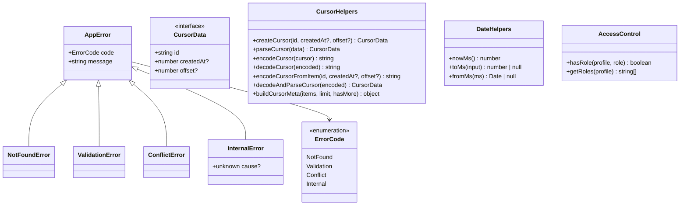
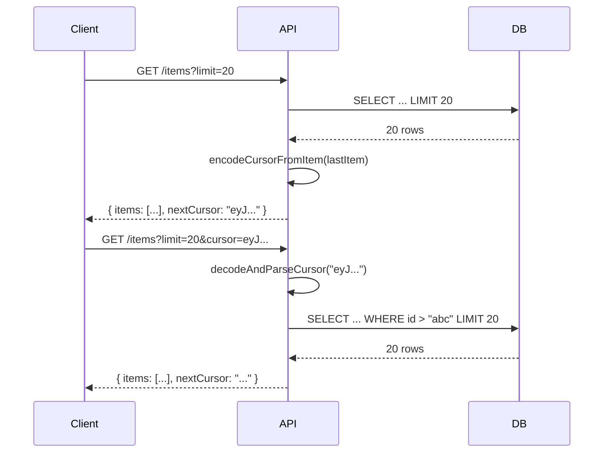

# @gobing-ai/ts-utils

Shared utilities — error types, date helpers, cursor-based pagination, role-based access control, API response builders, and output formatting. No platform dependencies; works in Bun, Node, and Cloudflare Workers.

## Overview

`ts-utils` provides small, composable utilities used across `ts-runtime`, `ts-db`, `ts-infra`, and application code. Each module is self-contained with zero external dependencies.

| Module | Purpose |
|--------|---------|
| `errors` | Typed application errors (`AppError`, `NotFoundError`, `ValidationError`, etc.) |
| `date` | `nowMs()`, timestamp ↔ Date conversion |
| `cursor` | Base64url-encoded cursor-based pagination |
| `access` | Zitadel + generic role-based access control (`hasRole`, `getRoles`) |
| `api-response` | Standard API response envelope builders |
| `output` | Human-readable output helpers (tables, JSON, etc.) |
| `origin` | Request origin parsing |
| `const` | Shared constants |

## Architecture



## How It Works

### Error types

Typed error hierarchy with error codes — consumers catch by type, not by string:

```ts
throw new NotFoundError(`User ${userId} not found`);
throw new ValidationError('Email is required');
throw new InternalError('DB connection lost', originalError);

// Callers can discriminate:
if (error instanceof NotFoundError) {
    return new Response(null, { status: 404 });
}
if (isAppError(error)) {
    // error.code is typed: 'NOT_FOUND' | 'VALIDATION' | 'CONFLICT' | 'INTERNAL'
}
```

### Cursor-based pagination

Encode a cursor from the last item in a page, return it to the client, decode on the next request:

```ts
import { encodeCursorFromItem, decodeAndParseCursor } from '@gobing-ai/ts-utils';

// Page 1: encode cursor from last item
const cursor = encodeCursorFromItem(lastItem.id, lastItem.createdAt);
// → "eyJpZCI6ImFiYyIsImNyZWF0ZWRBdCI6MTcwMDAwMDAwMH0"

// Page 2: decode cursor from query param
const parsed = decodeAndParseCursor(requestCursor);
// → { id: "abc", createdAt: 1700000000 }

// Build pagination metadata
const meta = buildCursorMeta(items, limit, hasMore);
// → { nextCursor: "eyJ...", hasMore: true, limit: 20 }
```

**Cursor flow:**



### Role-based access control

Supports Zitadel IAM roles and generic role arrays/objects:

```ts
import { hasRole, getRoles } from '@gobing-ai/ts-utils';

// Zitadel profile
const profile = {
    'urn:zitadel:iam:org:project:roles': { admin: 'project-1', viewer: 'project-1' },
};
hasRole(profile, 'admin'); // → true
getRoles(profile); // → ['admin', 'viewer']

// Generic roles array
hasRole({ roles: ['editor', 'viewer'] }, 'editor'); // → true

// Object-based roles
hasRole({ roles: { admin: true } }, 'admin'); // → true
```

### Date utilities

```ts
import { nowMs, toMs, fromMs } from '@gobing-ai/ts-utils';

const ts = nowMs(); // → 1700000000000

toMs(new Date('2024-01-01')); // → 1704067200000
toMs('2024-01-01'); // → 1704067200000
toMs(null); // → null

fromMs(1704067200000); // → Date('2024-01-01')
fromMs(null); // → null
```

## Usage

### Install

```bash
bun add @gobing-ai/ts-utils
```

### Common patterns

```ts
import {
    AppError, NotFoundError, ValidationError, ConflictError, InternalError,
    nowMs, toMs, fromMs,
    encodeCursorFromItem, decodeAndParseCursor, buildCursorMeta,
    hasRole, getRoles,
} from '@gobing-ai/ts-utils';

// Errors
function getUser(id: string) {
    const user = db.find(id);
    if (!user) throw new NotFoundError(`User ${id} not found`);
    return user;
}

// Pagination
async function listUsers(limit: number, cursor?: string) {
    const parsed = cursor ? decodeAndParseCursor(cursor) : undefined;
    const users = await db.query(limit, parsed?.id);
    const hasMore = users.length === limit;
    return {
        items: users,
        ...buildCursorMeta(users, limit, hasMore),
    };
}

// Auth guard
function requireAdmin(profile: unknown) {
    if (!hasRole(profile as Record<string, unknown>, 'admin')) {
        throw new ForbiddenError('Admin access required');
    }
}
```
